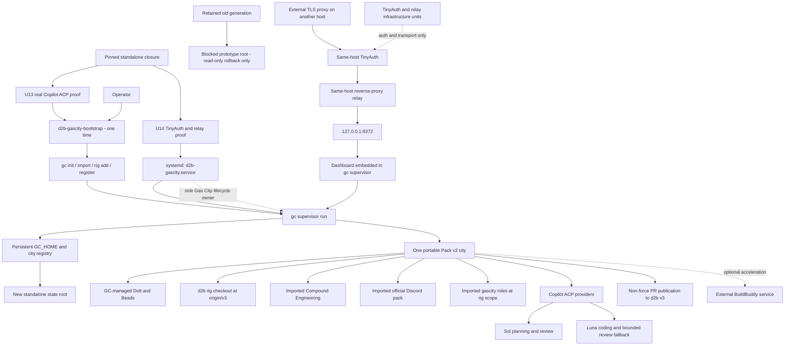

# Standalone Gas City Repository - Refactor Plan

## Goal Capsule

- **Objective:** Establish `vicondoa/d2b-gascity` as the private, standalone owner of the complete Gas City contributor deployment while keeping `vicondoa/d2b` branch `v3` as its sole product rig.
- **Reason for change:** The user directed this extraction after live startup failures made the iteration cost of carrying contributor infrastructure in d2b greater than the value of colocating it with the product repository.
- **Product authority:** This repository owns Gas City packaging, the NixOS module, portable city and Pack v2 configuration, local formulas and prompts, bootstrap and operator tooling, tests, CI, documentation, and deployment contracts. It does not own d2b product code or host-private configuration.
- **Upstream posture:** Use Gas City's supervisor, managed Dolt, Pack v2, formula engine, controller processes, embedded dashboard, worktrees, and recovery semantics directly. Local code may bridge a proven missing integration but must not replace upstream lifecycle or durable state.
- **Execution models:** Planning and review use `gpt-5.6-sol`, `long_context`, effort `xhigh`. Coding uses `gpt-5.6-luna`, effort `max`. Review falls back to Luna `max` only when Sol is explicitly unsupported or unavailable.
- **Process exclusions:** Do not use Speckit, the d2b panel or signoff system, d2b delivery sequencing, or pinning-hardening workflows for this extraction.
- **Primary stop conditions:** Stop before implementation proceeds past the provider proof if direct or thin-adapter Copilot ACP cannot complete a real create/prompt/restart cycle. Stop before enabling publication if worktrees or pull requests cannot be proven to target `origin/v3`. Stop before deleting anything from d2b until standalone cutover and rollback have both passed.

---

## Product Contract

### Summary

Deploy one private Gas City with one d2b rig. A single delegated Gas City lifecycle unit runs `gc supervisor run`; Gas City owns its child controllers, embedded dashboard, managed Dolt, sessions, pack services, worktrees, and restart behavior. TinyAuth and the same-host relay are separate ingress infrastructure, not lifecycle owners. One-time bootstrap uses supported `gc` commands; on reboot the only Gas City lifecycle command is `gc supervisor run`, while ingress units start independently.

The city imports current upstream Gas City, Compound Engineering, Discord, and `gascity/roles` through portable Pack v2 configuration and `packs.lock`. A narrow local root pack supplies Copilot provider declarations, the explicit `v3` branch correction, publication behavior, and d2b-specific workflow deltas that upstream does not provide.

### Problem Frame

The former d2b-owned deployment accumulated custom lifecycle services, provider relays, dashboard packaging, and broad repository validation coupling. That design raised the cost of each live correction and obscured which behavior belonged to Gas City versus NixOS deployment policy.

Extraction is not a file move alone. The current upstream architecture has advanced and now supplies the intended supervisor dashboard, stronger restart recovery, managed Dolt behavior, Pack v2 composition, formula fixes, and worktree fixes. The standalone repository must therefore preserve the product requirements while deleting superseded custom machinery.

### Key Decisions

- **Private standalone ownership.** (session-settled: user-directed - chosen over retaining Gas City in d2b because d2b iteration friction was too high during live failure recovery.) All Gas City implementation and operational artifacts move here. Governs R1, R18, R19.
- **Keep d2b as the sole rig and `v3` as its base.** (session-settled: user-directed - chosen over changing the target repository or branch because Gas City is contributor infrastructure, not the product.) Governs R2, R11, R15.
- **Use upstream lifecycle.** One delegated `d2b-gascity.service` runs `gc supervisor run`. No separate Dolt, dashboard, city-controller, or session-controller systemd unit is allowed. Governs R3-R5, R13, R14.
- **Bootstrap once, reconcile thereafter.** Fresh state uses `gc init`, imports, `gc rig add`, and implicit registration; restored state uses `gc register`. Reboots run only the supervisor. Governs R4, R5.
- **Use portable Pack v2 configuration.** `city.toml`, `pack.toml`, and `packs.lock` are portable. `.gc/site.toml` is created on the host and owns the rig path binding. Governs R7, R10, R11.
- **Prefer managed Dolt port selection.** Do not force a fixed port unless the selected NixOS owner-firewall posture requires one. Gas City remains the only Dolt lifecycle owner in either mode. Governs R5, R14.
- **Use only the dashboard embedded in `gc supervisor`.** Do not package or run a separate dashboard application or dashboard service. Preserve the existing two-hop ingress: an external TLS proxy on another host, followed by TinyAuth and a same-host reverse-proxy relay whose final hop is `127.0.0.1:8372`. The session term "tinyproxy" means that current authenticated path, not a new Tinyproxy forward-proxy dependency. TinyAuth and the relay may be separate deployment-infrastructure units; they are not Gas City lifecycle owners. Governs R3, R13, R16, R21-R23.
- **Keep BuildBuddy outside the core lifecycle.** BuildBuddy acceleration remains a required supported integration, but its proxy or hosted service is optional deployment infrastructure and is not a prerequisite for supervisor health. Governs R12, R14.
- **Use a clean source snapshot.** Import current source files with a provenance note instead of importing the complete d2b Git history. Do not copy live state or private host values. Governs R1, R16, R20.

### Actors

- A1. **Operator:** Bootstraps, starts, diagnoses, upgrades, cuts over, and rolls back the private deployment.
- A2. **Gas City supervisor:** Owns the city registry, embedded dashboard, reconciliation, controller processes, pack services, and managed Dolt.
- A3. **Copilot ACP provider:** Supplies Sol planning/review and Luna coding sessions through the native Gas City ACP subprocess contract.
- A4. **d2b rig:** A persistent checkout of `vicondoa/d2b` based on `origin/v3`.
- A5. **Compound Engineering and Gas City roles:** Supply upstream planning, implementation, review, and formula behavior.
- A6. **Discord pack:** Supplies the official Discord services; gateway-only operation is permitted when no public Interactions route is published.
- A7. **Publisher:** Opens or reuses a pull request against d2b `v3` and never merges it.
- A8. **External TLS proxy:** Runs on another host and forwards one external dashboard authority to the Gas City host.
- A9. **Same-host TinyAuth and reverse-proxy relay:** Authenticates the operator, preserves the browser authority and security headers, and forwards the complete listener to `127.0.0.1:8372`.
- A10. **Optional BuildBuddy service:** Accelerates approved builds without becoming a Gas City lifecycle dependency.

### Requirements

**Repository and ownership**

- R1. The private repository owns every Gas City Nix expression, module, script, local pack asset, formula delta, prompt, operator tool, document, test, workflow, and generated inventory required by the deployment.
- R2. Exactly one city and one rig are configured; the rig targets `vicondoa/d2b` and branch `v3`.
- R3. The default NixOS module declares exactly one Gas City lifecycle unit, `d2b-gascity.service`, running `gc supervisor run` as a dedicated unprivileged identity. TinyAuth and the same-host reverse-proxy relay may run as separate deployment-infrastructure units, but no other unit may own Gas City, Dolt, controllers, sessions, or a dashboard application.
- R4. Fresh bootstrap runs while the delegated service is stopped and uses the current supported sequence: `gc init --file <portable-source> --preserve-existing --no-start`, import installation, and `gc rig add`; a root operator then starts `d2b-gascity.service`, after which the service identity runs idempotent `gc register`/reconciliation under system delegation. Bootstrap and registration must not create a user supervisor.
- R5. The standalone deployment uses a new dedicated state root and clean upstream bootstrap. Once standalone work begins, supervisor restart and host reboot preserve that new root's `GC_HOME`, city state, `.gc`, Beads, managed Dolt, rig state, worktrees, decisions, Discord state, and publication metadata.

**Pinned runtime and portable composition**

- R6. The first standalone release pins Gas City `f6741d94861aa14f0253deffbe9efb1cb3a35d92`, gascity-packs `5d2a9d023edbb9ba24fdcff554e89fc3d7da72fe`, Beads `bf97b73749ac3ef2fca2365b54537ac041ad4293`, Dolt `2.1.7`, Go `1.26.6`, Copilot CLI `1.0.79`, and llm-agents.nix `387989ee56d550d86d46d9458ad68a55b9e0ca3b`.
- R7. Portable state consists of Pack v2 `city.toml`, `pack.toml`, and `packs.lock`; machine-local `.gc/site.toml` contains the persistent d2b rig path and is never committed.
- R8. Planning and review use Sol `xhigh` with `long_context`; coding uses Luna `max`. Luna review fallback occurs only for explicit Sol unsupported/unavailable results.
- R9. The exact packaged Copilot CLI completes a native ACP create/prompt/restart proof. If direct ACP is impossible, one stateless thin provider adapter is permitted; it may not own a socket service, session database, retry ledger, or lifecycle state.
- R10. Compound Engineering and Discord are upstream imports, and `gascity/roles` is imported at d2b rig scope. Local copies of upstream agents or formulas are prohibited.
- R11. Inventory every resolved imported/local pack path that can create a worktree. Every producer must pass a fixture whose remote default is `main` and prove a base of `origin/v3`; any correction is a narrow Pack v2 asset override, not a fork of `do-work` or Compound formulas.

**Integrations and operator surface**

- R12. BuildBuddy remains a required delivered integration through a documented optional external acceleration seam and is completed before U12. Its absence or outage degrades build speed but does not prevent the supervisor, city, or non-BuildBuddy checks from starting.
- R13. The only dashboard is the SPA embedded in and served by `gc supervisor`. The required deployment binds its shared API/dashboard listener to `127.0.0.1:8372`; the same-host authenticated relay is its only browser ingress. The relay preserves methods, bodies, cookies, Host, Origin, `Sec-Fetch-Site`, `X-GC-Request`, SSE, reconnect cursors, and every supported dashboard/API route.
- R14. The unit applies lightweight systemd cgroup sandboxing, an empty capability set, bounded CPU, memory, tasks, and restart policy without blocking Gas City's native child-process and managed-Dolt lifecycle. Imported packs and supervisor children share the Gas City identity; no per-child identity or custom sidecar is invented without explicit upstream support.
- R15. Publication uses a dedicated least-privilege GitHub App or fine-grained identity, a unique branch bound to an immutable Beads work ID and expected head SHA, and server-side rules that prevent direct `v3` update, merge, force, and ruleset bypass. It inspects every PR state, opens or reuses only the exact open head/base PR, records the URL durably, and stops on closed, merged, or SHA-mismatch state.
- R16. Host-specific domains, addresses, user and channel IDs, trusted proxy ranges, credential paths, and secrets exist only in host-local NixOS configuration or root-owned host files and never in either repository.

**Migration and proof**

- R17. Standalone Python fixtures and Nix checks cover packaging, portable composition, provider routing, formula deltas, publication, restart behavior, module evaluation, and generated inventory consistency; no standalone Rust contract-test crate/toolchain is introduced. VM and live checks cover systemd and external integrations.
- R18. Cutover uses separate roots: the broken prototype root remains untouched and read-only, while d2b-gascity uses a new root. Before real standalone work, rehearse old-new-old-new generation changes with each generation referencing only its own root; the old Gas City service remains stopped against the read-only prototype root. Retain prior system generations and store closures for offline rollback.
- R19. Public d2b cleanup is mechanically ineligible until U12 records representative standalone work, restart continuity, PR publication, operator authorization, old-new-old-new rollback rehearsal, and a materially simpler Gas City-only correction path. U11 then performs cleanup and post-cleanup target-repository verification.
- R20. The repository records source provenance from d2b commit `9e0abd0c` but imports neither the full d2b history nor prototype/runtime state, credentials, service dumps, reports, sockets, caches, or host configuration.
- R21. The target supervisor configuration does not set `allow_mutations` or `write_auth_allow_unverified`. Gas City derives read-only mode from the supervisor bind, and loopback remains writable even when the browser reaches it through both proxy hops.
- R22. The same-host relay preserves the browser's external Host and Origin, and the external hostname is listed in `[supervisor].allowed_hosts`. One external origin serves the SPA, `/api`, `/v0`, health, assets, and SSE, so the deployment remains same-origin and `[supervisor].allowed_origins` remains unset. The relay preserves `Sec-Fetch-Site`, `X-GC-Request`, unsafe methods, SSE, and `Last-Event-ID`; Gas City authorization does not rely on `X-Forwarded-*`.
- R23. Gas City `write_auth_*` and `read_auth_*` grant authentication remains disabled because the embedded first-party SPA does not mint those grants. TinyAuth, the same-host relay, and network admission protect the complete listener. Non-loopback supervisor deployment is not implemented; any future host that cannot use a same-host relay requires a separate plan.
- R24. TinyAuth `5.1.3` and Nginx `1.30.2` are exact standalone-lock/source-manifest inputs. TinyAuth accepts only approved salted password hashes; cookies are Secure, HttpOnly, and SameSite with bounded idle and absolute lifetimes; logout, users/key rotation invalidation, login rate limiting, expiry, and recovery are enforced without secrets in argv or logs.
- R25. The full browser journey is proven against the real topology before full module build-out: unauthenticated URL, TinyAuth login, exact return URI, SPA state, benign control, success, logout, reauthentication, session expiry, supervisor-restart recovery with authoritative reload, SSE reconnect/`Last-Event-ID`, and keyboard/screen-reader smoke.
- R26. The same-host relay itself performs TinyAuth `auth_request` or equivalent session validation before forwarding to `127.0.0.1:8372`; direct-to-relay unauthenticated requests fail. The OpenResty/Nginx HTTP backend is accepted without mTLS only on a private-network and source-firewall boundary, with that residual risk documented.
- R27. Credentials use least privilege and supported transient projections. The accepted trust boundary is one Gas City identity shared by imported packs and supervisor children, mitigated by exact pins, no admin/ruleset-bypass credentials, native ACP prompt/input sandboxing where supported, no credential material in source/logs, and planted prompt-injection attempts.
- R28. Discord setup uses supported `gc discord import-app`, gateway binding, and rotation through transient credential projection. Host-local guild, channel, user, and role boundaries default deny; bot/self messages are ignored; replay and rate controls are enforced; public Interactions remain off by default.
- R29. BuildBuddy uses verified TLS, pinned trust roots, instance/tenant scoping, explicit permitted data classes, and no secret-bearing actions. Authentication, certificate, integrity, or scope failure blocks acceleration and never silently falls back for acceleration-required checks.
- R30. Private flake access uses a daemon-compatible token-free Git mechanism proven on a clean host, including credential rotation, any configured remote builder, and offline rollback from retained closures; tokens never appear in URLs or lock files.
- R31. Prototype rollback state and any stopped snapshot remain root-owned, restrictively permissioned, encrypted at rest where supported, integrity-manifested, expiry-bound, and destroyed after the rollback window. New runtime sensitive state uses restrictive permissions/umask, bounded journal access/retention, redaction, and cleanup of replaceable session artifacts.
- R32. Before d2b cleanup, one comparable Gas City-only correction is measured before and after extraction for edit-to-validated-recovery time, repositories and gates touched, and rollback turnaround. The standalone path must be materially simpler and require neither a d2b code change nor a d2b Gas City gate.

### Acceptance Examples

- AE1. **Fresh bootstrap - covers R2-R7, R10.**
  - **Given:** Packages and the delegated unit are installed, the unit is stopped, and the new standalone city root does not exist.
  - **When:** The service identity runs the verified `gc init --file <portable-source> --preserve-existing --no-start` flow, installs imports, and adds the d2b rig; root starts the delegated system unit; then the service identity registers the city.
  - **Then:** one clean city and one d2b rig reconcile under the system unit, no user supervisor is created, and ordinary reboot runs only `gc supervisor run` for Gas City lifecycle.

- AE2. **ACP directness - covers R8-R9.**
  - **Given:** Scoped Copilot credentials and the exact packaged CLI.
  - **When:** The ACP proof creates a session, sends a prompt, terminates the provider process, and repeats after supervisor restart.
  - **Then:** Sol planning/review and Luna coding return valid ACP responses without a persistent local adapter service or private session database.

- AE3. **Branch correctness - covers R2, R11, R15.**
  - **Given:** The d2b remote default branch is deliberately not assumed to be `v3`.
  - **When:** A representative Compound work item creates a worktree and publication runs.
  - **Then:** the merge base is `origin/v3`, the pull request base is `v3`, repetition finds the same pull request, and no merge occurs.

- AE4. **Durable restart - covers R3-R5, R14-R15.**
  - **Given:** Fresh standalone work is in progress in the new state root with durable Beads, a managed Dolt listener, a worktree, and publication metadata.
  - **When:** The operator restarts `d2b-gascity.service`.
  - **Then:** systemd kills and restarts the complete service cgroup, Gas City reopens the same durable work, and no second Dolt or supervisor appears.

- AE5. **Required dashboard topology - covers R3, R13, R16, R21-R23.**
  - **Given:** The external TLS proxy forwards to TinyAuth and a relay on the Gas City host, and that relay forwards to `127.0.0.1:8372`.
  - **When:** authenticated and unauthenticated clients request the external dashboard authority.
  - **Then:** the authenticated client receives the embedded SPA, APIs, assets, health, and event stream from the one supervisor listener, while bypass and unauthenticated requests are denied and no separate dashboard process exists.

- AE6. **Separate-root cutover rollback - covers R5, R18-R20, R31.**
  - **Given:** The blocked prototype reports zero running agents/work, its root is stopped and preserved read-only, and the standalone generation has a separately bootstrapped empty root.
  - **When:** the operator rehearses old-new-old-new before creating standalone work.
  - **Then:** each generation references only its own root, the old Gas City service remains stopped, neither root is copied or ownership-converted, both generations remain bootable offline, and the prototype root/snapshot remains protected and expiry-bound solely for rollback.

- AE7. **Loopback mutation behavior - covers R13, R21, R23.**
  - **Given:** The supervisor binds `127.0.0.1:8372`, `allow_mutations` and all Gas City grant-auth fields are absent, and the authenticated relay preserves the SPA request.
  - **When:** the embedded SPA sends a representative unsafe control with its native `X-GC-Request`.
  - **Then:** the control succeeds because upstream read-only mode is false for loopback, not because an unsafe non-localhost acknowledgement was enabled.

- AE8. **Same-origin and Host preservation - covers R13, R16, R22-R23.**
  - **Given:** One external Host/origin serves SPA, APIs, health, assets, and SSE, and that Host is present in `allowed_hosts`.
  - **When:** requests cross both proxies.
  - **Then:** Host, Origin, `Sec-Fetch-Site`, `X-GC-Request`, method, body, cookies, SSE, and `Last-Event-ID` arrive unchanged; wrong Host, cross-site, unauthenticated, and missing-CSRF requests are rejected without consulting `X-Forwarded-*`.

- AE9. **Complete browser and session journey - covers R13, R22-R26.**
  - **Given:** The exact pinned TinyAuth and relay packages run the target two-hop ingress.
  - **When:** an unauthenticated keyboard-only user opens a deep URL, signs in, returns to that exact URL, reads SPA state, performs one benign control, logs out, retries, signs in again, lets idle/absolute expiry occur, and reconnects SSE after a supervisor restart.
  - **Then:** authentication and exact return URI work, the control succeeds only with a valid session, logout/expiry require reauthentication, an authoritative reload occurs before retry after restart, `Last-Event-ID` is preserved, and a screen-reader smoke reports usable labels/focus.

- AE10. **Iteration-cost outcome - covers R19, R32.**
  - **Given:** One bounded Gas City-only correction representative of the live startup failures.
  - **When:** the operator compares the former d2b path with the standalone path.
  - **Then:** the standalone correction has materially lower edit-to-validated-recovery and rollback time, touches only this repository and its local gates, and requires no d2b code change or d2b Gas City gate.

### Success Criteria

- One supervisor process and one managed Dolt serve one registered city and one d2b rig after reboot.
- A real Sol planning prompt, Sol review prompt, and Luna coding prompt pass the ACP proof, including a supervisor restart.
- A representative Compound task creates a worktree from `origin/v3` and opens or reuses a non-merged pull request with base `v3`.
- The embedded dashboard works through the private auth proxy and is not directly exposed.
- Live acceptance proves the target loopback listener remains writable with non-loopback mutation settings absent; any future non-loopback deployment requires a separate plan.
- BuildBuddy success and outage paths both pass their declared behavior.
- Clean-root cutover and separate-root rollback rehearsal pass without copying prototype state.
- A before/after correction demonstrates materially lower iteration and rollback cost with no d2b code/gate dependency.
- Public d2b has no remaining Gas City implementation or generated references beyond an optional authorized-contributor link.

### Scope Boundaries

- No custom scheduler, controller, state database, Dolt service, dashboard application, ACP session daemon, or generic egress framework.
- No multi-city or multi-rig support.
- No change to the d2b target repository or base branch.
- No public dashboard listener or repository-owned deployment authority.
- No automatic merge, merge queue, or force push.
- No upstream source upgrade beyond the pins named in R6 during extraction.
- No live state, host lock file, host configuration, token, identifier, hostname, address, or credential path is copied into this repository.
- No non-loopback supervisor option, implementation, fixture, or acceptance path; a future need requires a separate plan.
- No mTLS requirement on the private OpenResty-to-host HTTP backend. Source filtering/private networking is required, and residual on-path risk is accepted and documented.

---

## Planning Contract

### Product Contract Preservation

Every implementation unit traces to R1-R32. A unit may narrow implementation mechanics but may not add a second lifecycle owner, change the d2b target, weaken private-value exclusion, or proceed around the ACP, `origin/v3`, cutover, or rollback stop conditions.

### Key Technical Decisions

- KTD1. **Snapshot with provenance, not full history.** Copy the selected Gas City-owned source at d2b commit `9e0abd0c`, record its path allowlist and upstream licenses in `PROVENANCE.md`, and start ordinary standalone history here. This avoids importing unrelated d2b commits and identities.
- KTD2. **Use current upstream and ingress pins as one tested set.** Package Gas City, packs, Beads, Dolt, Go, Copilot CLI `1.0.79` from llm-agents.nix `387989ee56d550d86d46d9458ad68a55b9e0ca3b`, TinyAuth `5.1.3`, and Nginx `1.30.2` together. `flake.lock`, package metadata, the source manifest, and smoke tests must report the same pins.
- KTD3. **One delegated Gas City lifecycle boundary.** The module declares exactly one Gas City lifecycle unit, `d2b-gascity.service`, sets `GC_SUPERVISOR_SYSTEMD_UNIT=d2b-gascity.service` and `GC_SUPERVISOR_SYSTEMD_SCOPE=system`, and executes `gc supervisor run`. `KillMode=control-group` owns every Gas City child. TinyAuth and the same-host reverse-proxy relay may be separate deployment-infrastructure units because they authenticate and transport requests rather than own Gas City lifecycle.
- KTD4. **Bootstrap is stopped, no-start, and system-delegated.** Before locking bootstrap prose, test the packaged CLI help and the current source contract for `--file`, `--preserve-existing`, and `--no-start`. Install `d2b-gascity-bootstrap` with `init`, `register`, and `check` modes. `init` runs `gc init --file <portable-source> --preserve-existing --no-start`, completes imports and `gc rig add` while the service is stopped, and returns control to the root operator. Root starts `d2b-gascity.service`; only then does the service identity run idempotent `gc register` under `GC_SUPERVISOR_SYSTEMD_UNIT`/`GC_SUPERVISOR_SYSTEMD_SCOPE`, so no user supervisor can be created.
- KTD5. **Materialize only portable source.** The bootstrap package contains a source city/root-pack template. Initial bootstrap copies portable files into the durable city root before `gc init`; it never copies `.gc`, `.beads`, Dolt, worktrees, or service state. Subsequent source upgrades require an explicit drift check and atomic portable-file update.
- KTD6. **Keep site bindings machine-local.** `city.toml` names rig `d2b` without a path. `gc rig add` writes `.gc/site.toml`; tests fail if the persistent rig path appears in a committed TOML file.
- KTD7. **Managed Dolt by default.** Leave `GC_DOLT_PORT` unset normally and read the effective listener from Gas City runtime state. An optional fixed port may be configured only together with a NixOS owner-firewall rule and a test that rejects port drift. Both modes use GC-managed Dolt.
- KTD8. **U13 is the early ACP stop gate.** Immediately after packaging, use real credentials and the exact Copilot CLI `1.0.79` closure to prove ACP create/prompt/process-restart before city/module composition. Direct ACP is preferred. If the CLI lacks the required protocol, only a bounded stateless adapter feasibility path may proceed to U5; failure of both stops the plan.
- KTD9. **Fallback classification is closed.** Only typed or exact tested unsupported/unavailable provider results select Luna review. Authentication, network, quota, malformed protocol, and unknown errors stop readiness.
- KTD10. **Import, inventory every worktree producer, then patch narrowly.** Import Compound Engineering, Discord, and rig-scoped roles at exact locks. Generate a resolved inventory of every pack command/asset/formula that creates a worktree, test each against remote-default-`main`, and correct only the affected assets to `origin/v3`. Local files otherwise contain provider declarations, agent patches, and d2b-specific finalization/publication steps only.
- KTD11. **Publication is stateless, convergent, and server-constrained.** Use immutable Beads work ID, unique branch, expected head SHA, GitHub PR state, and server-side branch/ruleset policy as authorities. A dedicated least-privilege identity cannot update `v3`, merge, force, or bypass rules. Repetition inspects open, closed, and merged PRs and returns only the exact open head/base/SHA match; every other state stops without mutation.
- KTD12. **BuildBuddy is required delivery outside core health.** The core lifecycle accepts no BuildBuddy dependency. A separately configured acceleration service uses verified TLS, pinned trust, tenant/instance scoping, approved non-secret data classes, and no secret-bearing action. Optional checks may fall back locally; required acceleration fails closed on auth, certificate, integrity, or scope error. U7 completes this before U12.
- KTD13. **The embedded supervisor dashboard is the only dashboard.** Current upstream compiles the SPA into `gc` and states there is nothing else to install or run. The repository therefore has no dashboard package, binary, unit, or application. The required route is external TLS proxy to same-host TinyAuth/relay to `127.0.0.1:8372`; only TinyAuth and the transport relay may have separate infrastructure units.
- KTD14. **Sandbox the cgroup and accept upstream's shared identity.** Use one dedicated Gas City account, private temporary directory, strict writable paths, empty capability bounds, no-new-privileges, resource controls, and supervisor bind `127.0.0.1:8372`. Imported packs and supervisor children share that identity, including legitimate internal API access; do not firewall loopback to relay-only or split children into custom identities. Mitigate with exact pins, least-privilege external credentials, no admin/ruleset-bypass scopes, native ACP prompt/input sandboxing where supported, restrictive runtime permissions, and prompt-injection negatives. Distinct integration sidecars are allowed only when upstream explicitly supports them without lifecycle duplication.
- KTD15. **Use a clean state root; quarantine the prototype.** Do not adopt, migrate, copy, chown, or schema-convert the blocked prototype runtime state. Bootstrap d2b-gascity in a new root. Keep the stopped prototype root and optional filesystem snapshot read-only solely for old-generation rollback, with root ownership, restrictive mode, encryption where supported, integrity manifest, expiry, and destruction after the rollback window. Re-import credentials through supported host-local paths.
- KTD16. **U12 authorizes U11 cleanup.** Public d2b cleanup is ineligible until live acceptance proves representative standalone work, restart, publication, target ingress, operator authorization, separate-root rollback rehearsal, and the iteration-cost improvement. U11 then performs current-`origin/v3` inventory regeneration, deletion, target generators/gates, and post-cleanup verification.
- KTD17. **Preserve one same-origin authority through the relay.** Gas City computes `readOnly = nonLocal && !allow_mutations`, so the target loopback bind remains writable with both `allow_mutations` and `write_auth_allow_unverified` absent. The relay preserves the external Host, Origin, `Sec-Fetch-Site`, `X-GC-Request`, unsafe method/body, cookies, SSE, and `Last-Event-ID`; the external hostname is configured in `allowed_hosts`. SPA, `/api`, `/v0`, health, assets, and SSE share that one external origin, so `allowed_origins` remains unset. Neither read nor write grant auth is enabled. Gas City performs no trusted `X-Forwarded-*` interpretation. Non-loopback supervisor deployment is outside this plan and requires a separate future plan.
- KTD18. **Private flake fetch must work for the Nix daemon.** Use token-free private Git over SSH with a dedicated deploy key or an equivalently daemon-compatible credential helper that never serializes a token into `flake.nix`, `flake.lock`, store paths, logs, or URLs. Prove clean-host lock/fetch/build, credential rotation, any configured remote builder, and offline rollback from retained closures before host cutover.
- KTD19. **Runtime privacy is operational, not a ban on generic assets.** Generic prompt templates, test prompts, documentation examples, and the literal `127.0.0.1` topology may be committed. Live prompts/responses, credentials, host-specific authorities/IDs/addresses/paths, runtime databases, private worktrees, and unredacted logs may not. Use restrictive umask/modes, bounded journal access/retention, redaction, and replaceable-session cleanup.

### Upstream Baseline

| Component | Pin or contract |
| --- | --- |
| Gas City | `f6741d94861aa14f0253deffbe9efb1cb3a35d92` |
| gascity-packs | `5d2a9d023edbb9ba24fdcff554e89fc3d7da72fe` |
| Beads | `bf97b73749ac3ef2fca2365b54537ac041ad4293` |
| Dolt | `2.1.7` |
| Go | `1.26.6` |
| Copilot CLI | `1.0.79` |
| llm-agents.nix | `387989ee56d550d86d46d9458ad68a55b9e0ca3b` |
| TinyAuth | `5.1.3` |
| Nginx relay | `1.30.2` |
| Supervisor | One delegated Gas City lifecycle unit, loopback API and embedded dashboard |
| City configuration | Pack v2, exact `packs.lock`, machine-local site binding |
| Durable work | Beads and GC-managed Dolt; sessions are replaceable |

### Source Authority

- Upstream Gas City: `gastownhall/gascity:cmd/gc/supervisor_systemd_delegate.go`, `internal/supervisor/config.go`, `internal/config/site_binding.go`, `internal/runtime/acp/protocol.go`, and `docs/runbooks/managed-city-endpoints.md`.
- Current bootstrap evidence at `f6741d94861aa14f0253deffbe9efb1cb3a35d92`: `gastownhall/gascity:cmd/gc/cmd_init.go:315-414` defines `--file`, `--preserve-existing`, and `--no-start`; `cmd/gc/init_provider_readiness.go:42-127` proves no-start skips registration/supervisor startup after initialization; and `cmd/gc/cmd_register.go:18-99` proves registration is idempotent and starts/reconciles the delegated supervisor if needed.
- Current Discord pack evidence at `5d2a9d023edbb9ba24fdcff554e89fc3d7da72fe`: `gastownhall/gascity-packs:discord/README.md:46-107` and `discord/commands/import-app/**` define `gc discord import-app` and gateway/app binding.
- Current dashboard and mutation-gate evidence at `f6741d94861aa14f0253deffbe9efb1cb3a35d92`: `gastownhall/gascity:docs/getting-started/dashboard.md:6-8,36-58` establishes that the only dashboard is compiled into and served by the supervisor, uses `X-GC-Request`, and becomes read-only on a non-localhost bind without `allow_mutations`; `internal/supervisor/config.go:39-53` defines the relevant bind, host, origin, and write-auth fields; `cmd/gc/cmd_supervisor.go:1341-1368` proves read-only is derived from the bind and `allow_mutations`; `internal/api/supervisor.go:254-269` and `internal/api/middleware.go:165-177,258-285` prove the supervisor validates the actual Host header against `allowed_hosts`; `internal/api/dashboardbff/plane.go:145-190` proves unsafe BFF methods require same-origin `Sec-Fetch-Site`/Origin and `X-GC-Request`; `internal/api/dashboardspa/web/frontend/src/api/client.ts:27-50,86-88` and `internal/api/dashboardspa/web/frontend/src/supervisor/client.ts:83-86` prove the SPA supplies the same-origin CSRF header; and `internal/api/writeauth.go:24-32,415-438` proves the embedded first-party SPA mints no signed write grant and would be rejected if grant auth were enabled. The supervisor middleware uses Host, Origin, `Sec-Fetch-Site`, `X-GC-Request`, and the socket peer; there is no trusted `X-Forwarded-*` interpretation in this request path.
- Upstream packs: `gastownhall/gascity-packs:compound-engineering/pack.toml`, `gascity/formulas/do-work.formula.toml`, and `discord/pack.toml`.
- Extraction source: `vicondoa/d2b` commit `9e0abd0c`, limited to the allowlist recorded in `PROVENANCE.md`.

### Global Failure Guards

- A second long-lived Gas City unit fails module evaluation and source policy.
- A committed host-specific deployment authority, private ID/address/path, credential, live prompt/response, or runtime artifact fails privacy policy; generic prompt templates and `127.0.0.1` fixtures remain allowed.
- A provider fallback on any reason outside unsupported/unavailable fails the provider contract test.
- A worktree not based on `origin/v3` or a pull request with another base disables publication.
- Any cutover step that mutates schema or cannot roll back stops public d2b cleanup.
- A separate dashboard package/service, non-loopback supervisor implementation, target deployment use of `allow_mutations`, `write_auth_allow_unverified`, read/write grant auth, or `allowed_origins`, failure to preserve Host/Origin/fetch-site/CSRF/SSE, or reliance on `X-Forwarded-*` for a Gas City gate fails module and acceptance checks.

---

## High-Level Technical Design



### Lifecycle

```text
fresh host:
  deploy package/module
    -> bootstrap init
    -> install imports
    -> add d2b rig
    -> validate/register
    -> supervisor reconciles

normal reboot:
  systemd
    -> gc supervisor run
    -> registry reconciliation
    -> managed Dolt adoption/start
    -> controller/session recovery from Beads
  independent ingress infrastructure
    -> TinyAuth
    -> same-host relay
    -> 127.0.0.1:8372

rollback:
  stop active generation
    -> switch retained generation and its own state root
    -> validate that neither root was copied or modified by the other
    -> return offline from retained closures
```

---

## Output Structure

```text
.
├── AGENTS.md
├── CHANGELOG.md
├── CONTRIBUTING.md
├── LICENSE
├── PROVENANCE.md
├── README.md
├── SECURITY.md
├── flake.lock
├── flake.nix
├── .github/
│   └── workflows/
│       ├── check.yml
│       └── update-generated.yml
├── city/
│   ├── city.toml
│   ├── pack.toml
│   ├── packs.lock
│   ├── agents/
│   ├── assets/
│   │   └── workflows/
│   ├── formulas/
│   └── providers/
├── docs/
│   ├── architecture.md
│   ├── bootstrap.md
│   ├── dashboard-proxy.md
│   ├── feasibility/
│   │   ├── copilot-acp.md
│   │   └── ingress.md
│   ├── operations.md
│   ├── rollback.md
│   └── plans/
│       └── 2026-08-14-001-refactor-standalone-gas-city-repository-plan.md
├── nix/
│   ├── packages/
│   │   ├── beads.nix
│   │   ├── contributor.nix
│   │   ├── dolt.nix
│   │   └── gascity.nix
│   └── source-manifest.nix
├── nixos-modules/
│   ├── default.nix
│   ├── ingress-relay.nix
│   └── options.nix
├── operator/
│   ├── buildbuddy/
│   │   └── README.md
│   └── proxy/
│       ├── README.md
│       └── nginx.conf.example
├── scripts/
│   ├── bootstrap.py
│   ├── copilot-acp-adapter.py
│   ├── operator.py
│   ├── publish-pr.py
│   └── source-manifest.py
└── tests/
    ├── acceptance/
    │   ├── cleanup-eligibility.py
    │   ├── copilot-acp.py
    │   ├── copilot-acp-feasibility.py
    │   ├── live.py
    │   └── rollback.py
    ├── fixtures/
    │   ├── acp/
    │   ├── buildbuddy/
    │   ├── ingress/
    │   ├── discord/
    │   ├── github/
    │   └── worktree-producers/
    ├── host/
    │   └── d2b-gascity.nix
    ├── nix/
    │   └── module.nix
    ├── policy/
    │   ├── composition.py
    │   ├── privacy.py
    │   ├── provider.py
    │   ├── publication.py
    │   └── topology.py
    └── smoke/
        └── package.nix
```

`scripts/copilot-acp-adapter.py` is conditional output. It must not exist if direct Copilot ACP passes.

---

## Implementation Units

The units are ordered by dependency. A later unit may not weaken a stop condition established by an earlier unit.

### U1. Repository governance and clean scaffold

**Deliverable:** A private standalone repository with explicit scope, provenance, contribution rules, security boundaries, and no imported runtime or unrelated d2b history.

**Owned files:**

- `AGENTS.md`
- `CHANGELOG.md`
- `CONTRIBUTING.md`
- `LICENSE`
- `PROVENANCE.md`
- `README.md`
- `SECURITY.md`
- `.gitignore`

**Implementation:**

1. Expand the README to name the private infrastructure purpose, one d2b rig, and `v3` base.
2. Record source commit `9e0abd0c`, the exact extraction allowlist, upstream repositories, and Apache-2.0 provenance in `PROVENANCE.md`.
3. Define local contribution rules: no private deployment values, no runtime state, one logical change per commit, and human-owned merge.
4. Ignore `.gc`, `.beads`, result links, build outputs, credentials, local host overrides, sockets, reports, and copied runtime state.
5. Do not import d2b commit history. Copy only the files selected by this plan.

**Tests and scenarios:**

- A tracked-file scan finds no `.gc`, `.beads`, credential, socket, report, or host override.
- `git log --max-parents=0` contains only the standalone repository root history, while `PROVENANCE.md` names the d2b source commit.
- License and provenance checks identify copied and upstream-derived files.

**Stop condition:** Stop if the extraction allowlist includes unrelated d2b product code or if any candidate file contains a private host value.

**Done condition:** All owned files exist; the repository contains only README/LICENSE/governance/plan files before U2 begins; the privacy scan exits zero.

### U2. Pinned flake and package closure

**Prerequisite:** U1.

**Deliverable:** A standalone flake that builds the exact Gas City runtime, Copilot CLI, Beads, Dolt, and source manifest without importing d2b.

**Owned files:**

- `flake.nix`
- `flake.lock`
- `nix/packages/beads.nix`
- `nix/packages/contributor.nix`
- `nix/packages/dolt.nix`
- `nix/packages/gascity.nix`
- `nix/source-manifest.nix`
- `scripts/source-manifest.py`
- `tests/smoke/package.nix`

**Implementation:**

1. Add current Gas City, gascity-packs, llm-agents.nix `387989ee56d550d86d46d9458ad68a55b9e0ca3b`, and the package-only nixpkgs source as flake inputs.
2. Package R6 as one closure and preserve the upstream Go test set that is hermetic under Nix.
3. Export `packages.gascity`, `packages.beads`, `packages.dolt`, and `packages.gas-city-contributor`.
4. Export a development shell containing only the runtime and validation tools required here.
5. Pin and manifest Copilot CLI `1.0.79`, TinyAuth `5.1.3`, and Nginx `1.30.2` from the standalone lock.
6. Generate a source manifest from flake input revisions and package versions; do not duplicate hand-maintained revision strings outside test expectations.
7. Implement the daemon-compatible token-free private Git mechanism from KTD18 and document its operator setup without embedding credential material.

**Tests and scenarios:**

- Package smoke checks `gc version --long`, `bd version`, `dolt version`, `go version`, Copilot CLI, TinyAuth, Nginx, and llm-agents.nix revision against R6/R24.
- The runtime closure contains `gc`, `bd`, `dolt`, `git`, `gh`, Copilot CLI, Python, and required certificate roots.
- The source manifest is reproducible and fails when a package/version does not match the lock.
- A source scan proves no dependency on a d2b flake path or package.
- A clean host running through the Nix daemon can lock, fetch, and build the private flake with no token in URL/lock/log; rotating the deploy credential invalidates the old key and permits a new fetch.
- Any configured remote builder proves the same access or receives a pre-copied closure without private source credentials; retained closures boot offline.

**Stop condition:** Stop if Gas City and the pinned Beads revision cannot be built and tested as one compatible set, or if packaging requires patching upstream lifecycle behavior.

**Done condition:** `nix build .#packages.x86_64-linux.gas-city-contributor` and the package smoke check pass from a clean checkout.

### U13. Copilot ACP feasibility stop gate

**Prerequisite:** U2.

**Deliverable:** A real credential-backed feasibility result for Copilot CLI `1.0.79` completing ACP create, prompt, process termination, fresh-process restart, and prompt again before city/module implementation proceeds.

**Owned files:**

- `docs/feasibility/copilot-acp.md`
- `tests/acceptance/copilot-acp-feasibility.py`
- minimal feasibility fixture under `tests/fixtures/acp/**`

**Implementation:**

1. Use only the exact U2 closure and a transient host credential projection; do not use ambient interactive login state.
2. Record the exact direct Copilot ACP command, arguments, protocol frames, exit classification, and child-process cleanup without recording prompt/response content or credentials.
3. Send a generic non-sensitive prompt, observe a valid response shape, terminate the provider process, start a fresh process, and repeat.
4. If direct ACP is unavailable, run one bounded stateless adapter feasibility spike using the same CLI. The adapter may use only stdio and process memory and may not create a daemon, socket, database, retry ledger, or durable lifecycle authority.
5. Classify failure as protocol unsupported, unavailable, authentication, transport, malformed, or unknown; only a successful direct or permitted adapter path unlocks later units.

**Tests and scenarios:**

- Real credential-backed direct create/prompt/restart/prompt.
- Process-tree inspection proves no provider/adapter child remains after close.
- Credential, argv, environment, journal, and test-output scans contain no secret or live prompt/response.
- A deliberately invalid credential fails as authentication and never masquerades as protocol unsupported.

**Stop condition:** Stop the plan before U3 if neither direct ACP nor the permitted stateless adapter feasibility path succeeds with the exact pinned CLI.

**Done condition:** `tests/acceptance/copilot-acp-feasibility.py` passes and `docs/feasibility/copilot-acp.md` records the selected command shape and direct/adapter decision using only non-sensitive evidence.

### U14. Ingress package and real-topology feasibility

**Prerequisites:** U2, U13.

**Deliverable:** An early proof that exact TinyAuth `5.1.3` and Nginx `1.30.2` can implement external HTTP ingress to same-host authentication/relay to `127.0.0.1:8372` before full U4/U8 module work.

**Owned files:**

- `docs/feasibility/ingress.md`
- `tests/fixtures/ingress/**`

**Implementation:**

1. Build the exact lock/source-manifest packages and run a supervisor fixture on `127.0.0.1:8372`.
2. Configure the relay itself to enforce TinyAuth with `auth_request` or equivalent session validation before any upstream forwarding.
3. Use plain HTTP on the external-OpenResty-to-host backend as directed. Admit only the configured private-network source in the fixture and document the residual lack-of-mTLS risk.
4. Preserve one external Host/origin and all KTD17 headers; reject direct-to-relay unauthenticated requests and never treat `X-Forwarded-*` as Gas City authorization.
5. Configure approved salted password hashes, Secure/HttpOnly/SameSite cookies, bounded idle and absolute lifetime, logout, users/key rotation invalidation, and login rate limiting with no secret in argv/logs.
6. Automate the browser journey from R25, including exact deep-link return, benign control, logout/reauth, expiry, supervisor restart with authoritative reload, SSE reconnect/`Last-Event-ID`, keyboard navigation, and a basic screen-reader accessibility scan.

**Tests and scenarios:**

- Direct-to-relay unauthenticated bypass fails before the loopback fixture records a request.
- Login returns to the exact original path/query and reaches SPA state.
- Benign control succeeds only with a valid session; logout, expiry, and users/key rotation invalidate it.
- Restart temporarily reports unavailable, performs an authoritative reload before retry, and reconnects SSE with `Last-Event-ID`.
- Wrong source, Host, Origin, fetch-site, CSRF, and forged forwarding headers fail.
- Rate limiting triggers without logging password/hash/cookie.
- Keyboard focus order, labels, and screen-reader smoke pass.

**Stop condition:** Stop before U4/U8 if the relay cannot enforce TinyAuth itself, the exact return URI or same-origin headers cannot be preserved, the backend requires public exposure, or sensitive auth material appears in argv/logs.

**Done condition:** The exact package fixture passes the complete browser/auth/restart/SSE/accessibility journey and records the private-HTTP residual risk without introducing mTLS.

### U3. Portable city, local root pack, and bootstrap tooling

**Prerequisites:** U2, U13.

**Deliverable:** One portable Pack v2 city and an explicit stopped no-start bootstrap tool for a new standalone state root using current supported Gas City commands.

**Owned files:**

- `city/city.toml`
- `city/pack.toml`
- `city/packs.lock`
- initial `city/agents/**`, `city/assets/**`, `city/formulas/**`, `city/providers/**`
- `scripts/bootstrap.py`
- `scripts/operator.py`
- `docs/bootstrap.md`
- `docs/operations.md`

**Implementation:**

1. Define workspace `d2b-gascity`, one logical rig named `d2b`, and no committed rig path.
2. Create Pack v2 schema 2 root metadata and exact named imports.
3. Before finalizing command text, assert packaged `gc init --help` exposes `--file`, `--preserve-existing`, and `--no-start`, matching the current-source citations.
4. Implement bootstrap modes:
   - `init`: require the delegated service stopped and the new root absent; materialize portable files; run `gc init --file <portable-source> --preserve-existing --no-start`; complete `gc import add`/`gc import install`, transiently project supported credentials, clone d2b at `v3`, and run `gc rig add` while stopped.
   - `register`: after a root operator starts `d2b-gascity.service`, run idempotent `gc register` as the service identity with system delegation variables set, then request reconciliation/checks.
   - `check`: perform no mutation and run import, config, city, rig, registration, service-scope, and no-user-supervisor checks.
5. Keep root-only service start separate from the service-identity bootstrap/register commands. Never invoke `gc supervisor start`, install a user unit, edit `cities.toml`, or write `.gc/site.toml` directly.
6. Re-import Copilot, Discord, GitHub, and optional BuildBuddy credentials from host-local sources through supported transient projections; copy no prototype credential or runtime file.
7. Provide an explicit portable-file update command that refuses local drift and preserves only the new root's runtime directories.

**Tests and scenarios:**

- Fresh stopped bootstrap creates exactly one city and one rig in the new root without starting or registering a supervisor.
- Repeating `init` refuses with the `register` remedy.
- Root-start followed by service-identity `register` is idempotent and reconciles the same city.
- Process/unit inspection proves no user supervisor or user unit exists.
- A partial city fails before any import, registration, or Dolt mutation.
- Reboot simulation invokes only `gc supervisor run`.
- A source policy rejects path fields in committed rig configuration.
- Prototype-root hashes, ownership, and modes remain unchanged throughout.

**Stop condition:** Stop if bootstrap requires direct edits to `cities.toml`, `.gc/site.toml`, port files, Beads metadata, or managed Dolt state.

**Done condition:** Fixture-backed no-start init, root-start, idempotent register, no-user-supervisor, and prototype-nonmutation tests pass; `gc import check`, `gc config show --validate`, `gc lint`, and `gc doctor` pass for the new city.

### U4. NixOS module and lightweight sandbox

**Prerequisites:** U2, U3, U13, U14.

**Deliverable:** One default NixOS module with one delegated Gas City lifecycle unit, plus separately classified TinyAuth and same-host relay infrastructure units implementing the required remote-dashboard ingress.

**Owned files:**

- `nixos-modules/default.nix`
- `nixos-modules/ingress-relay.nix`
- `nixos-modules/options.nix`
- `tests/nix/module.nix`
- `tests/host/d2b-gascity.nix`
- `docs/architecture.md`

**Implementation:**

1. Export `nixosModules.gasCityContributor`.
2. Define typed options for enablement, package, the new standalone state root, service resources, supervisor bind/port, optional fixed Dolt port, credential source files, operator users, the external dashboard Host, the external TLS proxy source, TinyAuth users file, and same-host relay listener. The prototype root is not an input to the new service.
3. Create one dedicated Gas City service identity and `d2b-gascity.service`, with `ExecStart=gc supervisor run`.
4. Set the delegated systemd environment named by KTD3.
5. Use `KillMode=control-group`, bounded restart policy, CPU quota, memory high/max, tasks maximum, empty capabilities, `NoNewPrivileges`, private temporary storage, protected home/system paths, restrictive umask/state modes, bounded journal access/retention, redaction, and explicit writable state.
6. Load Copilot, Discord, and publication credentials with systemd credentials. Do not serialize their values in unit environment text.
7. Generate supervisor configuration with bind `127.0.0.1`, port `8372`, and the one host-local external dashboard hostname in `allowed_hosts`. Leave `allowed_origins`, `allow_mutations`, `write_auth_*`, and `read_auth_*` unset.
8. When the required remote-dashboard path is enabled, declare separate exact-pinned TinyAuth and same-host reverse-proxy relay infrastructure units. They have distinct identities and credentials, are not `PartOf` the Gas City lifecycle, and never launch or restart Gas City.
9. Restrict relay ingress to the configured external TLS proxy source and its only upstream to `127.0.0.1:8372`. Do not impose relay-only loopback admission: the supervisor and its upstream-managed children share the Gas City identity and may legitimately use the API. Record that same-identity trust boundary.
10. Configure the relay to preserve external Host, Origin, `Sec-Fetch-Site`, `X-GC-Request`, method/body, cookies, SSE, and `Last-Event-ID`. Do not rewrite the upstream Host to loopback, synthesize CSRF, or use `X-Forwarded-*` as a Gas City authorization input.
11. Run imported packs and every supervisor child as the Gas City identity. Supply only least-privilege external credentials, deny admin/ruleset-bypass scopes, use native ACP prompt/input sandboxing when available, and add no custom per-child identity or lifecycle sidecar.
12. Clean replaceable ACP/session artifacts at terminal state without deleting durable Beads/worktree/publication state.
13. Use managed Dolt allocation by default. Add the Dolt owner-firewall rule only when the fixed-port option is set.
14. Assert that a fixed-port firewall and configured port move together.
15. Do not declare Dolt, dashboard, controller, Discord, or ACP worker units.

**Tests and scenarios:**

- Disabled module declares no users, paths, firewall rules, or units.
- Enabled core module declares exactly one Gas City lifecycle unit, `d2b-gascity.service`.
- Enabling authenticated ingress may additionally declare only TinyAuth and relay infrastructure units; neither has Gas City/Dolt/dashboard lifecycle commands or `PartOf=d2b-gascity.service`.
- Unit rendering contains the expected delegation, identity, sandbox, resources, credential projections, loopback bind, and control-group kill.
- Managed-port mode has no fixed Dolt firewall rule.
- Fixed-port mode has one owner rule and rejects missing/mismatched port configuration.
- Loopback backend mode remains mutation-capable without setting `allow_mutations`, proving that upstream keys read-only behavior from the bind rather than the browser's proxy path.
- Target rendering contains external `allowed_hosts` and contains no `allowed_origins`, `allow_mutations`, `write_auth_*`, or `read_auth_*`.
- The relay upstream is exactly `127.0.0.1:8372`, preserves external Host and Origin, and has no authorization dependency on `X-Forwarded-*`.
- No non-loopback supervisor option or rendering path exists.
- Source/unit policy proves imported packs and supervisor children share the single Gas City identity and that no custom per-child lifecycle machinery exists.
- Runtime state modes/umask, journal access/retention, redaction, and terminal replaceable-session cleanup are enforced.
- Any declared dashboard package or dashboard unit fails source policy.
- VM stop kills supervisor, managed Dolt, and representative child processes.
- VM restart reopens the same new-root city and leaves its durable fixture hashes unchanged.

**Stop condition:** Stop if the sandbox requires a custom child launcher/per-child identity, if Gas City cannot operate under the shared-identity empty-capability/writable-path contract, or if the target supervisor config contains non-loopback, grant-auth, or mutation-acknowledgement settings.

**Done condition:** Module evaluation and the systemd VM test pass, with one Gas City lifecycle unit, only the permitted auth/relay infrastructure units, the exact loopback final hop, and no orphan Gas City process after stop.

### U5. Copilot ACP proof and provider contract

**Prerequisites:** U2, U4, U13.

**Deliverable:** Proven Copilot ACP provider definitions for Sol and Luna, or one minimal stateless adapter when direct ACP is conclusively unavailable.

**Owned files:**

- provider declarations under `city/providers/**`
- provider and agent patches in `city/city.toml`
- `tests/acceptance/copilot-acp.py`
- optional `scripts/copilot-acp-adapter.py`
- provider fixtures under `tests/fixtures/acp/**`
- `tests/policy/provider.py`

**Implementation:**

1. Consume U13's proven direct or stateless-adapter command without reopening feasibility.
2. Drive the complete Gas City ACP JSON-RPC initialization, session creation, prompt, cancellation/close, process termination, fresh-process restart, profile selection, and error classification.
3. Define:
   - planning Sol: `gpt-5.6-sol`, `long_context`, `xhigh`;
   - review Sol: `gpt-5.6-sol`, `long_context`, `xhigh`;
   - coding Luna: `gpt-5.6-luna`, default context, `max`;
   - review fallback Luna: `gpt-5.6-luna`, `long_context`, `max`.
4. Encode the closed fallback classification from KTD9.
5. If direct ACP fails because the CLI lacks protocol support, implement one stdio adapter that translates only ACP process messages to the documented Copilot invocation. It stores no state beyond one process and delegates restart to Gas City.
6. Project only the required Copilot credential, use native ACP prompt/input sandboxing where supported, and ensure imported prompts cannot request credential, host configuration, ruleset bypass, or admin authority.

**Tests and scenarios:**

- Direct executable contract: create, prompt, close, process restart, prompt.
- Exact model/context/effort observations for all profiles.
- Sol unsupported and Sol unavailable select Luna review.
- Authentication, network, quota, malformed, timeout, and unknown errors do not fall back.
- Killing the provider leaves no adapter daemon, socket, database, or child.
- Supervisor restart creates a fresh ACP process while durable Beads work remains available.
- Planted prompt-injection attempts to disclose credentials, host-private values, or bypass publication rules are refused and produce redacted diagnostics.

**Stop condition:** Stop provider composition if it diverges from U13's proven executable path, widens fallback beyond unsupported/unavailable, requires durable adapter authority, or exposes credentials/private values to prompt output or logs.

**Done condition:** The hermetic protocol tests and one real Copilot acceptance run pass; the chosen direct/adapter decision is recorded in `docs/architecture.md`.

### U6. Compound, Discord, roles, and `v3` composition

**Prerequisites:** U3, U5, U13.

**Deliverable:** Upstream Compound Engineering, official Discord, rig-scoped roles, and the smallest tested d2b workflow delta.

**Owned files:**

- import and patch portions of `city/pack.toml`, `city/packs.lock`, and `city/city.toml`
- narrow files under `city/assets/workflows/**`
- d2b-only files under `city/formulas/**`
- `tests/policy/composition.py`
- `tests/fixtures/worktree-producers/**`
- Discord fixtures under `tests/fixtures/discord/**`

**Implementation:**

1. Lock Compound Engineering and Discord from gascity-packs R6.
2. Import `gascity/roles` only under the d2b rig.
3. Patch upstream agents to the proven provider profiles without copying their definitions.
4. Resolve the final pack graph and generate an inventory of every command, asset, formula step, and imported path that can create a worktree.
5. Test each inventoried producer against a fixture remote whose default is `main`; every created worktree must use `origin/v3`.
6. Where a producer fails, override only its narrow Pack v2 asset at higher precedence; do not fork `do-work`, Compound formulas, or unrelated assets.
7. Import Discord app metadata and bot credential through `gc discord import-app` with transient credential projection, then bind the official gateway service through supported pack configuration.
8. Make host-local guild, channel, user, and role allowlists mandatory and default-deny. Ignore bot/self events, reject replay, bound intake/retry rate, and keep public Interactions publication off by default.
9. Document credential/app rotation as a stopped or reconciled transient re-import that invalidates old material without committing it.
10. Add only d2b-specific workflow deltas that cannot be represented as agent patches or parameters.

**Tests and scenarios:**

- `gc import check`, config validation, and formula expansion resolve all imported agents and steps.
- The generated worktree-producer inventory is complete against the resolved pack tree.
- Every inventoried producer passes the remote-default-`main` fixture and has merge base `origin/v3`.
- Removing any required narrow branch override makes its specific planted fixture fail.
- No local file duplicates upstream Compound or Gas City formula bodies.
- Gateway-only Discord starts without a public Interactions route.
- Wrong guild/channel/user/role, bot/self, replayed event, and rate excess are denied.
- `gc discord import-app` bootstrap and rotation consume a transient credential and leave no credential in source, argv, or logs.
- Discord state survives supervisor restart.

**Stop condition:** Stop before publication if the producer inventory is incomplete, any producer cannot be proven as `origin/v3`, Discord cannot use the supported import/gateway flow, or satisfying the requirement would require forking upstream lifecycle/formulas.

**Done condition:** Composition and planted-negative tests pass, and the resolved graph contains the expected imported roles with no copied upstream agent/formula implementation.

### U7. BuildBuddy and publication seams

**Prerequisites:** U4, U6, U13.

**Deliverable:** Optional external BuildBuddy acceleration and convergent, non-merging pull-request publication against d2b `v3`.

**Owned files:**

- `city/formulas/**` and `city/assets/workflows/**` for finalization/publication
- `scripts/publish-pr.py`
- `operator/buildbuddy/README.md`
- `tests/fixtures/buildbuddy/**`
- `tests/fixtures/github/**`
- publication and acceleration contract tests

**Implementation:**

1. Define BuildBuddy endpoint, enablement, credential references, pinned trust roots, instance/tenant namespace, and permitted build metadata/CAS/action data classes as host-local inputs to approved build commands; keep them out of core supervisor readiness.
2. Support an external proxy or hosted endpoint without declaring it in the default module. Require verified TLS/SNI/SAN, never send prompt/credential/host-private material, and refuse secret-bearing actions.
3. Define check behavior explicitly:
   - acceleration-optional checks fall back locally;
   - acceleration-required checks return a typed unavailable result.
4. Create a dedicated least-privilege GitHub App or fine-grained publication identity whose server-side repository rules deny direct `v3` update, force, merge, auto-merge, merge queue, and ruleset bypass.
5. Implement publication as a bounded helper invoked by the workflow: derive a unique branch from immutable Beads work ID, bind the expected head SHA, create a Git bundle or exact managed ref, push without force, enumerate all PR states for the exact head/base, create only when no PR exists, and record the URL/SHA in Beads.
6. Hard-code the allowed publication base contract to `v3` and repository contract to `vicondoa/d2b`; accept no request override for identity, branch, SHA, merge, force, or bypass.

**Tests and scenarios:**

- BuildBuddy enabled success, cache miss/hit, unavailable optional fallback, unavailable required failure, tenant/instance separation, permitted-data enforcement, credential-redaction, invalid auth, wrong certificate/SAN, and corrupt-result/integrity cases.
- Publication creates one uniquely named branch and one pull request with base `v3`, immutable Beads work ID, and expected head SHA.
- Repeating after success and after an ambiguous response returns the same open pull request.
- Closed PR, merged PR, unexpected head SHA, duplicate/conflicting PR, wrong repository/base, force push, merge, auto-merge, merge queue, and ruleset-bypass requests stop before network mutation.
- Restart between push and PR creation reconciles from remote state and Beads.

**Stop condition:** Keep publication disabled until every U6 worktree producer, PR state/SHA guard, server-side protection, and BuildBuddy trust/integrity negative passes.

**Done condition:** Fixture tests pass with exactly one non-force branch update, one reusable PR, no merge API call, and no BuildBuddy dependency in supervisor health.

### U8. Embedded dashboard authentication and proxy contract

**Prerequisites:** U4, U6, U13, U14.

**Deliverable:** Documentation, configuration contract, and fixtures for the exact-pinned TinyAuth-authenticated same-host relay to the only dashboard, the one embedded in `gc supervisor`, with the required loopback final hop.

**Owned files:**

- `docs/dashboard-proxy.md`
- `operator/proxy/README.md`
- `operator/proxy/nginx.conf.example`
- dashboard proxy fixtures and policy tests

**Implementation:**

1. Remove the former standalone dashboard package and service design; no replacement dashboard package or unit is permitted.
2. Document the session term "tinyproxy" as the existing TinyAuth plus reverse proxy path, not a new Tinyproxy forward proxy.
3. Pin TinyAuth `5.1.3` and Nginx `1.30.2` from the standalone lock/source manifest; keep all public authorities, addresses, trusted sources, password hashes, and authentication data supplied only by host-local NixOS configuration.
4. Require the exact target route: external OpenResty/TLS proxy on another host over private HTTP to same-host relay/TinyAuth to `127.0.0.1:8372`. Do not add mTLS; document private-network/source-filtering assumptions and residual interception risk.
5. Preserve one external Host through both proxy hops and list its hostname in supervisor `allowed_hosts`. Preserve one external Origin for the SPA, `/api`, `/v0`, health, assets, and SSE; leave `allowed_origins` unset because every browser request is same-origin.
6. Preserve Origin, `Sec-Fetch-Site`, `X-GC-Request`, unsafe methods and bodies, cookies, SSE, and `Last-Event-ID`. Do not rewrite Host or Origin to loopback, synthesize `X-GC-Request`, or use `X-Forwarded-*` for any Gas City gate.
7. Leave `allow_mutations`, `write_auth_allow_unverified`, `write_auth_*`, and `read_auth_*` absent from the target supervisor configuration.
8. Require kernel admission from only the external TLS proxy into the relay and enforce TinyAuth with relay-side `auth_request` or equivalent session validation before every upstream request. Do not impose relay-only access on the loopback supervisor; accept upstream's Gas City same-identity API trust boundary.
9. Require approved salted password hashes, Secure/HttpOnly/SameSite cookies, bounded idle and absolute lifetimes, explicit logout, users/key rotation invalidation, rate limiting, and no auth secret in argv/logs.
10. Proxy the complete embedded listener faithfully, including future routes; direct-to-relay unauthenticated requests must never reach supervisor.
11. Implement the complete U14 browser journey and require authoritative SPA reload before retry after supervisor restart.
12. Add only a short documentation note: a future host requiring a non-loopback supervisor bind needs a separate plan. Implement no option, code, fixture, or acceptance path for it here.
13. Keep dashboard unavailability observational; it may not mutate workflow state to claim recovery.

**Tests and scenarios:**

- Authenticated SPA, `/api`, `/v0`, health, assets, and SSE succeed under one external Host/origin through both proxy fixtures.
- Missing, invalid, and expired authentication are rejected.
- Direct-to-relay unauthenticated requests are rejected before any loopback request.
- The target supervisor binds `127.0.0.1:8372`; target configuration contains `allowed_hosts` and none of `allowed_origins`, `allow_mutations`, `write_auth_*`, or `read_auth_*`.
- Preserved external Host is accepted; an unknown Host receives upstream 421.
- Same-origin Origin/`Sec-Fetch-Site` plus native `X-GC-Request` permits a representative unsafe embedded-dashboard control.
- Cross-site `Sec-Fetch-Site`, mismatched Origin, or missing `X-GC-Request` rejects the same control.
- Enabling `write_auth_verify_key` causes the embedded dashboard's grant-less mutation to return 401; this planted negative proves why that mode is not selected for the first-party SPA.
- Enabling read-grant auth likewise rejects grant-less first-party reads and is prohibited.
- Forged `X-Forwarded-For`, `X-Forwarded-Host`, or `X-Forwarded-Proto` does not change Gas City's Host/origin/CSRF decision.
- Direct-to-relay unauthenticated access is denied and non-host network peers cannot reach supervisor loopback; same-identity Gas City child access to loopback remains an accepted trust boundary.
- Host, Origin, `Sec-Fetch-Site`, CSRF, cookies, unsafe method/body, SSE, and `Last-Event-ID` survive both proxy hops.
- Approved hash validation, login rate limiting, Secure/HttpOnly/SameSite cookie shape, idle/absolute expiry, logout, and users/key rotation invalidation pass without auth material in argv/logs.
- Supervisor restart produces a temporary unavailable response, forces authoritative reload before retry, and reconnects SSE with `Last-Event-ID` without a second dashboard process.
- The deep-link login/return/control/logout/reauth journey and keyboard/screen-reader smoke pass.
- A source scan finds no non-loopback supervisor option, implementation, test, or acceptance path.
- A source and realized-unit scan finds no standalone dashboard package, binary, unit, or application.

**Stop condition:** Stop if the target route cannot terminate at `127.0.0.1:8372`, rewrites the external Host/Origin, requires `allowed_origins`, relies on `X-Forwarded-*`, bypasses TinyAuth, weakens upstream Host/origin/CSRF behavior, enables grant auth, or adds another dashboard application/service.

**Done condition:** Exact-package proxy fixtures and live target-topology browser/auth/session/restart/SSE/accessibility acceptance pass with one dashboard implementation, the one embedded in `gc`, and no non-loopback implementation exists.

### U9. Standalone test graph and CI

**Prerequisites:** U2-U8, U13-U14.

**Deliverable:** Repository-local checks and private CI with no dependency on d2b's test harness.

**Owned files:**

- `.github/workflows/check.yml`
- `.github/workflows/update-generated.yml`
- `tests/**`
- generated source/test inventories
- check outputs in `flake.nix`

**Implementation:**

1. Provide Nix flake checks and Python fixtures for package smoke, module evaluation, Pack v2 composition, policy, provider routing, publication, topology, privacy, and generated drift. Do not add a Rust contract-test crate or Rust toolchain.
2. Keep real-systemd VM checks outside the default cross-system evaluation but expose a named `vmChecks` output.
3. Keep real credentials and live GitHub/Discord/BuildBuddy tests manual and explicitly enabled.
4. Create a private CI workflow for hermetic checks and generated-drift verification. Generated updates must use a separate explicit workflow and never include private values.
5. Plant negatives for second lifecycle units, committed site paths, any non-loopback supervisor implementation, every non-v3 worktree producer, wrong PR states/SHA/base, merge/bypass calls, public dashboard binds, runtime-state additions, target-topology `allow_mutations`, `write_auth_allow_unverified`, read/write grant auth, `allowed_origins`, Host/Origin rewriting, missing external `allowed_hosts`, dropped `Sec-Fetch-Site`/CSRF/SSE headers, `X-Forwarded-*` authorization, direct-to-relay auth bypass, credential over-scope, prompt injection, and unpinned ingress tools.

**Tests and scenarios:**

- Clean checkout `nix flake check`.
- Standalone Python, Nix, and package tests run without d2b paths or a Rust toolchain.
- Generated files reproduce byte-for-byte.
- Each planted negative fails the intended enforcing check.
- CI has no secret requirement for pull-request-equivalent hermetic checks.

**Stop condition:** Stop before cutover if any former d2b-enforced Gas City contract lacks a standalone enforcing successor or an explicit deletion rationale.

**Done condition:** All hermetic checks pass in private CI, the VM check passes on the deployment architecture, and every planted negative is observed failing.

### U10. Host cutover and rollback

**Prerequisites:** U1-U9, U13-U14.

**Deliverable:** A private host generation that replaces the d2b-owned module with a clean standalone state root while preserving the stopped prototype root only for rollback, plus a proven separate-root old-new-old-new rehearsal.

**Owned files:**

- `docs/rollback.md`
- `tests/acceptance/rollback.py`
- host-local configuration outside this repository

**Implementation:**

1. Complete KTD18's clean-host daemon/private-fetch and credential-rotation proof, then add the private flake input to host-local NixOS configuration without a token in URL or lock.
2. Keep the existing d2b input and product module.
3. Replace only the old named Gas City module import with this repository's module.
4. Confirm the prototype reports zero running agents/work and its blocked state. Stop it and never point the new module at the existing `gascity-*` StateDirectory roots.
5. Preserve the prototype root unchanged and read-only. If a host filesystem snapshot is taken, make it root-owned, restrictively permissioned, encrypted at rest where supported, integrity-manifested, expiry-bound, and inaccessible to the standalone unit.
6. Configure a new dedicated d2b-gascity state root and re-import credentials through supported host-local/transient paths; perform no ownership conversion or copy of legacy Beads, Discord, worktree, decision, or publication state.
7. Build without switching and compare rendered identities, writable paths, credentials, resources, distinct state roots, TinyAuth/relay admission, the relay's `127.0.0.1:8372` upstream, and the supervisor's external `allowed_hosts` entry.
8. Rehearse old-new-old-new before any real standalone work:
   - old generation renders only the prototype root and keeps the old Gas City service stopped against read-only state;
   - new generation clean-bootstraps and opens only the new root;
   - old generation returns offline from retained closure with the old Gas City service still stopped and sees its unchanged root;
   - new generation returns and sees its own clean root.
9. Only after that rehearsal, authorize U12 to create representative standalone work in the new root.
10. Retain required generations and store closures without garbage collection until the rollback expiry, then securely destroy the prototype snapshot/root according to the approved retention decision.

**Tests and scenarios:**

- Pre-switch config comparison proves intentionally distinct prototype and standalone state roots with no shared writable path.
- Candidate config has one Gas City lifecycle unit, only the permitted TinyAuth/relay infrastructure units, the required loopback final hop, and no target mutation/grant/CORS settings.
- Prototype root/snapshot hashes, ownership, modes, and integrity manifest remain unchanged after every new-generation action.
- New generation uses U3's clean no-start bootstrap and has no legacy Beads/Discord/publication/worktree records.
- Old-new-old-new switches succeed while the old service remains stopped/read-only and the new service opens only the new root.
- Private flake credentials can rotate, any remote builder works as declared, and the old generation boots offline from retained closure.
- Failed new service startup leaves the read-only prototype root/snapshot and prior generation usable.

**Stop condition:** Stop immediately if the new service reads/writes the prototype root, any legacy state is copied/converted/chowned, prototype integrity changes, private fetch/rotation/offline rollback fails, roots overlap, or old-new-old-new rehearsal fails. Do not create standalone work or begin public d2b cleanup.

**Done condition:** The redacted rehearsal proves distinct roots, prototype immutability, clean standalone bootstrap, old-new-old-new offline-capable rollback, and protected expiry-bound legacy retention; U12 is explicitly authorized to create representative new work.

### U12. Final live acceptance

**Prerequisites:** U10, U13, and U14 complete; U10 has authorized creation of representative work in the new root.

**Deliverable:** Redacted live evidence that the standalone repository meets R1-R32 and that public d2b deletion is safe.

**Owned files:**

- `tests/acceptance/live.py`
- `tests/acceptance/cleanup-eligibility.py`
- redacted acceptance template in `docs/operations.md`
- no committed live output

**Implementation and scenarios:**

1. Verify exact package/source pins, including Copilot CLI/llm-agents.nix and TinyAuth/Nginx.
2. Reboot and prove one supervisor, one city, one d2b rig, and one managed Dolt listener.
3. Run import, config, lint, and doctor checks.
4. Run real Sol planning, Sol review, Luna coding, and the permitted review fallback probe.
5. Create representative work based on `origin/v3`.
6. Import/bind Discord through the supported flow, exercise one default-deny-authorized decision, and run bot/self/replay/rate negatives.
7. Exercise BuildBuddy verified-TLS scoped acceleration, permitted-data policy, and auth/cert/integrity failure behavior.
8. Open a pull request against d2b `v3` using the least-privilege publication identity, immutable work ID, unique branch, and expected SHA; repeat publication, inspect all PR states, and verify the same open unmerged pull request.
9. Restart during durable work and verify Beads, Dolt, worktree, decision, and publication continuity.
10. Prove there is exactly one Gas City lifecycle unit; separately inventory only the permitted TinyAuth and relay infrastructure units.
11. Prove the supervisor binds `127.0.0.1:8372`, the external hostname appears in `allowed_hosts`, and `allowed_origins`, `allow_mutations`, `write_auth_*`, and `read_auth_*` are absent.
12. Authenticate through external TLS proxy to same-host TinyAuth/relay and read the embedded SPA, `/api`, `/v0`, health, assets, and SSE under one external Host/origin.
13. Execute one benign embedded-dashboard mutation and prove Host, Origin, `Sec-Fetch-Site`, native `X-GC-Request`, method/body, and cookies reach Gas City unchanged.
14. Reject direct, unauthenticated, wrong-source, wrong-Host, cross-site, wrong-Origin, and missing-`X-GC-Request` requests; prove forged `X-Forwarded-*` does not alter the result.
15. Exercise SSE reconnect and `Last-Event-ID` across both proxy hops.
16. Complete the full U14 browser journey, logout/reauth, idle/absolute expiry, users/key rotation invalidation, authoritative reload after supervisor restart, SSE reconnect/`Last-Event-ID`, keyboard navigation, and screen-reader smoke.
17. Confirm the package/process/unit inventory contains no separate dashboard binary, application, package, service, non-loopback option, or custom per-child lifecycle machinery.
18. Rehearse rollback from the working standalone generation to the old generation and back, keeping the old Gas City service stopped against its read-only root, proving separate-root configuration and offline retained-closure startup, and confirming new work remains only in the new root.
19. Run one bounded Gas City-only correction through the standalone path and record edit-to-validated-recovery time, repositories/gates touched, and rollback turnaround against the former d2b baseline.
20. Require operator authorization only if all U12 results pass and the standalone correction is materially simpler with no d2b code change or d2b Gas City gate.
21. Publish a machine-readable redacted cleanup-eligibility record consumed by U11; record only pass/fail, revisions, non-sensitive counts/timings, and redacted hashes.

**Stop condition:** Any wrong model, widened fallback, incomplete worktree-producer proof, non-v3 base, PR state/SHA mismatch, merge/bypass action, BuildBuddy trust failure accepted as success, lost new-root durable state, prototype-root mutation, second lifecycle process, public/non-loopback dashboard exposure, target grant-auth/mutation setting, Host/Origin/security-header rewrite or loss, reliance on `X-Forwarded-*`, TinyAuth bypass, failed browser/accessibility/session journey, failed separate-root rollback, or non-improved iteration cost blocks U11.

**Done condition:** Every pre-cleanup item in the Migration Acceptance Matrix is `PASS`, the cleanup-eligibility record is valid, no live/private evidence is tracked, the iteration outcome is materially simpler, and the operator explicitly authorizes U11.

### U11. Remove Gas City from public d2b

**Target repository:** `vicondoa/d2b`

**Prerequisites:** U12 and U13 done, U12's cleanup-eligibility record valid, operator authorization recorded, standalone commit available from the private remote, and rollback window still open.

**Deliverable:** Public d2b contains no Gas City implementation, test, generated reference, live documentation, or release fragment beyond an optional external contributor link.

**Target-repo paths to delete:**

- `nix/gas-city-contributor/**`
- `nixos-modules/gas-city-contributor/**`
- `pkgs/gascity/**`
- `pkgs/gascity-dashboard/**`
- Gas City-only `pkgs/dolt/**` and `pkgs/beads/**`
- `tests/fixtures/gas-city/**`
- `tests/host-integration/gas-city-contributor.nix`
- `tests/unit/nix/cases/gas-city-contributor-*.nix`
- `tests/unit/nix/helpers/gas-city-contributor.nix`
- `tests/unit/smoke/gas-city-package-smoke.nix`
- `packages/d2b-contract-tests/tests/policy_gas_city_*.rs`
- `packages/d2b-contract-tests/tests/policy_gas_city/**`
- `packages/d2b-contract-tests/tests/policy_gas_city.rs`
- `tests/unit/nix/cases/gas-city-contributor.nix`
- Gas City operational docs, plans, ADR files/specs, and changelog fragments enumerated in `PROVENANCE.md`

**Target-repo paths to update/regenerate:**

- `flake.nix`
- `flake.lock`
- `AGENTS.md`
- `.gitignore`
- `docs/adr/README.md`
- `docs/contributing/README.md`
- `docs/contributing/copilot-agents.md`
- `docs/contributing/panel-review.md`
- `docs/adr/0055-discover-fix-verify-panel-review.md`
- `tests/lib.sh`
- `tests/unit/nix/pinned/common.txt`
- `tests/golden/flake-check-matrix/x86_64-linux.txt`
- `tests/tools/flake-check-classes.sh`
- `.github/skills/d2b-panel-round/selection-table.json`
- `scripts/copilot/prompt-corpus-manifest.json`

**Implementation:**

1. Fetch current `origin/v3` and regenerate the deletion/update inventory from its tracked paths and content, including historical monolithic and current split Gas City policy/Nix case names. Compare it to this plan and fail on an unclassified Gas City path.
2. Follow current d2b test-retirement rules for every removed test, including required retirement records, successor/rationale fields, pinned inventories, and generator updates.
3. Remove Gas City flake inputs, packages, module output, dev shell, checks, Nix-unit registrations, lock nodes, owned paths, pending release fragments, ADR index rows, and cross-references.
4. Add the required d2b changelog fragment for removal/externalization.
5. Regenerate d2b Nix-unit pins, flake matrix, prompt corpus, selection bindings, test ledgers, and any other inventory named by current `origin/v3`.
6. Commit the complete d2b cleanup before validation, then run the current documented d2b enforcing gates and retirement/generator checks.
7. Open the cleanup pull request against d2b `v3` using the ordinary required PR process, without Speckit, panel/signoff, delivery sequencing, or pinning-hardening workflows.
8. Optionally retain one authorized-contributor link; do not retain deployment instructions or code.

**Tests and scenarios:**

- d2b's full enforcing gate passes.
- A case-insensitive source/path scan finds no Gas City implementation terms outside the optional link and historical Git objects.
- d2b flake metadata has no Gas City input, output, package, module, check, or dev shell.
- Generated-inventory checks pass with no dangling path.
- Test-retirement records and successor/deletion rationales pass current d2b policy.
- The cleanup changelog fragment is present and the validating commit predates validation evidence.
- Post-cleanup target-repository verification reruns the full enforcing gate from the exact PR head and confirms flake metadata, tracked-path/content scan, generated inventories, and retirement ledgers remain clean.

**Stop condition:** Do not edit d2b unless U12's eligibility record and operator authorization are valid. Stop on stale `origin/v3`, an unclassified path, missing retirement/generator/changelog work, a d2b Gas City gate still required by standalone operation, any failed post-cleanup target verification, collected rollback closure, or active work.

**Done condition:** The target PR head passes current d2b retirement, generator, and full enforcing gates; post-cleanup flake/path/content verification finds no Gas City-owned surface beyond the optional link; and R19's U12 eligibility record is attached to the cleanup record.

---

## Verification Contract

### Validation Lanes

| Lane | Command or action | Required evidence |
| --- | --- | --- |
| Flake evaluation | `nix flake check --no-write-lock-file` | All hermetic checks pass from clean checkout |
| Package | `nix build .#packages.x86_64-linux.gas-city-contributor` | Exact executable and source-manifest pins |
| Python/Nix policy | `python -m pytest -q tests/policy tests/fixtures` | Composition, privacy, topology, provider, worktree, Discord, publication, ingress and BuildBuddy positives/negatives without Rust |
| ACP feasibility | `python tests/acceptance/copilot-acp-feasibility.py` | U13 real create/prompt/restart stop gate with exact CLI |
| Ingress feasibility | Targeted ingress fixture check | U14 exact-package full browser/auth/session/restart/SSE/accessibility path |
| Module VM | `nix build .#vmChecks.x86_64-linux.d2b-gascity` | One Gas City lifecycle unit, permitted ingress infrastructure units, cgroup cleanup, new-root restart, sandbox |
| ACP acceptance | `python tests/acceptance/copilot-acp.py` | Real create/prompt/restart for configured profiles |
| Live acceptance | `python tests/acceptance/live.py` | Redacted end-to-end result; no output committed |
| Rollback | `python tests/acceptance/rollback.py` | Separate-root old-new-old-new rehearsal with old service stopped/read-only and offline retained-closure proof |
| Public d2b cleanup | Current target-repository retirement/generator/full enforcing gates | U12 eligibility, regenerated current-`origin/v3` inventory, no Gas City path/output/stale pin/reference |

### Required Planted Negatives

| Negative | Guard |
| --- | --- |
| Second Gas City long-lived unit | Module/source policy fails |
| Committed rig path or `.gc/site.toml` | Portable-config privacy test fails |
| ACP feasibility invalid credential classified unsupported | U13 typed-classification test fails |
| Bootstrap omits `--no-start` or creates user supervisor | Bootstrap/source/process policy fails |
| New service reads/copies/chowns prototype state | Separate-root integrity test fails |
| Sol auth/network/quota error selecting Luna | Provider fallback test fails |
| Any inventoried worktree producer uses remote default instead of `origin/v3` | Per-producer branch provenance test fails |
| Wrong PR base/state/SHA or direct/force/merge/bypass attempt | Publication preflight/server-policy test fails |
| Public supervisor/dashboard bind | Module assertion fails |
| Target config sets `allow_mutations` or `write_auth_allow_unverified` | Target-topology policy fails |
| Target config sets `allowed_origins` | Same-origin topology policy fails |
| Target config enables write/read grant auth | Grant-less SPA request returns 401 and policy fails |
| External Host absent from `allowed_hosts` | Supervisor Host test returns 421 |
| Relay rewrites Host/Origin or drops fetch-site/CSRF/SSE headers | Proxy fidelity test fails |
| Gas City gate trusts `X-Forwarded-*` | Forged-forwarding planted negative fails policy |
| Any non-loopback supervisor option/code/test | Source and module policy fails |
| Direct-to-relay unauthenticated request reaches loopback | U14/U8 auth-bypass test fails |
| Weak/unsalted hash, unsafe cookie, unbounded session, missing logout/rotation/rate limit | TinyAuth policy test fails |
| Auth secret appears in argv/log | Secret-redaction test fails |
| Separate dashboard package, binary, or unit | Source and realized-unit policy fails |
| BuildBuddy auth/cert/scope/integrity error accepted | Acceleration trust test fails |
| Discord wrong boundary, bot/self, replay or rate excess accepted | Discord policy fixture fails |
| Private flake token in URL/lock or daemon/rotation/offline failure | Private-fetch proof fails |
| Per-child identity/custom lifecycle sidecar introduced | Shared-identity lifecycle policy fails |
| Prompt injection discloses private/credential/bypass authority | ACP policy fixture fails |
| Bootstrap invoked by systemd | Unit policy test fails |
| Runtime state added to Git | Repository privacy test fails |
| Public d2b cleanup before valid U12 eligibility/operator authorization | Cleanup eligibility check fails |

### Migration Acceptance Matrix

| Contract | Proof |
| --- | --- |
| R1, R20 | Provenance allowlist and tracked-file privacy scan |
| R2, R4, R7, R10 | Verified no-start CLI, stopped bootstrap, root start, delegated idempotent registration, import/rig checks |
| R3, R5, R14, R18, R27, R31 | Module VM, shared-identity policy, new-root restart, prototype integrity/retention, separate-root rollback |
| R6, R24 | Source manifest and exact executable/ingress versions |
| R8-R9 | U13 feasibility plus U5 full profile/fallback/restart observations |
| R11 | Complete resolved producer inventory and per-producer `origin/v3` proof |
| R12, R29 | BuildBuddy TLS/auth/scope/data/integrity success and failure tests |
| R13, R16, R21-R26 | Embedded-only dashboard inventory; two-hop fidelity; relay-side TinyAuth; full browser/session/accessibility journey; Host/origin/fetch-site/CSRF/SSE rejection; HTTP residual-risk record |
| R15 | Least-privilege identity, server rules, immutable work ID, unique branch, expected SHA, all PR state handling |
| R28 | Supported Discord import/gateway/rotation and default-deny/replay/rate tests |
| R17 | Clean standalone CI and VM result |
| R19, R32 | U12 cleanup-eligibility record, operator authorization, measured iteration improvement, U11 current-v3 retirement/generator/full/post-cleanup gates |
| R30 | Clean-host daemon fetch/build, credential rotation, remote-builder posture, offline rollback |

### Evidence Privacy

Never commit live prompts/responses, tokens, credentials, cookies, host-specific private configuration, authorities, IDs, addresses, credential paths, service environment dumps, live databases, private worktrees, private pull-request payloads, or unredacted logs. Generic prompt templates, planted non-sensitive test prompts, documentation placeholders, and the literal `127.0.0.1` topology are allowed. Live evidence records only revisions, pass/fail, safe counts/timings, and redacted hashes.

---

## Definition of Done

- [ ] `vicondoa/d2b-gascity` has standalone governance, Apache-2.0 licensing, and provenance naming d2b commit `9e0abd0c` without importing full d2b history.
- [ ] `LICENSE` is owned by U1 and the repository records copied/upstream license provenance.
- [ ] The flake/source manifest/smoke checks agree on Gas City `f6741d94861aa14f0253deffbe9efb1cb3a35d92`, gascity-packs `5d2a9d023edbb9ba24fdcff554e89fc3d7da72fe`, Beads `bf97b73749ac3ef2fca2365b54537ac041ad4293`, Dolt `2.1.7`, Go `1.26.6`, Copilot CLI `1.0.79`, llm-agents.nix `387989ee56d550d86d46d9458ad68a55b9e0ca3b`, TinyAuth `5.1.3`, and Nginx `1.30.2`.
- [ ] U13 passes the real credential-backed ACP feasibility gate before U3 begins.
- [ ] Daemon-compatible private flake fetch, rotation, any remote builder, and offline rollback pass without a token in URL/lock/log.
- [ ] The default module declares exactly one Gas City lifecycle service running `gc supervisor run`; any TinyAuth and relay units are separately classified deployment infrastructure.
- [ ] Fresh bootstrap uses verified `--file --preserve-existing --no-start`, completes imports/rig while stopped, starts the system unit as root, and registers idempotently as the service identity without a user supervisor.
- [ ] Portable config contains one city and logical rig `d2b`; machine-local site state contains the rig path.
- [ ] Compound Engineering, official Discord, and rig-scoped Gas City roles resolve from exact Pack v2 imports without copied upstream implementations; every resolved worktree producer proves `origin/v3`.
- [ ] Discord uses supported import-app/gateway/rotation with default-deny host boundaries, bot/self suppression, replay protection, rate limits, and public Interactions off.
- [ ] Sol planning/review and Luna coding pass real ACP create/prompt/restart; fallback is limited to unsupported/unavailable.
- [ ] Planted prompt-injection attempts cannot disclose credentials/private values or obtain admin/publication bypass authority.
- [ ] BuildBuddy verified TLS, tenant/instance/data policy, auth/cert/integrity failures, and optional/required outage behavior satisfy R12/R29 without entering core health.
- [ ] Publication uses the least-privilege identity and server rules, immutable work ID, unique branch, expected SHA, full PR-state inspection, and one exact unmerged `v3` pull request.
- [ ] External TLS proxy to same-host TinyAuth/relay to `127.0.0.1:8372` faithfully serves only the embedded supervisor dashboard.
- [ ] Exact TinyAuth/Nginx packages pass login/deep-link/control/logout/reauth, expiry, rotation, rate-limit, restart/reload, SSE reconnect, keyboard, and screen-reader checks; direct-to-relay bypass fails.
- [ ] Target supervisor config contains the external `allowed_hosts` entry and no `allowed_origins`, `allow_mutations`, `write_auth_*`, or `read_auth_*`.
- [ ] Authenticated loopback-backed dashboard controls succeed with preserved Host, Origin, `Sec-Fetch-Site`, and native `X-GC-Request`.
- [ ] Direct, unauthenticated, wrong-source, wrong-Host, cross-site, wrong-Origin, missing-CSRF, and forged-`X-Forwarded-*` requests are rejected.
- [ ] No non-loopback supervisor option, code, fixture, or acceptance path exists; future need is documented as requiring a separate plan.
- [ ] No separate dashboard package, binary, application, or service exists.
- [ ] Imported packs/children share the accepted Gas City identity with exact-pin/least-privilege/runtime-permission mitigations and no custom per-child lifecycle.
- [ ] Python, Nix, package, fixture, VM, generated, privacy, and planted-negative checks pass without a standalone Rust toolchain.
- [ ] The new standalone root is clean-bootstrapped; prototype state is never adopted/copied/converted/chowned and remains protected/read-only/integrity-manifested/expiry-bound only for rollback.
- [ ] Old-new-old-new separate-root rollback passes with the old service stopped/read-only before representative standalone work, then U12 proves new-root restart continuity and offline generation rollback.
- [ ] U12 proves representative work, Discord, BuildBuddy, PR publication, browser journey, restart, rollback, operator authorization, and a materially simpler correction with no d2b code/gate dependency.
- [ ] U11 starts only from a valid U12 eligibility record, regenerates inventory from current `origin/v3`, follows d2b retirement/generator/changelog/commit-before-validation/PR-to-v3 rules, and passes post-cleanup target verification without panel workflows.
- [ ] Public d2b contains no Gas City package, module, script, pack, test, documentation artifact, changelog fragment, flake output, lock node, or generated reference beyond an optional external contributor link.
- [ ] Prototype rollback state/snapshot is securely destroyed after the rollback window; final evidence tracks no live/private value.
