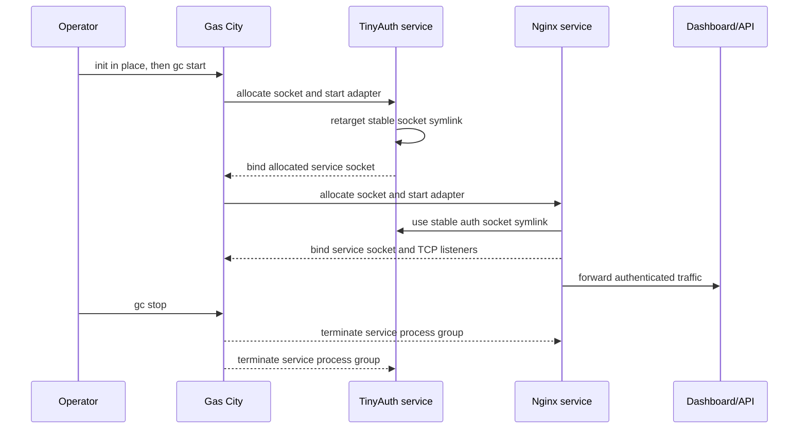
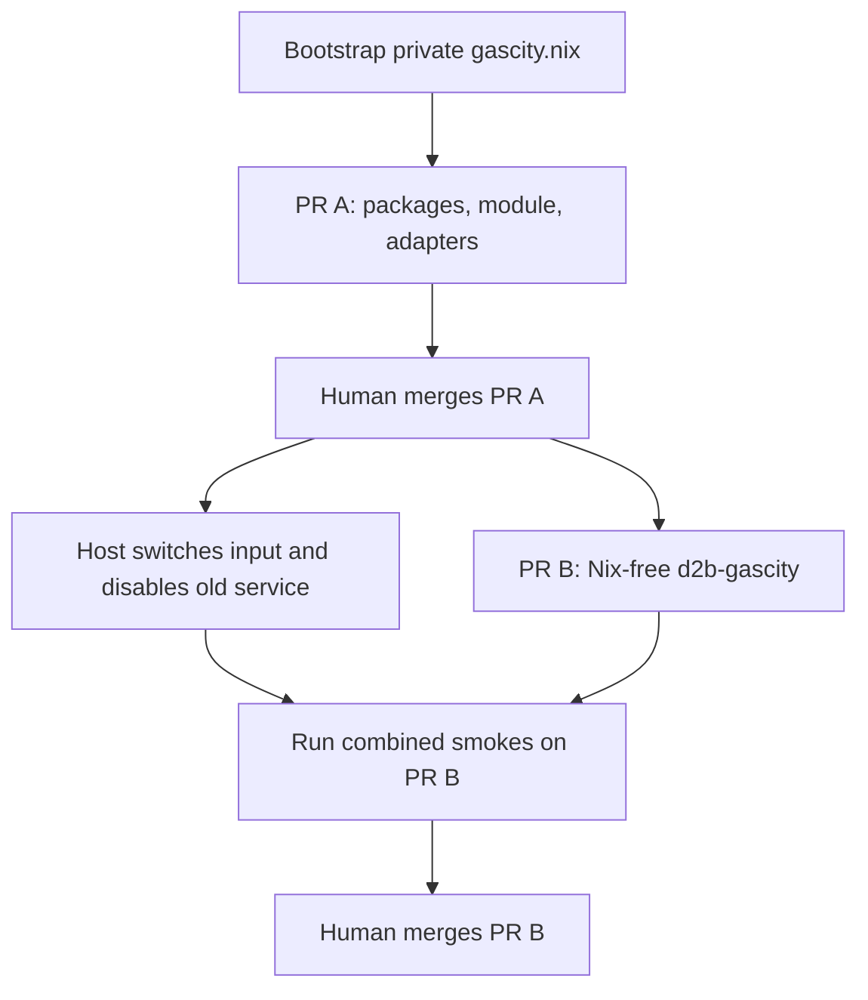

# Native Gas City Distribution and City Configuration - Plan

## Goal Capsule

- **Objective:** Deliver one native Gas City workflow through a generic `gascity.nix` distribution and a Nix-free `d2b-gascity` portable city, using upstream lifecycle, Pack v2, builtin Copilot, official Compound Engineering, official Discord, and official publication wherever the pinned releases support them.
- **Product authority:** `gascity.nix` owns Nix installation and optional host integration binaries. `d2b-gascity` owns the portable city, the d2b rig declaration, city services, and the two narrow `v3` workflow overrides. The d2b product repository remains the rig worktree and does not become another city-config repository.
- **Product Contract preservation:** R23, F1, and AE2 retain the native no-wrapper setup behavior but use in-place `gc init --file` because tagged source shows `gc init --from` copies repository metadata into the live city. F3 and AE3 now name the already-required user-owned supervisor-config link.
- **Execution profile:** Coding uses Luna at maximum effort. Planning and primary review use Grok 4.6 with high effort and long context.
- **Stop conditions:** Stop if the proxy needs a new relay or lifecycle owner, if native Compound Engineering cannot open a `v3` PR without restoring the publication worker, or if either repository would contain private host values or runtime state.
- **Tail ownership:** LFG may create the private `gascity.nix` repository and open both implementation PRs. A human owns merge order and host cutover.
- **Open blockers:** None.

---

## Product Contract

### Summary

Create `gascity.nix` as an inert Nix distribution for Gas City and its core dependencies, with optional integration and authenticated-ingress binaries.
Refocus `d2b-gascity` into the repository-root portable city that a user initializes with native `gc`, binds to a d2b checkout, and exercises through official Compound Engineering to a `v3` pull request.

### Problem Frame

The current repository combines portable city configuration with Nix packaging, a dedicated system identity, a host-wide supervisor, bootstrap and operator wrappers, compatibility proxies, provider and publication executables, generated inventories, and deployment-heavy verification.
That coupling obscures Gas City's native workflow and makes host installation, city configuration, and d2b-specific behavior harder to reason about independently.

Pinned Gas City already supplies local city initialization, per-user state, supervisor lifecycle, Pack v2 imports, rig binding, managed services, builtin Copilot sessions, Discord integration, and Compound Engineering publication.
The replacement should use those capabilities directly and retain local behavior only where the pinned official workflows cannot honor d2b's non-default `v3` base or adapt stock proxy binaries to Gas City's service socket contract.

### Key Decisions

- **Split distribution from city configuration.** (session-settled: user-directed - chosen over retaining Nix and host deployment inside `d2b-gascity`: the two repositories form one native workflow with clear ownership.) Governs R1-R4.
- **Use the recipe layout at repository root.** (session-settled: user-directed - chosen over keeping a `city/` subdirectory: the portable repository itself should be the city source.) Governs R3, R20-R22.
- **Use native per-user lifecycle and state.** (session-settled: user-directed - chosen over a dedicated `/var` identity and system supervisor: the invoking user should run normal `gc` commands with Gas City's supported state.) Governs R8-R12.
- **Accept native supervisor persistence after first start.** (session-settled: user-directed - chosen over an inert delegated user unit: installation stays inert, but the first manual `gc start` may enable Gas City's user unit and linger.) Governs R9-R11.
- **Keep integrations optional in the installer.** (session-settled: user-directed - chosen over a complete d2b runtime by default: Copilot CLI and `gh` may come from `gascity.nix` or another installation.) Governs R6-R7, R31.
- **Include the proxy pack by default.** (session-settled: user-directed - chosen over a separate enable-time import: core-only hosts may report degraded proxy services while the city still starts.) Governs R13-R15.
- **Use builtin Copilot and official publication.** (session-settled: user-directed - chosen over ACP and custom publication executables: model selection remains native and the city carries only the prompt-level `v3` delta.) Governs R24-R29.
- **Keep d2b on `v3` without changing its remote default.** (session-settled: user-directed - chosen over changing the d2b default branch: two city-owned Pack v2 assets select `v3` for worktree preparation and PR creation.) Governs R27-R29.
- **Use Discord gateway-only operation.** (session-settled: user-directed - chosen over publishing public Interactions: app credentials and mappings remain live site state.) Governs R25.

### Supersession

This plan supersedes the parts of `docs/plans/2026-08-14-001-refactor-standalone-gas-city-repository-plan.md` that assign Nix packaging, a NixOS lifecycle module, dedicated system users, `/var` state, a system supervisor, authenticated ingress units, ACP adaptation, publication workers, generated inventories, and deployment or delivery verification to `d2b-gascity`.

The earlier plan remains historical context for the private city, d2b `v3` targeting, official-pack preference, privacy boundary, and human-owned merge decisions where those points do not conflict with this plan.

<!-- ce-section: work-relationships -->
### How This Work Fits Together

This Product Contract owns one end-to-end outcome delivered through two repositories.
The boundary is a current decision, not permission for either repository to absorb the other's responsibilities later.

- **`gascity.nix` enables:** Native Gas City execution on NixOS, optional provider and GitHub binaries, and optional authenticated ingress binaries and host configuration.
- **`d2b-gascity` consumes:** The installed commands and supplies the complete portable city and authored d2b rig behavior.
- **d2b supplies:** The product checkout bound by native `gc rig add`; it does not supply city, provider, service, or imported-pack configuration.
- **The consuming `/etc/nixos` supplies:** Host-private ingress, login, network, and credential references to `gascity.nix`.

```mermaid
flowchart TB
  H[/etc/nixos host configuration] --> N[gascity.nix runtime and optional proxy binaries]
  N --> U[User-owned Gas City runtime]
  C[d2b-gascity portable city] --> U
  U --> R[d2b rig checkout]
  U --> P[TinyAuth and Nginx city services]
  P --> D[Embedded Gas City dashboard and API]
```

### Actors

- A1. **NixOS host owner:** Imports `gascity.nix` and supplies host-local package, proxy, login, hostname, port, interface, CIDR, and credential settings.
- A2. **Gas City operator:** Initializes the portable city, starts it under their UID, adds the d2b rig, diagnoses services, and slings work.
- A3. **Gas City supervisor:** Uses the operator's native `GC_HOME`, reconciles registered cities, and owns city controllers and Pack v2 services.
- A4. **d2b-gascity city:** Declares imports, providers, services, the d2b rig, and the narrow `v3` workflow overrides.
- A5. **d2b rig:** Receives worktrees and pull requests based on `v3`.
- A6. **External TLS proxy:** Forwards the configured dashboard and authentication authorities to the host ingress listeners when remote access is enabled.

### Requirements

**Repository ownership**

- R1. Create a separate `gascity.nix` repository that owns Nix packaging, optional integration packages, and host-consumed authenticated-ingress configuration without owning any city or rig definition.
- R2. Remove Nix expressions, NixOS modules, host services, executable provider and publication adapters, bootstrap and operator wrappers, generated inventories, and deployment-heavy test machinery from `d2b-gascity`.
- R3. Make `d2b-gascity` a Nix-free portable city whose active native files and Pack v2 assets live at repository root.
- R4. Keep host-private configuration, credentials, live `.gc` and `.beads` state, databases, worktrees, logs, and copied runtime payloads out of both repositories.

**gascity.nix core distribution**

- R5. The default distribution installs the pinned Gas City binary and the upstream-required core runtime dependencies for native city initialization, Pack v2, tmux sessions, Git, Beads, and managed Dolt operation.
- R6. Copilot CLI and `gh` are optional packages rather than core dependencies, and a compatible executable supplied through another Nix or host source remains supported.
- R7. Authenticated-ingress support is optional and installs the pinned TinyAuth and Nginx binaries plus only the minimal adapters needed to execute them as Gas City `proxy_process` services.
- R8. Installing or enabling the Nix distribution starts no Gas City supervisor, city, TinyAuth process, Nginx process, or custom lifecycle service.
- R9. A user starts the city with native `gc start` under their own UID, using Gas City's default per-user `GC_HOME` and the live city's `.gc` state.
- R10. The first manual start may install and enable Gas City's native user supervisor and linger; subsequent login or reboot recovery of a still-registered city is accepted upstream behavior.
- R11. Native `gc stop` stops and unregisters the city and its city services without requiring a repository-specific operator wrapper.
- R12. No dedicated Gas City system identity, host-wide `/var` state root, delegated system supervisor, compatibility API listener, or second Gas City lifecycle owner is introduced.

**Authenticated ingress**

- R13. The portable city's resolved Pack v2 graph includes the authenticated-ingress service definitions by default; if the optional binaries or host configuration are absent, only those services become visibly degraded and the rest of the city remains usable.
- R14. TinyAuth and Nginx run as separate native `proxy_process` services under the Gas City operator's UID, use Gas City's service state and secrets directories, restart through the native service manager, and close with the city.
- R15. The service adapters only translate Gas City's dynamic service socket and host-rendered configuration into stock TinyAuth and Nginx execution; they do not proxy traffic, supervise another Gas City, or persist an independent lifecycle database.
- R16. The consuming `/etc/nixos` configuration supplies the existing dashboard and authentication hostnames, dashboard port `8373`, authentication port `8374`, admitted interface and CIDRs, users and password hashes, and any credential paths or external proxy settings.
- R17. No host authority, private address, user identifier, hash, CIDR, or credential path is committed to either source repository.
- R18. The enabled proxy preserves the existing login page, secure cookies, bounded idle and absolute session lifetimes, login retry and timeout controls, logout and reauthentication behavior, and source admission.
- R19. The enabled proxy preserves methods, request bodies, Host, Origin, Referer, `Sec-Fetch-Site`, `X-GC-Request`, cookies, SPA and API routes, SSE, reconnect behavior, and `Last-Event-ID` while forwarding to the loopback Gas City supervisor listener.

**Portable city and rig**

- R20. Repository-root `city.toml` declares exactly one d2b rig named `d2b`, with prefix `d2b`, default branch `v3`, no committed machine path, and no obsolete compatibility API listener.
- R21. Repository-root `pack.toml` imports official core/Beads behavior, Compound Engineering, and Discord, and includes the city-owned authenticated-ingress service definitions through Pack v2.
- R22. Repository-root `packs.lock` is generated through native import tooling and pins every imported source consistently with the selected Gas City and official-pack releases.
- R23. Native in-place `gc init --file` preserves the portable root configuration without a bootstrap wrapper, and native `gc rig add` binds the d2b checkout as `d2b` in `.gc/site.toml`.
- R24. Planning and review roles use builtin Copilot with Grok 4.6, high effort, and long context; coding roles use builtin Copilot with Luna at maximum effort.
- R25. The city imports the official Discord pack for gateway operation only; app credentials, guild/channel/user mappings, and service data remain site-local and no public Interactions endpoint is published.
- R26. The official Compound Engineering and `gascity/roles` assets remain imported rather than copied, and local agent patches are limited to model/provider routing that the portable city actually requires.
- R27. One city-owned Pack v2 worktree asset explicitly prepares Compound Engineering work from `origin/v3` because the pinned official `do-work` asset follows the d2b remote default.
- R28. Official Compound Engineering publication remains opt-in through its native `push` and `open_pr` variables, and no publication worker, PR database, or custom GitHub lifecycle executable is retained.
- R29. One city-owned Pack v2 publication prompt makes `v3` the explicit PR base; the basic end-to-end acceptance run must prove the resulting PR uses `v3`.
- R30. Native `gc rig add` may create its supported `.gitignore`, Beads identity, and runtime bookkeeping in d2b, but no separately authored city, provider, pack, or service configuration is added to the product repository.

**Validation**

- R31. Basic checks cover package and dependency presence, portable configuration and lock validity, native initialization and rig binding, proxy lifecycle and authenticated forwarding, and one representative Compound Engineering-to-PR flow.
- R32. The repositories do not add delivery-verification agents, publication verification workers, generated repository inventories, broad policy harnesses, or live private integration payloads as proof machinery.
- R33. The real end-to-end proof may require optional Copilot CLI, `gh`, credentials, and network access, but those integrations remain replaceable host inputs rather than core package ownership.

### Key Flows

- F1. Install and initialize
  - **Trigger:** A NixOS user wants a local d2b Gas City.
  - **Actors:** A1, A2, A3, A4
  - **Steps:** The host installs the inert Gas City core through `gascity.nix`; the operator obtains `d2b-gascity`; native in-place `gc init --file` preserves its authored Pack v2 files; the operator manually runs `gc start`.
  - **Outcome:** The city runs under the operator's UID with native per-user state and no repository-specific bootstrap or system lifecycle.
  - **Covered by:** R1-R12, R20-R23
- F2. Bind and exercise d2b
  - **Trigger:** The operator has a local d2b checkout.
  - **Actors:** A2, A3, A4, A5
  - **Steps:** Native `gc rig add` binds the checkout as `d2b`; the operator creates a simple work item and slings official `compound-build` with push and PR publication enabled.
  - **Outcome:** Builtin Copilot executes official Compound Engineering in a worktree based on `origin/v3` and opens a PR against `v3`.
  - **Covered by:** R20-R30, R33
- F3. Start authenticated ingress
  - **Trigger:** The host enables proxy binaries and configuration and the operator starts the city.
  - **Actors:** A1, A2, A3, A6
  - **Steps:** The operator links the host-rendered supervisor config into their `GC_HOME`; Gas City starts TinyAuth and Nginx; Nginx exposes the configured authentication and dashboard listeners; an authenticated browser reaches the embedded supervisor SPA, APIs, and event stream.
  - **Outcome:** Remote ingress is available only while the city services are running and uses the existing login and forwarding contract.
  - **Covered by:** R7-R19
- F4. Run without optional integrations
  - **Trigger:** A host installs only the core distribution.
  - **Actors:** A1, A2, A3
  - **Steps:** The operator initializes and starts the city without proxy, Copilot, or `gh` binaries.
  - **Outcome:** Core Gas City starts; unavailable optional capabilities are explicit, and missing proxy binaries degrade only the imported proxy services.
  - **Covered by:** R5-R8, R13, R31-R33
- F5. Recover through native lifecycle
  - **Trigger:** The user logs in or the host reboots after the native user supervisor was enabled by a prior start.
  - **Actors:** A2, A3
  - **Steps:** Gas City's native user supervisor restarts and reconciles registered cities and their available services.
  - **Outcome:** The same user-owned city and service state returns without a custom host-wide lifecycle.
  - **Covered by:** R9-R15

### Acceptance Examples

- AE1. Inert core install
  - **Covers R5-R12.**
  - **Given:** A NixOS host has enabled the default `gascity.nix` distribution for a user who has never started Gas City.
  - **When:** The new system generation becomes active.
  - **Then:** `gc` and its core dependencies are on PATH, no Gas City or proxy process is running, and no dedicated Gas City `/var` state or system identity exists.
- AE2. Native city and rig setup
  - **Covers R20-R23, R30.**
  - **Given:** The operator has a clean portable `d2b-gascity` source and a d2b checkout.
  - **When:** The operator initializes the portable repository in place with native `gc init --file`, starts it, and adds the checkout with native `gc rig add`.
  - **Then:** The city validates and reconciles, the path exists only in live `.gc/site.toml`, and d2b contains only native rig bookkeeping.
- AE3. Enabled proxy lifecycle
  - **Covers R7, R13-R19.**
  - **Given:** `/etc/nixos` enables the optional proxy binaries and supplies generic host-local configuration and credentials, and the operator has linked the rendered supervisor config into `~/.gc/supervisor.toml`.
  - **When:** The city is stopped, started, exercised through login, and stopped again.
  - **Then:** Ingress is unavailable before start, unauthenticated access is denied after start, authenticated SPA/API/SSE access succeeds, and the ingress listeners disappear when the city stops.
- AE4. Core-only degradation
  - **Covers R5-R8, R13, R31-R33.**
  - **Given:** A host has only the core distribution and the portable city still imports the proxy pack.
  - **When:** The operator runs `gc start`.
  - **Then:** The city starts, proxy services report an actionable degraded state, and no silent fallback or substitute ingress process appears.
- AE5. Compound Engineering pull request
  - **Covers R6, R20-R30, R33.**
  - **Given:** Copilot CLI, `gh`, credentials, network access, a simple work item, and a d2b checkout whose remote default is not assumed to be `v3`.
  - **When:** The operator slings official `compound-build` through Gas City with native push and PR publication enabled.
  - **Then:** Builtin Copilot executes the imported Compound Engineering workflow, the worktree is based on `origin/v3`, official publication opens a pull request against `v3`, and no custom ACP or publication executable participates.
- AE6. Source and state boundary
  - **Covers R1-R4, R16-R17, R30, R32.**
  - **Given:** Both repositories are ready for review.
  - **When:** Their tracked files and staged diffs are inspected.
  - **Then:** No private host value, credential, runtime state, copied d2b product code, generated live payload, or delivery-verification machinery is present.

### Scope Boundaries

- Do not patch or fork Gas City, Compound Engineering, `gascity/roles`, Discord, TinyAuth, or Nginx.
- Do not create a custom Gas City lifecycle owner, durable relay service, ACP adapter, publication worker, bootstrap framework, operator RPC layer, or compatibility API.
- Do not move city or rig configuration into `gascity.nix` or d2b.
- Do not move Nix packaging, NixOS host integration, or host-private ingress values into `d2b-gascity`.
- Do not add public Discord Interactions, GitHub intake, automatic merge, or human-ownership replacement.
- Do not turn basic functional validation into delivery verification, broad policy enforcement, generated inventory governance, or a live private test harness.

### Dependencies and Assumptions

- Gas City v1.4.1, its compatible core/Beads assets, and the selected official gascity-packs revision remain the initial compatibility baseline.
- TinyAuth v5.1.3 supports Unix sockets, and Nginx supports simultaneous Unix and TCP listeners; adapters remain bounded to translating Gas City's service environment into those stock capabilities.
- The external TLS proxy remains separate deployment infrastructure and forwards only to host-configured authentication and dashboard listeners.
- The publication base override is prompt-level at the pinned official pack, so AE5 is the required observable proof that the resulting PR targets `v3`.
- Native Gas City may enable a user supervisor and linger after the first manual start; that persistence is accepted and must not be replaced with another lifecycle.

### Sources

- `docs/plans/2026-08-14-001-refactor-standalone-gas-city-repository-plan.md`
- `city/city.toml`
- `city/pack.toml`
- `nixos-modules/default.nix`
- `nixos-modules/ingress-relay.nix`
- `nixos-modules/options.nix`
- [Gas City v1.4.1 configuration recipes](https://github.com/gastownhall/gascity/blob/v1.4.1/docs/guides/gastown-config-recipes.md)
- [Gas City v1.4.1 initialization](https://github.com/gastownhall/gascity/blob/v1.4.1/cmd/gc/cmd_init.go)
- [Gas City v1.4.1 native supervisor lifecycle](https://github.com/gastownhall/gascity/blob/v1.4.1/cmd/gc/cmd_supervisor_lifecycle.go)
- [Gas City v1.4.1 Pack v2 service schema](https://github.com/gastownhall/gascity/blob/v1.4.1/internal/config/service.go)
- [Gas City v1.4.1 proxy process lifecycle](https://github.com/gastownhall/gascity/blob/v1.4.1/internal/workspacesvc/proxy_process.go)
- [Pinned Compound Engineering pack](https://github.com/gastownhall/gascity-packs/tree/5d2a9d023edbb9ba24fdcff554e89fc3d7da72fe/compound-engineering)
- [Pinned official publication formula](https://github.com/gastownhall/gascity-packs/blob/5d2a9d023edbb9ba24fdcff554e89fc3d7da72fe/gascity/formulas/publish.formula.toml)
- [TinyAuth v5.1.3 server configuration](https://github.com/tinyauthapp/tinyauth/blob/v5.1.3/internal/model/config.go)

---

## Planning Contract

### Key Technical Decisions

- KTD1. **Create and ship two private repositories through dependent PRs.** Bootstrap `vicondoa/gascity.nix` with only its README and Apache-2.0 license on the default branch, then place implementation on a feature branch. Merge its human-reviewed PR, switch the host flake input, and disable the old system service before the `d2b-gascity` cleanup PR can merge. Run combined smokes on that cleanup branch before human merge. (session-settled: user-directed - chosen over retaining one combined repository: distribution and city configuration need separate ownership.) Governs R1-R4.
- KTD2. **Expose a core runtime, optional packages, and an inert module.** `packages.default` is the core Gas City runtime. Separate package outputs expose Copilot CLI, `gh`, TinyAuth, Nginx, and proxy adapters. The NixOS module only selects packages and renders host-owned configuration files; it defines no enabled service. (session-settled: user-directed - chosen over installing the complete d2b runtime by default: optional tools may come from another host source.) Governs R5-R12.
- KTD3. **Initialize the repository in place with native `gc`.** Use `gc init --file city.toml --preserve-existing --no-start .` in the portable repository. Do not use `gc init --from` because v1.4.1 copies `.git`, documentation, and other repository files into the destination. Governs R3, R8-R9, R20-R23.
- KTD4. **Run two stock proxy processes through bounded exec adapters.** Root `pack.toml` declares TinyAuth and Nginx as private `proxy_process` services from the same pack source with one shared service state root. Before exec, the TinyAuth adapter creates a fixed-name symlink in the shared run directory that targets its allocated socket. Nginx always authenticates through that stable symlink, so a TinyAuth restart can atomically retarget it without restarting a healthy Nginx process. Both adapters use a restrictive umask and exec stock binaries. Gas City owns readiness, retry, termination, and logs. (session-settled: user-approved - chosen over system-wide proxy units and a custom multiprocess relay: ingress must follow native city lifecycle.) Governs R7, R13-R19.
- KTD5. **Render host config outside user state and preserve owner-based admission.** The NixOS module renders non-secret proxy settings and a supervisor configuration under `/etc/gascity`. It accepts an operator user and host-managed credential-file paths, rejects store or malformed secret paths, and never copies secret content. Before first start, the operator places a user-owned link from `~/.gc/supervisor.toml` to the rendered supervisor file. The module keeps loopback `8372` and ingress response traffic restricted to the operator UID without starting any process. Nix never writes other `~/.gc` content. Governs R8-R9, R16-R19.
- KTD6. **Align bundled imports to the binary's canonical pin.** Pin core and Beads imports to `sha:f895c0ff47d6ee9334ed282a416387eb5b084d24`, the canonical bundled-pack pin in Gas City v1.4.1. Keep Compound Engineering, Discord, and rig roles at `5d2a9d023edbb9ba24fdcff554e89fc3d7da72fe`, then regenerate `packs.lock` with native import tooling. Governs R5, R21-R22.
- KTD7. **Use the smallest builtin Copilot provider graph.** Keep provider profiles for Grok planning/review and Luna coding. Remove ACP transport, `session` clearing that does not change resolved transport, generated provider inventories, and patches that only route out-of-scope deployment-verification roles. Resolve imported roles through the workspace default plus targeted provider patches only where model class differs. (session-settled: user-directed - chosen over the ACP shim: builtin tmux retains model selection without custom transport.) Governs R6, R24, R26, R32-R33.
- KTD8. **Shadow only the two pinned workflow prompts that need `v3`.** Keep the `do-work` worktree preparation asset and shadow the `assets/workflows/build-base/publish.md` step executed by `compound-build`. That publisher prompt must honor `gc.publication.base_ref` and create the GitHub PR with base `v3`. Treat the rule as prompt-level and prove it through AE5. (session-settled: user-directed - chosen over changing d2b's remote default or retaining a publication worker: the city owns the narrow branch delta.) Governs R27-R29.
- KTD9. **Use basic contract checks plus two live smokes.** Automate package evaluation, root Pack v2 validation, native init/rig binding, adapter behavior, and degraded optional services. Keep authenticated browser ingress and credentialed Compound Engineering publication as bounded live smokes with redacted output and no committed report. (session-settled: user-approved - chosen over the current delivery-verification harness: proof should validate native behavior without becoming another subsystem.) Governs R31-R33.

### High-Level Technical Design

The final component boundary is:

```mermaid
flowchart TB
  HC[/etc/nixos host values] --> GM[gascity.nix module]
  GM --> CP[Core and optional packages]
  GM --> EC[/etc/gascity rendered config]
  CP --> GU[User-owned Gas City]
  EC --> TA[TinyAuth adapter]
  EC --> NG[Nginx adapter]
  DC[d2b-gascity root Pack v2 city] --> GU
  GU --> TA
  GU --> NG
  TA --> TS[TinyAuth Unix socket]
  NG --> TS
  NG --> GS[Gas City supervisor 127.0.0.1:8372]
  GU --> DR[d2b rig]
```

Native lifecycle and ingress sequencing are:



Cross-repository delivery uses this dependency order:



### Output Structure

**Target repo: `vicondoa/gascity.nix`**

```text
.
|-- flake.nix
|-- flake.lock
|-- LICENSE
|-- NOTICE
|-- PROVENANCE.md
|-- README.md
|-- SECURITY.md
|-- nix/
|   |-- packages/
|   |   |-- beads.nix
|   |   |-- dolt.nix
|   |   `-- gascity.nix
|   |-- proxy-adapters.nix
|   `-- runtime.nix
|-- nixosModules/
|   `-- default.nix
|-- proxy/
|   |-- nginx.conf.in
|   |-- gascity-nginx-service
|   `-- gascity-tinyauth-service
`-- tests/
    |-- module.nix
    |-- package.nix
    `-- proxy_adapters.py
```

**Target repo: `vicondoa/d2b-gascity`**

```text
.
|-- city.toml
|-- pack.toml
|-- packs.lock
|-- assets/
|   `-- workflows/
|       |-- build-base/publish.md
|       `-- do-work/prepare-worktree.md
|-- docs/
|   |-- operations.md
|   `-- testing.md
|-- tests/
|   `-- test_city.py
|-- .github/workflows/check.yml
|-- .gitignore
|-- AGENTS.md
|-- CONTRIBUTING.md
|-- LICENSE
|-- PROVENANCE.md
|-- README.md
`-- SECURITY.md
```

### Implementation Constraints

- Gas City v1.4.1 supports `x86_64-linux` through the selected release artifact. Do not add an unverified architecture build.
- TinyAuth listens on its Gas City Unix socket only. Nginx owns external TCP listeners and fails closed when TinyAuth is absent or unhealthy.
- Service state and run directories are mode `0700`. Adapters use a restrictive umask, validate the fixed rendezvous path, and never bind ingress without an active `auth_request` configuration.
- Nix store content is not secret. Options accept secret-file paths and never inline password hashes or tokens.
- Secret-file options reject relative paths, control characters, and `/nix/store` paths. Adapters pass paths only and never copy secret content into `/etc/gascity`, service state, argv, or logs.
- One operator UID owns the live listeners on ports `8372`, `8373`, and `8374`. Host firewall policy drops non-operator loopback access to `8372` and non-operator responses from the ingress ports.
- The rendered supervisor configuration binds `127.0.0.1:8372`, allows loopback and the dashboard hostname, and omits publication, mutation, origin, and grant-auth overrides.
- The official Discord import may create local Interactions and admin services. Gateway-only means no public base domain, external route, or Discord Interactions registration.
- The external TLS proxy remains outside both repositories.
- No unit writes or copies live proof payloads, prompts, model responses, PR bodies, service logs, or runtime state into source control.

### Assumptions

- The authenticated GitHub identity may create the private `vicondoa/gascity.nix` repository and configure its default branch for PR-only implementation changes.
- The Gas City operator can read the host-managed TinyAuth users file and bind the configured unprivileged ingress ports.
- The external TLS proxy and private network admission remain available at host cutover.
- Copilot CLI accepts the configured model, context, and effort arguments; U4 validation and AE5 stop if the installed optional binary does not.
- GitHub credentials used by AE5 can be limited to `vicondoa/d2b` content and pull-request writes without merge, force-push, or ruleset-bypass capability.

### Phased Delivery

1. **Distribution foundation:** Bootstrap `gascity.nix`, land U1-U3, U6, and U7 through PR A, then obtain human merge.
2. **Host cutover:** Switch the host flake input to merged `gascity.nix`, provide the supervisor-config link, and disable the old `d2b-gascity` system service.
3. **Portable city cutover:** Land U4, U5, U9, and U8 on PR B. Run AE3 and AE5 on that branch without committed evidence, then obtain human merge.

### System-Wide Impact

- **Lifecycle:** Gas City moves from a host-wide system identity to each operator's native user supervisor and state.
- **Authentication:** TinyAuth and Nginx retain the current browser contract but move under city service lifecycle.
- **Host admission:** NixOS firewall policy continues to restrict supervisor and ingress traffic to the configured operator UID and admitted external sources.
- **Agent workspace:** Operators and builtin Copilot share the same city, Beads store, rig binding, worktrees, and publication metadata.
- **Repository operations:** One new private repository and two dependent PRs replace one combined infrastructure repository.
- **Host configuration:** Private authorities, users, hashes, CIDRs, and interfaces remain in the consuming `/etc/nixos` configuration.

### Risks and Mitigations

| Risk | Mitigation |
|---|---|
| TinyAuth and Nginx receive different dynamic sockets | Use KTD4's validated stable symlink and test atomic retargeting after a TinyAuth restart. |
| Nginx starts before TinyAuth | Render `auth_request` unconditionally; missing TinyAuth fails closed until the stable socket target appears. |
| Local users bypass authenticated ingress or hijack stopped listeners | Apply KTD5 owner-based firewall rules and stop if an old service or another UID occupies `8372`, `8373`, or `8374`. |
| Host config cannot be merged automatically into native user state | Render one constrained supervisor file under `/etc/gascity` and require the one-time user-owned link from KTD5. |
| Secret paths leak through the Nix store or service state | Reject store and malformed paths, pass path references only, and test that hashes and tokens are absent from outputs and logs. |
| Prompt-level publication ignores `v3` | Shadow the `build-base/publish.md` step executed by `compound-build` and stop on an AE5 base mismatch. |
| Publication credentials are broader than required | Require repository-scoped content and PR write access with no merge or force capability; never persist credentials in city or Nix artifacts. |
| Core/Beads pin drift causes network-only imports | Use KTD6 and regenerate the lock with the pinned binary. |
| Discord's public-intent service is present | Leave publication unconfigured and expose no route or Interactions URL. |
| New repository shipping bypasses human review | Keep product code off its bootstrap commit and require PR A before PR B merge. |
| Cleanup removes the host's active flake input | Merge PR A and switch the host to `gascity.nix` before PR B can remove old packaging. |

### Sources and Research

- Gas City v1.4.1 `internal/config/public_packs.go` defines the canonical core/Beads pin in KTD6.
- Gas City v1.4.1 `cmd/gc/cmd_init.go` shows that `--from` copies all repository content except runtime state and test shims, which drives KTD3.
- Gas City v1.4.1 `internal/workspacesvc/proxy_process.go` defines the socket, readiness, retry, signal, and logging contract in KTD4.
- Gas City v1.4.1 `internal/config/site_binding.go` keeps rig paths in `.gc/site.toml`.
- TinyAuth v5.1.3 `internal/bootstrap/router_bootstrap.go` defines Unix-or-TCP listener behavior.
- Nginx `auth_request`, `listen`, and proxy buffering documentation define fail-closed auth and SSE behavior.
- Pinned Compound Engineering `compound-build` and official `publish` formulas define the AE5 launch and opt-in publication variables.
- No institutional solutions corpus exists in this repository.

---

## Implementation Units

### U1. Bootstrap gascity.nix and package the core runtime

- **Target repo:** `vicondoa/gascity.nix`
- **Goal:** Create the private repository baseline and an inert core Gas City runtime.
- **Requirements:** R1, R4-R5, R8, R12, R17, R31-R32
- **Dependencies:** None
- **Files:** `flake.nix`, `flake.lock`, `nix/packages/gascity.nix`, `nix/packages/beads.nix`, `nix/packages/dolt.nix`, `nix/runtime.nix`, `tests/package.nix`, `LICENSE`, `NOTICE`, `PROVENANCE.md`
- **Approach:**
  1. Bootstrap the private repository with only governance files on the default branch, then create the implementation branch.
  2. Configure the default branch so implementation changes require human-reviewed PRs.
  3. Extract the existing release-tarball package expressions without city assets or d2b wrappers.
  4. Compose `packages.default` from Gas City, Beads, Dolt, tmux, jq, Git, util-linux, coreutils, and CA certificates.
  5. Expose the component packages and a default overlay.
  6. Preserve upstream licenses and source provenance.
- **Execution note:** This is packaging work. Prefer build and PATH smoke evidence over a new test framework.
- **Patterns to follow:** `nix/packages/gascity.nix`, `nix/packages/beads.nix`, `nix/packages/dolt.nix`, and existing flake pin extraction.
- **Test scenarios:**
  - Covers AE1. Building the default package exposes `gc` v1.4.1 and each mandatory core command.
  - Evaluating the flake creates no systemd unit, user, `/var` path, or runtime state.
  - An unsupported platform fails evaluation with a clear platform constraint instead of selecting the Linux archive.
  - Package metadata and notices identify upstream licenses without relicensing imported binaries.
- **Verification:** The default package builds, its command closure is complete, and installation remains inert.

### U2. Add optional packages and the inert NixOS module

- **Target repo:** `vicondoa/gascity.nix`
- **Goal:** Let a host select optional integrations and render proxy settings without starting processes or owning user state.
- **Requirements:** R6-R12, R16-R19, R33
- **Dependencies:** U1
- **Files:** `flake.nix`, `nixosModules/default.nix`, `tests/module.nix`, `README.md`
- **Approach:**
  1. Expose optional Copilot CLI, `gh`, TinyAuth, Nginx, and adapter package outputs independently from the core runtime.
  2. Define `programs.gascity` options for core installation, optional package selection, operator user, and optional proxy settings.
  3. Render non-secret proxy settings and a constrained loopback supervisor file under `/etc/gascity`.
  4. Accept host-managed credential-file paths, reject store or malformed paths, and never copy their content.
  5. Require distinct dashboard and authentication hosts, with the authentication host exactly one label below the dashboard host for parent-domain cookies.
  6. Require an enabled compatible firewall backend, then preserve source CIDR admission and owner-based rules for supervisor and ingress traffic.
  7. Add packages and firewall policy only; define no service or activation that starts Gas City or ingress.
- **Patterns to follow:** NixOS option assertions in `nixos-modules/options.nix`; package override resolution in `nixos-modules/ingress-relay.nix`; KTD2 and KTD5.
- **Test scenarios:**
  - Covers AE1. Enabling only core adds the runtime package and creates no service, user, `/var` state, or proxy config.
  - Supplying optional Copilot or `gh` packages adds them independently and accepts host-provided alternatives.
  - Enabling proxy support requires generic hostnames, ports, CIDRs, and a users-file path but never reads the users file during evaluation.
  - Module evaluation rejects a disabled or incompatible firewall, invalid listener, port collision, missing operator, missing hostname, relative or store-backed secret path, or missing users-file path.
  - Module evaluation rejects equal, unrelated, or too-deep authentication hostnames and accepts exactly one additional auth label below the dashboard host.
  - The rendered supervisor file binds `127.0.0.1:8372`, includes the dashboard host, and contains no publication, mutation, origin, or grant-auth override.
  - Firewall evaluation restricts loopback `8372` and ingress-port responses to the configured operator UID while retaining source CIDR admission.
  - Rendered Nix output contains no password hash, token, or credential content.
- **Verification:** Module evaluation proves inert defaults, option independence, host-only values, and no systemd ownership.

### U3. Implement native TinyAuth and Nginx service adapters

- **Target repo:** `vicondoa/gascity.nix`
- **Goal:** Adapt stock TinyAuth and Nginx to Gas City's `proxy_process` contract without creating another lifecycle.
- **Requirements:** R7, R13-R19, R31-R32
- **Dependencies:** U2
- **Files:** `proxy/gascity-tinyauth-service`, `proxy/gascity-nginx-service`, `proxy/nginx.conf.in`, `nix/proxy-adapters.nix`, `tests/proxy_adapters.py`
- **Approach:**
  1. Validate the required `GC_SERVICE_*` environment and `/etc/gascity` inputs before spawning a child.
  2. Have the TinyAuth adapter require an operator-readable `0600` users file and configure its allocated socket, service-state SQLite database, and current session policy.
  3. Set state and run directories to mode `0700`, use a restrictive umask, and atomically retarget the fixed TinyAuth socket symlink before exec.
  4. Have the Nginx adapter validate the stable symlink, render a runtime-only config with unconditional `auth_request`, and bind its Gas City socket plus ports `8373` and `8374`.
  5. Preserve current source admission, login throttling, auth redirect, header, method, body, cookie, SPA/API, SSE, and reconnect behavior.
  6. Install the stable `gascity-tinyauth-service` and `gascity-nginx-service` command names on PATH.
  7. Exec stock binaries in the foreground so Gas City remains the process owner.
- **Execution note:** Start with adapter contract tests and a fail-closed TinyAuth-down characterization before moving the ingress config.
- **Patterns to follow:** `nixos-modules/ingress-relay.nix`, `operator/proxy/nginx.conf.example`, Gas City v1.4.1 `proxy_process.go`, and TinyAuth v5.1.3 Unix listener behavior.
- **Test scenarios:**
  - Covers AE3. TinyAuth binds the exact Gas City socket and stores its database under the service state root.
  - Covers AE3. Nginx binds its Gas City socket and both configured TCP listeners with authentication targeted through the stable TinyAuth symlink.
  - Covers AE3. An unauthenticated dashboard request redirects to login; a valid session reaches SPA, API, and SSE routes.
  - TinyAuth absence, a missing or invalid rendezvous, invalid users configuration, or an unreadable users file denies access and never produces an unauthenticated ingress listener.
  - A process restart reuses its allocated Gas City socket and recreates the fixed symlink; a service-instance recreation may allocate a new socket and atomically retarget the symlink.
  - Another UID cannot traverse the service state, connect to TinyAuth's socket, or read its SQLite database.
  - Host, Origin, CSRF, unsafe methods, cookies, request bodies, `Last-Event-ID`, and SSE buffering match the current ingress contract.
  - No secret value appears in argv, generated Nix store files, or adapter logs.
- **Verification:** Adapter tests prove socket ownership, fail-closed authentication, native restart compatibility, and preserved forwarding behavior.

### U4. Convert d2b-gascity to the root portable city

- **Target repo:** `vicondoa/d2b-gascity`
- **Goal:** Make the repository itself the minimal Pack v2 city and rig configuration.
- **Requirements:** R3-R4, R13-R15, R20-R30, R32-R33
- **Dependencies:** U3
- **Files:** `city.toml`, `pack.toml`, `packs.lock`, `assets/workflows/do-work/prepare-worktree.md`, `assets/workflows/build-base/publish.md`, `.gitignore`, `tests/test_city.py`; delete or move the corresponding `city/` paths
- **Approach:**
  1. Move the portable files and required assets to repository root.
  2. Remove `[api]`, `suspended_on_start`, placeholder directories, the custom Beads backup order, and unnecessary `session` patches.
  3. Keep one pathless `d2b` rig, set `default_branch = "v3"`, and retain only provider-routing patches needed for Grok planning/review and Luna coding.
  4. Declare private root `proxy_process` services that call `gascity-tinyauth-service` and `gascity-nginx-service` with one shared state root.
  5. Align core and Beads to KTD6, retain the official pack pins, and regenerate `packs.lock` with the pinned `gc`.
  6. Stop unless native composition proves the canonical core/Beads pin works with the selected Compound Engineering, Discord, and roles imports.
  7. Keep the worktree shadow and make the `compound-build` publish-stage shadow honor `gc.publication.base_ref` and create PRs against `v3`.
- **Execution note:** Validate the root Pack v2 graph before deleting the old subdirectory or generated composition fixtures.
- **Patterns to follow:** Pinned `gastown-config-recipes.md`, `city/city.toml`, `city/pack.toml`, `city/assets/workflows/do-work/prepare-worktree.md`, and KTD6-KTD8.
- **Test scenarios:**
  - Covers AE2. Root configuration validates, contains one pathless d2b rig, and has no compatibility API listener.
  - Native in-place init preserves root `pack.toml`, `packs.lock`, services, providers, and assets while creating ignored `.gc` state.
  - Native rig add writes only the d2b path to `.gc/site.toml` and supported Beads bookkeeping to the fixture rig.
  - The resolved provider graph uses builtin Copilot and contains no ACP transport or locally routed deployment-verification role.
  - Core and Beads resolve at the v1.4.1 canonical bundled pin, and native composition validates them with the selected official-pack commit.
  - The worktree asset selects `origin/v3`, and the `compound-build` publication stage names `v3` as the GitHub PR base.
  - Gateway-only Discord has no public base domain, external route, or committed site mapping.
- **Verification:** Native config/import checks and the focused city test pass from repository root with no generated inventory.

### U5. Remove superseded d2b-gascity infrastructure

- **Target repo:** `vicondoa/d2b-gascity`
- **Goal:** Delete every old implementation surface that no longer belongs to the portable city.
- **Requirements:** R2-R4, R8, R12, R17, R28, R30-R32
- **Dependencies:** U3, U4
- **Files:** delete `flake.nix`, `flake.lock`, `nix/`, `nixos-modules/`, `operator/`, `scripts/`, deployment-heavy `tests/`, `.github/workflows/update-generated.yml`, `city/role-provider-matrix.json`, and `city/worktree-producer-inventory.json`; simplify `Makefile` and `.github/workflows/check.yml`
- **Approach:**
  1. Remove Nix packaging after U1 provides the replacement distribution.
  2. Remove system lifecycle, `/var` state, API compatibility proxy, bootstrap/operator wrappers, ACP adapter, Discord wrapper, publication workers, inventory generation, rollback, and broad policy harnesses.
  3. Replace the current test runner with the focused basic checks from U4 and U6.
  4. Keep only CI that validates portable source and avoids credentials or live integrations.
- **Execution note:** Delete by ownership boundary, then use repository-wide searches to catch stale references. Do not translate old machinery into new wrappers.
- **Patterns to follow:** R2, R32, and the deletion map in planning research.
- **Test scenarios:**
  - Covers AE6. Tracked files contain no Nix, systemd, `/var/lib/d2b-gascity`, ACP, API `18372`, publication-worker, rollback, or generated-inventory implementation.
  - The reduced CI invokes only basic portable-city checks and needs no private credentials.
  - The root city still validates after all old bootstrap, composition, and packaging fixtures are gone.
- **Verification:** The repository tree matches the Product Contract boundary and the remaining checks pass without deleted helpers.

### U6. Add focused gascity.nix checks

- **Target repo:** `vicondoa/gascity.nix`
- **Goal:** Prove the distribution, module, and adapter contracts without rebuilding the former delivery-verification system.
- **Requirements:** R31-R33
- **Dependencies:** U1-U3
- **Files:** `tests/package.nix`, `tests/module.nix`, `tests/proxy_adapters.py`, `.github/workflows/check.yml`
- **Approach:**
  1. Keep Nix evaluation, package-presence, module-security, and adapter process/socket checks in this repository.
  2. Use temporary homes, sockets, and generic fixture values.
  3. Exclude live Copilot, GitHub, Discord, external TLS, and private host data from CI.
- **Execution note:** Prefer one small runner per repository. Do not reintroduce policy, inventory, or delivery-verification layers.
- **Patterns to follow:** Existing ingress behavior fixtures and portable-config assertions, reduced to direct contract tests.
- **Test scenarios:**
  - Covers AE1. Core package and inert module checks run on a clean evaluator.
  - Covers AE3. Adapter fixtures prove auth and SSE behavior without starting a host-wide Gas City service.
  - Module checks prove firewall rules name the configured operator UID, loopback `8372`, ingress response ports, and admitted source CIDRs.
  - Wrong Host, forged forwarded identity, invalid Origin or Referer, missing CSRF headers, TinyAuth failure, and an empty login redirect fail closed.
  - Covers AE6. Fixtures contain only generic authorities, identifiers, hashes, and `127.0.0.1`.
- **Verification:** CI runs only focused Nix and adapter checks and requires no secrets.

### U7. Document gascity.nix installation and host integration

- **Target repo:** `vicondoa/gascity.nix`
- **Goal:** Make core installation, optional packages, proxy enablement, and user-state boundaries operable without hidden steps.
- **Requirements:** R1, R5-R19, R31-R33
- **Dependencies:** U1-U3, U6
- **Files:** `README.md`, `SECURITY.md`, `PROVENANCE.md`, `NOTICE`
- **Approach:**
  1. Document core and optional flake outputs and the inert NixOS module.
  2. Show host-local proxy settings with generic placeholders only.
  3. Explain the users-file ownership requirement and one-time supervisor-config link.
  4. Explain operator UID firewall ownership, native first-start linger, city stop behavior, proxy degraded status, and external TLS ownership.
  5. Require secret files outside the Nix store with mode `0600`, and document repository-scoped GitHub credentials with no merge or force capability.
  6. Require TinyAuth users and SQLite session rotation while the city is stopped, and document the private plaintext hop from the external TLS proxy.
  7. Record component licenses and exact source pins.
- **Patterns to follow:** Existing `docs/dashboard-proxy.md` behavior, current security guidance, and KTD2-KTD5.
- **Test scenarios:** Test expectation: none - this unit documents behavior already verified by U1-U3 and U6.
- **Verification:** A cold NixOS operator can configure the host without adding city files, committing private values, or starting a custom service.

### U9. Add focused portable-city checks

- **Target repo:** `vicondoa/d2b-gascity`
- **Goal:** Prove root Pack v2, native init, rig binding, optional-service degradation, and source privacy without a delivery harness.
- **Requirements:** R20-R33
- **Dependencies:** U4, U5
- **Files:** `tests/test_city.py`, `.github/workflows/check.yml`
- **Approach:**
  1. Validate the root configuration, canonical core/Beads pin, official imports, proxy service declarations, and the two `v3` assets.
  2. Have CI download the official Gas City v1.4.1 Linux archive, verify its pinned hash, and use that `gc` for native checks.
  3. Exercise in-place no-start init and rig binding with temporary homes and repositories.
  4. Assert that missing optional proxy executables degrade only those services.
  5. Use generic fixtures and exclude live Copilot, GitHub, Discord, external TLS, and private host data.
- **Execution note:** Keep one standard-library test module and one CI command. Do not recreate policy or generated-inventory layers.
- **Patterns to follow:** The direct portable-config assertions that survive U5, KTD3, KTD6, and KTD8.
- **Test scenarios:**
  - Covers AE2. Native init preserves authored root files, and rig binding writes the path only to ignored site state.
  - Covers AE4. Missing proxy adapters yield visible degraded services while core city status remains healthy.
  - The resolved graph contains builtin Copilot and no local ACP or deployment-verification routing.
  - The worktree and `compound-build` publish prompts both select `v3`.
  - Covers AE6. Fixtures contain only generic values and no runtime state is tracked.
- **Verification:** The reduced d2b-gascity CI validates portable city behavior with no secrets or deleted helpers.

### U8. Rewrite d2b-gascity operations and privacy guidance

- **Target repo:** `vicondoa/d2b-gascity`
- **Goal:** Document only the portable city workflow and remove every stale system-deployment instruction.
- **Requirements:** R2-R4, R17, R20-R33
- **Dependencies:** U4, U5, U9
- **Files:** `README.md`, `AGENTS.md`, `CONTRIBUTING.md`, `SECURITY.md`, `PROVENANCE.md`, `docs/operations.md`, `docs/testing.md`, `.gitignore`; delete obsolete bootstrap, rollback, ACP, ingress-feasibility, architecture, and proxy documents
- **Approach:**
  1. Document in-place native init, native start, native rig add, Discord import, service diagnosis, and focused tests.
  2. Document the official `compound-build` launch variables and the live AE5 stop condition without storing prompts or outputs.
  3. Point Nix and proxy-binary installation to `gascity.nix`.
  4. Preserve the strict privacy and human-merge boundaries.
  5. Require GitHub credentials scoped to `vicondoa/d2b` content and PR writes with no merge or force capability.
  6. Remove tracked private authorities, real d2b tip values, `/var` paths, API `18372`, ACP, and publication-worker guidance.
- **Patterns to follow:** The Product Contract, current privacy policy, and upstream native command documentation.
- **Test scenarios:** Test expectation: none - this unit documents and removes stale guidance after behavioral checks exist.
- **Verification:** Repository documentation describes one native portable city and contains no private or superseded deployment detail.

---

## Verification Contract

| Gate | Target | Required outcome |
|---|---|---|
| `nix flake check` | `gascity.nix` | Core package, module evaluation, and proxy adapter checks pass without starting services. |
| Focused Python unit tests | Both repositories | Adapter and portable-city tests pass with temporary generic fixtures. |
| Native config/import check | `d2b-gascity` | Root config validates and all imports resolve at the planned pins. |
| Native init/rig smoke | `d2b-gascity` | In-place no-start init preserves authored files, start succeeds, and rig path lands only in `.gc/site.toml`. |
| Core-only smoke | Combined | Missing optional proxy binaries degrade only those services and leave core city status healthy. |
| Host admission smoke | Combined host | The old system unit and foreign UIDs cannot own or reach `8372`-`8374`; only the configured operator and admitted external sources pass. |
| Authenticated ingress smoke | Combined host | Before start the listeners are absent; after start login, SPA, API, SSE, and reconnect work; TinyAuth failure denies access; after stop listeners are absent. |
| Compound Engineering smoke | d2b rig | A native `compound-build` sling with `push=true` and `open_pr=true` creates a worktree from `origin/v3` and a `vicondoa/d2b` PR whose base is `v3`. |
| Staged privacy review | Both repositories | No private host value, credential, runtime state, live payload, or copied d2b product code is staged. |

The Compound Engineering smoke uses `gc.run-operator`, `compound-build`, autonomous interaction, agent review, separate drain, and opt-in push and PR publication.
The operator selects a small non-sensitive d2b work item.
Its credential has repository-scoped content and PR write access with no merge, force-push, or ruleset-bypass capability.
If the repository or PR base is not `vicondoa/d2b` and `v3`, implementation stops without adding a worker or changing the remote default.

---

## Definition of Done

- The Product Contract remains preserved except for the documented R23, F1, and AE2 native-init implementation correction.
- U1-U3, U6, and U7 are present in a private `gascity.nix` PR with focused checks passing.
- U4, U5, U9, and U8 are present in a `d2b-gascity` PR that depends on the `gascity.nix` PR.
- `gascity.nix` installs the core runtime inertly and exposes optional packages without owning a city or user lifecycle.
- `d2b-gascity` contains only the root portable city, required assets, focused tests, governance, and operations documentation.
- Native Gas City owns supervisor, city, proxy service, retry, stop, and persistent user-state lifecycle.
- TinyAuth and Nginx preserve the current authenticated ingress contract and fail closed.
- Host firewall and file permissions prevent other UIDs from bypassing TinyAuth, reading service state, or hijacking admitted ingress traffic.
- The official Compound Engineering smoke opens a human-unmerged PR against d2b `v3` through builtin Copilot and official publication.
- Both repositories pass the Verification Contract with redacted or ephemeral live evidence.
- No abandoned staging code, obsolete wrapper, deleted-lifecycle reference, generated inventory, delivery-verification code, private value, or runtime artifact remains.
- Both PRs remain unmerged for human review, with the `gascity.nix` merge ordered before `d2b-gascity`.
