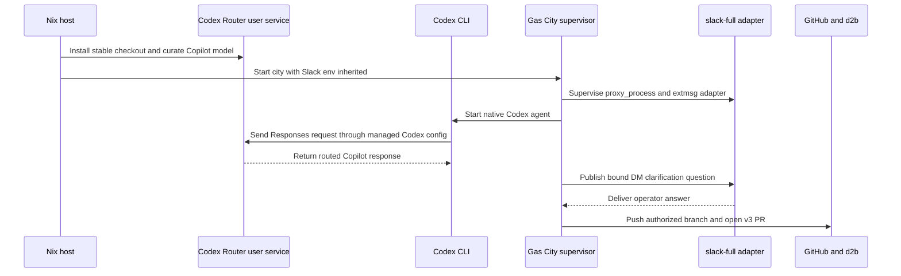

# Codex Router Copilot Slack Setup - Plan

## Goal Capsule

- **Objective:** Move the d2b Gas City setup from direct Copilot CLI agents to Gas City's native Codex provider routed through Codex Router and GitHub Copilot models, add stock Slack Full Pack question-and-answer scaffolding, and prove one real Compound Engineering request can open a d2b pull request.
- **Product authority:** `d2b-gascity` owns the portable city composition and workflows. The separate `gascity.nix` distribution owns host installation, runtime dependencies, router setup, and host-local values, and changes to that sibling repository are in scope.
- **Open blockers:** The operator must configure a Copilot Requests credential, a pull-request credential, and Slack app/channel values through host-local setup. The exact Copilot model is selected from the operator's live account catalog rather than assumed by the city.
- **Stop conditions:** Stop if the stock Gas City Codex provider or Slack Full Pack cannot complete the proof without adding a custom relay or second lifecycle owner.
- **Execution profile:** Cross-repository packaging and configuration work with a small runtime smoke proof. Do not add a verification harness.
- **Tail ownership:** The implementation owns changes in `d2b-gascity`, `gascity.nix`, and the permitted host configuration. Shipping must preserve the repository-specific ownership and privacy boundaries.

## Product Contract

### Summary

Provide one simple, user-owned Gas City workflow in which `codex` remains the agent command, Codex Router supplies the selected GitHub Copilot model, and Slack Full Pack carries one clarification exchange for a Compound Engineering run. The runtime proof is a small change against d2b `v3` that results in an opened pull request and no merge.

### Problem Frame

The current city starts agents through direct Copilot CLI provider profiles. That makes the host depend on the Copilot CLI as the agent runtime instead of using the Codex-compatible path that the requested router already manages.

The desired setup also needs a practical human question-and-answer loop. Slack Full Pack already provides external-message bindings and replies, but the setup must connect one coordinator session to Slack without inventing a new messaging service.

<!-- ce-section: work-relationships -->
### How This Work Fits Together

This plan owns the integrated host and city setup plus one end-to-end runtime proof. The broader breakdown below is the current understanding, not a committed roadmap.

- **Codex Router foundation:** Enables Gas City agents to use curated GitHub Copilot models through the native Codex provider.
- **Slack clarification path:** Depends on the running city and provides the human answer channel for the proof request.
- **Role-specific model lanes:** Deferred until the single-model proof shows that separate planning and coding models are necessary.
- **Slack-first operation:** Deferred; the proof uses Slack without making it mandatory for every future `gc` run.

### Key Decisions

- **Use native Codex through Codex Router:** (session-settled: user-directed - chosen over direct Copilot CLI agents: use the requested Codex wrapper while retaining Gas City's stock provider behavior) Governs R1-R3.
- **Keep the first proof to one host-selected Copilot model:** Avoids account-specific model IDs and role-lane configuration until runtime evidence shows they are needed. Governs R3 and R8.
- **Use stock Slack Full Pack for one coordinator conversation:** Reuse its bindings and reply path instead of adding a Slack-specific Compound Engineering service. Governs R5 and R6.
- **Keep the city portable and the host distribution responsible for installation:** (session-settled: user-directed - chosen over an all-in-one repository: keep host values and state outside the city) Governs R1, R4, and R5.
- **Keep Gas City's native per-user lifecycle:** (session-settled: user-directed - chosen over a second system-wide lifecycle owner: preserve the operator UID and native state behavior) Governs R1, R4, and R5.
- **Do not add a custom relay:** (session-settled: user-directed - chosen over custom lifecycle glue: use upstream Gas City and pack capabilities) Governs R5, R6, and R8.

### Actors

- A1. **Operator:** Installs the host distribution, supplies credentials and Slack identifiers through local setup, starts the city, and answers the clarification question.
- A2. **Gas City coordinator:** Runs the Compound Engineering request, asks for clarification through the bound Slack conversation, and resumes after the answer.
- A3. **Codex Router:** Provides the local Codex-compatible gateway and routes inference to the operator-selected GitHub Copilot model.
- A4. **Slack Full Pack:** Delivers inbound questions and outbound answers for the bound conversation.
- A5. **GitHub and d2b:** Receive the authorized branch push and pull-request creation against `v3`.

### Requirements

**Host routing**

- R1. The `gascity.nix` host distribution must install and expose the Codex CLI and a pinned Codex Router revision alongside the existing Gas City runtime.
- R2. Gas City agents must launch the native `codex` provider so Codex Router, rather than the Copilot CLI, handles model traffic.
- R3. Host setup must let the operator connect GitHub Copilot, curate an account-visible model, and select it without hard-coding a universal Copilot model identifier in the portable city.
- R4. Router state, credentials, service state, and host-specific values must remain user-owned or host-local and must not enter the city repository.

**City and Slack**

- R5. The portable city must import the pinned stock `slack-full` pack and let Gas City supervise its adapter through the native service lifecycle.
- R6. The setup must support one operator-verified one-to-one Slack DM bound to the Compound Engineering coordinator for sending and receiving a clarification exchange.
- R7. Slack adapter variables may be inherited by the native Slack service, but Copilot, router, and pull-request credentials must stay out of that ambient supervisor environment and out of committed city configuration.

**End-to-end runtime**

- R8. A Compound Engineering request must start from the configured city, use the routed Copilot model, ask one clarification question in the bound Slack conversation, and continue after the operator answers.
- R9. The proof must use a small safe change in `vicondoa/d2b` based on the current `v3` remote tip and open a pull request with base `v3` without merging it.
- R10. Validation must be runtime-focused: basic `gc` status/start checks and one real end-to-end request are sufficient, with no broad verification harness or delivery-verification code.

### Key Flows

- F1. **Host setup**
  - **Trigger:** The operator updates the host distribution.
  - **Actors:** A1, A3.
  - **Steps:** Install Codex and Codex Router; connect and curate the Copilot provider through protected local prompts; expose the native `codex` command; keep the router service and state in the operator's user environment.
  - **Outcome:** Gas City can start a Codex agent whose inference uses the selected Copilot model.
  - **Covers:** R1-R4.

- F2. **City and Slack activation**
  - **Trigger:** The operator starts the city from the portable city directory.
  - **Actors:** A1, A2, A4.
  - **Steps:** Start the native city; start the stock Slack adapter through the pack; bind one Slack DM to the coordinator session using operator-supplied identifiers.
  - **Outcome:** The coordinator has a working inbound and outbound Slack conversation.
  - **Covers:** R5-R7.

- F3. **Compound Engineering proof**
  - **Trigger:** The operator submits one small d2b change request.
  - **Actors:** A1, A2, A3, A4, A5.
  - **Steps:** The coordinator begins the existing Compound Engineering flow; it asks one clarification question through Slack; the operator answers; the coordinator completes the change, pushes the authorized branch, and opens the pull request.
  - **Outcome:** The pull request is open against d2b `v3`, and no merge occurs.
  - **Covers:** R8-R10.

### Acceptance Examples

- AE1. **Native routed agent:** Given the host setup is complete, when the city starts a Codex agent, then the agent runs through Gas City's native Codex provider and the selected Copilot model is available through Codex Router rather than the Copilot CLI.
- AE2. **Slack clarification:** Given the coordinator is bound to one Slack DM, when the request needs clarification, then the question reaches Slack and the coordinator receives the operator's answer in the same conversation.
- AE3. **Pull request result:** Given the operator answers the clarification, when the request completes, then a small d2b pull request targeting `v3` is opened and no merge is performed.
- AE4. **Missing setup input:** Given a required Copilot, pull-request, or Slack input is absent, when setup or the runtime proof is attempted, then it stops with an actionable local setup instruction rather than committing or exposing the missing secret.

### Scope Boundaries

**Deferred for later**

- Separate planning, review, and coding Copilot model lanes.
- Slack as the mandatory control plane for all Compound Engineering runs.
- Peer fanout, launcher mode, automatic workflow-status projection, and other Slack Full Pack features not needed for one clarification exchange.
- Broad automated delivery verification or a permanent demo harness.

**Outside this work**

- Direct Copilot CLI as a Gas City agent runtime.
- A custom relay, custom Slack question service, or second Gas City lifecycle owner.
- Pull-request merging, changes to d2b product behavior unrelated to the proof, and any committed credential or private host value.

### Dependencies and Assumptions

- The operator has a GitHub Copilot entitlement compatible with Codex Router's GitHub Copilot provider and can create the required fine-grained credential through local setup.
- Codex Router's selected revision remains compatible with the installed Codex CLI and the host's supported Node/Python runtime.
- The operator has separate GitHub authorization capable of pushing a branch and opening a pull request in `vicondoa/d2b`.
- A Slack app can provide the bot token, signing secret, workspace identifier, and the DM or channel identifier needed by the stock pack.
- The existing Compound Engineering and d2b `v3` workflow assets remain the source of request and publication behavior.

### Success Criteria

- `gc status` resolves the city and `gc start .` starts it with the native Codex provider and Slack service available.
- One real Compound Engineering request completes the Slack question-and-answer loop and opens a d2b pull request against `v3` without merging.

### Outstanding Questions

**Deferred to implementation**

- The exact Copilot model selected during protected operator setup.
- The exact stock Gas City session-creation invocation used to expose the live coordinator before the proof request starts.
- The precise harmless d2b proof change.

### Sources and Research

- Existing city composition: `city.toml`, `pack.toml`, `packs.lock`.
- Existing workflow and runtime guidance: `docs/operations.md`, `assets/workflows/do-work/prepare-worktree.md`, and `assets/workflows/build-base/publish.md`.
- Existing extraction authority: `docs/plans/2026-08-18-001-refactor-native-gas-city-distribution-plan.md`.
- Gas City provider and Pack v2 references: [Config System](https://github.com/gastownhall/gascity/blob/main/engdocs/architecture/config.md), [Pack Specification](https://github.com/gastownhall/gascity/blob/main/docs/reference/specs/pack-spec.md), and [builtin provider catalog](https://github.com/gastownhall/gascity/blob/main/internal/worker/builtin/profiles.go).
- Codex Router behavior and setup: [README](https://github.com/duolahypercho/codex-router/blob/main/README.md), [installation](https://github.com/duolahypercho/codex-router/blob/main/docs/INSTALL.md), and [request flow](https://github.com/duolahypercho/codex-router/blob/main/docs/HOW-IT-WORKS.md).
- Slack Full Pack behavior at the pinned pack revision: [README](https://github.com/gastownhall/gascity-packs/blob/5d2a9d023edbb9ba24fdcff554e89fc3d7da72fe/slack-full/README.md) and [pack declaration](https://github.com/gastownhall/gascity-packs/blob/5d2a9d023edbb9ba24fdcff554e89fc3d7da72fe/slack-full/pack.toml).

## Planning Contract

### Product Contract Preservation

Product Contract unchanged. This section adds implementation decisions, sequencing, and verification without changing the confirmed product behavior or scope.

### Key Technical Decisions

- KTD1. **Expose Codex Router as a pinned source and prerequisite set:** `gascity.nix` may provide the exact Codex Router source, Codex CLI, Node, Python/uv, Git, and optional Go dependencies, but the upstream installer owns the writable operator checkout, user service, and router state. (session-settled: user-directed - chosen over a Nix-owned router service: preserve the stock per-user lifecycle) Governs R1 and R4.
- KTD2. **Use the stock Gas City Codex provider:** Define `providers.codex` from `builtin:codex`, set its model option to the empty Default choice, and persist the curated Copilot model as the active Codex model through Codex Router's stock control path. Do not set a wrapper command, Copilot model ID, router URL, or provider credential in the city. (session-settled: user-directed - chosen over a custom Codex wrapper: keep Gas City on its native provider) Governs R2-R4.
- KTD3. **Pin Codex Router to the usable tagged revision:** Use `v0.4.0-beta.4` at `2376defbc9c184577f8de80276a7e356a1c05092` rather than a moving `main` checkout. The host setup must run the upstream installer from a stable writable checkout and must not run the router's moving-branch updater.
- KTD4. **Let Slack Full Pack own Slack service lifecycle:** Import `slack-full` at `5d2a9d023edbb9ba24fdcff554e89fc3d7da72fe`, build its source-only binaries in the materialized pack when absent, and let Gas City supervise its `proxy_process`. Do not add a city service, NixOS service, Socket Mode bridge, or public dashboard proxy route.
- KTD5. **Force the proof question through the existing workflow:** Keep the existing autonomous Compound Engineering launch, attach the stock `slack-v0` fragment to the coordinator, and plant one explicit clarification requirement that uses the stock Slack publish/reply path. Create the live coordinator session first, bind an operator-verified one-to-one DM, and start the proof only after the binding exists. Treat inbound Slack text as untrusted input that may supply the missing fact but may not change the remote, base, credentials, merge policy, or included paths. Stop if the stock path cannot keep the proof limited to that DM.
- KTD6. **Keep credentials separate:** Store the Copilot Requests PAT only in Codex Router's protected provider state, use the operator UID's existing GitHub/git authorization for d2b push/PR creation, and keep Slack adapter secrets in the operator's protected environment file. Only Slack adapter variables may be ambient to the native supervisor; remove the current Copilot-to-`GH_TOKEN` coupling.
- KTD7. **Use runtime proof instead of new verification infrastructure:** Existing city and distribution checks cover authored configuration. The feature proof is `gc` startup/service health, router doctor and active-model checks, one Slack question/answer, an outgoing diff review, and one unmerged d2b `v3` pull request. Fail the proof when only a native GPT route is active; if no backend receipt exists after the existing checks, record the model route as unverified rather than adding a receipt harness.

### High-Level Technical Design

The router and Gas City supervisor are separate user-owned processes with separate responsibilities. The city never starts or stops the router. Slack public Events ingress remains host-owned and separate from the dashboard proxy.

### Implementation Constraints and Sequencing

1. Complete U1 before selecting host packages in U2. The distribution must expose the pinned router source and prerequisites without owning router state.
2. U3 may proceed independently from U1 and U2 because its authored checks use a dummy `codex` executable and do not start the host.
3. Complete U2 and U3 before U4. The host must expose `codex`, the router must have an active curated model, and the city must import the pinned Slack pack before any live setup.
4. Run U4 only with operator-provided credentials and host ingress. Keep all runtime evidence redacted and outside tracked files.

### System-Wide Impact

- **User lifecycle:** Gas City remains a native per-user supervisor. Codex Router adds its own native per-user service and state, but no new Gas City lifecycle owner.
- **Authentication:** Copilot model inference, GitHub PR publication, and Slack ingress use separate credential boundaries. No credential is rendered into Nix, city TOML, or tracked documentation.
- **Ingress:** Slack Events requires a host-provided public HTTPS endpoint. It must not be routed through TinyAuth or the existing dashboard Nginx path.
- **Agent behavior:** Only the Compound Engineering coordinator receives the Slack binding for the proof. Other agents remain unbound and use the existing workflow.
- **Trust boundary:** This is a single-operator host setup, not a multi-tenant Slack-to-agent service. The operator must verify the bound DM counterpart and review outgoing proof content before publication.

### Risks and Dependencies

- Codex Router is a community beta project with no official Nix package. A read-only pinned source output plus the upstream installer avoids reimplementing its dependency build and service lifecycle.
- Copilot models are account- and policy-specific. The router may expose no eligible model or may reject the selected account; the proof must stop with the upstream doctor/setup result.
- `slack-full` is a preview pack and ships source-only adapter and CLI binaries. Missing binaries or missing inherited environment must leave the Slack service degraded rather than trigger a second service.
- Slack Events ingress depends on host TLS/Funnel configuration. A localhost-only adapter cannot complete the proof.
- Slack request signing authenticates the Slack app request, not the human author. A one-to-one operator DM and an operator preflight check are required because the stock pack is not a general authorization layer.
- GitHub fine-grained credentials have different scopes and owners for Copilot Requests and d2b PR publication. A missing or mixed credential must fail closed.
- The same operator account owns the router, Gas City agents, and Slack adapter. Keep non-Slack credentials out of the supervisor environment and inspect the outgoing diff and PR metadata before publication.

### Documentation and Operational Notes

- Document the stable Codex Router checkout and upstream operator setup in `gascity.nix` documentation and the d2b operations guide. Do not document an unpinned `curl` installer.
- Document the operator-owned `${XDG_CONFIG_HOME:-$HOME/.config}/gc-slack-adapter/env` file at mode `0600` outside the Nix store. The operator sources it in the same session as `gc start` so the native supervisor inherits only the Slack adapter variables.
- Document the Slack env-file variables, required bot scopes, `GC_CITY_NAME`, `GC_CITY_PATH`, and the existing host supervisor value for `GC_API_BASE_URL`, not the Slack pack's alternate default. Do not include example secrets, real workspace/channel identifiers, or live ingress values.
- Document the bind-after-sling order: start the city and Slack service, create the live coordinator session through the stock session path, bind and confirm its one-to-one DM, attach the stock `slack-v0` fragment, then run the planted proof request.
- Document that the proof uses only `gc slack bind-dm`, inbound Events, and stock publish/reply. Do not run `sync-commands`, `bind-room`, `map-channel`, `map-rig`, launcher, or file-transfer flows.
- Document a pre-publication review of the outgoing diff, branch, commit messages, PR title/body, and generated artifacts. Abort if they contain Slack text, prompts, model output, private paths, credentials, or runtime identifiers outside the intended proof change.

### Planning Sources

- Codex Router tagged source and setup: [v0.4.0-beta.4](https://github.com/duolahypercho/codex-router/releases/tag/v0.4.0-beta.4), [installation](https://github.com/duolahypercho/codex-router/blob/9995c77278608640759982c98ec5bdaeb371c174/docs/INSTALL.md), and [request flow](https://github.com/duolahypercho/codex-router/blob/9995c77278608640759982c98ec5bdaeb371c174/docs/HOW-IT-WORKS.md).
- Gas City 1.4.1 provider and Pack v2 behavior: `internal/worker/builtin/profiles.go`, `internal/config/resolve.go`, and `docs/reference/specs/pack-spec.md`.
- Slack Full Pack pinned behavior: [pack declaration](https://github.com/gastownhall/gascity-packs/blob/5d2a9d023edbb9ba24fdcff554e89fc3d7da72fe/slack-full/pack.toml) and [operator flow](https://github.com/gastownhall/gascity-packs/blob/5d2a9d023edbb9ba24fdcff554e89fc3d7da72fe/slack-full/README.md).
- GitHub credential boundaries: [Copilot authentication](https://docs.github.com/en/copilot/how-tos/copilot-cli/set-up-copilot-cli/authenticate-copilot-cli) and [Slack request verification](https://docs.slack.dev/authentication/verifying-requests-from-slack).
- Existing local patterns: `nixosModules/default.nix`, `nix/runtime.nix`, `tests/module.nix`, `tests/package.nix`, `city.toml`, `pack.toml`, and `tests/test_city.py`.

## Implementation Units

### U1. Adding pinned Codex Router distribution support

- **Goal:** Extend `gascity.nix` with the Codex CLI, Codex Router source pin, and prerequisites needed for the upstream operator installer without adding a router service or activation hook.
- **Requirements:** R1, R4, KTD1, KTD3.
- **Dependencies:** None.
- **Target repository:** `gascity.nix`.
- **Files:** `flake.nix`, `nix/packages/codex-router.nix`, `nix/runtime.nix`, `nixosModules/default.nix`, `tests/module.nix`, `tests/package.nix`, `README.md`, `PROVENANCE.md`.
- **Approach:**
  1. Add a non-flake Codex Router input pinned to the exact tagged revision and expose a read-only source package.
  2. Add nullable optional package slots for Codex, the router source, Node/uv, and the Go toolchain needed to build source-only Slack binaries.
  3. Keep the module limited to `environment.systemPackages` and existing inert package rendering. Do not add `systemd.services`, `systemd.user.services`, activation, linger, `/etc` router configuration, or `/var` router state.
  4. Document that the operator copies or checks out the pinned source into a writable stable user directory and runs the upstream installer as the operator UID.
- **Patterns to follow:** Existing optional `copilotPackage`/`ghPackage` module options, inert package outputs, pinned `flake` inputs, and provenance records.
- **Test scenarios:**
  - The flake input and source package identify the exact Codex Router tag and commit rather than `main`.
  - Enabling the optional distribution adds the selected Codex, router source, Node/uv, and Go packages without adding a system or user service.
  - The package and module checks continue to pass with the optional packages absent.
  - The source package contains no credentials, host values, or runtime state and does not run the upstream installer during Nix evaluation.
- **Verification:** `nix flake check path:. --no-update-lock-file` and the existing package/module checks pass in `gascity.nix`.

### U2. Wiring host package selection and operator-local setup

- **Goal:** Select the new distribution outputs on the Nix host while keeping Codex Router, Slack credentials, and native user services outside NixOS lifecycle ownership.
- **Requirements:** R1, R3, R4, R7, KTD1, KTD6.
- **Dependencies:** U1.
- **Target repository:** `NixOS host configuration`.
- **Files:** `flake.nix`, `flake.lock`, `modules/d2b-gascity.nix`.
- **Approach:**
  1. Select the Codex CLI, pinned router source, Node/uv, and optional Go packages through the existing `programs.gascity` module path.
  2. Do not render Copilot, router, or PR credentials into the NixOS configuration, `/nix/store`, or the supervisor environment. Supply only the stock Slack adapter variables at runtime from the operator-owned `0600` env file outside the store.
  3. Keep router setup and its user systemd unit under the operator UID using the upstream installer.
  4. Keep Slack Events ingress and its TLS/Funnel configuration host-owned and separate from the dashboard proxy.
- **Patterns to follow:** Existing host flake pinning, `programs.gascity` package selection, and host-only secret-file rules.
- **Test scenarios:**
  - The host evaluates with the new optional packages selected and still has no NixOS-owned Codex Router or Slack service.
  - The rebuilt host exposes `codex`, Node/uv, and the pinned router source to the operator.
  - Host configuration review finds no Copilot PAT, router secret, PR token, Slack secret, workspace ID, channel ID, or public ingress value.
- **Verification:** Host flake evaluation/build succeeds and the operator can complete the upstream router doctor without a system-owned router unit.

### U3. Switching the portable city to native Codex and Slack Full

- **Goal:** Replace direct Copilot CLI provider profiles with one stock Codex provider and import the pinned Slack Full Pack without adding city-owned services.
- **Requirements:** R2, R3, R5-R7, KTD2, KTD4, KTD6.
- **Dependencies:** None.
- **Target repository:** `d2b-gascity`.
- **Files:** `city.toml`, `pack.toml`, `packs.lock`, `tests/test_city.py`, `docs/operations.md`, `docs/testing.md`, `README.md`, `SECURITY.md`, `AGENTS.md`, `PROVENANCE.md`.
- **Approach:**
  1. Declare `[workspace].name = "d2b-gascity"` and `providers.codex` with `base = "builtin:codex"` so the host can set matching `GC_CITY_NAME` without a private identifier.
  2. Set the provider model option to the empty Default choice so the active Codex model comes from the host router configuration. Do not set `command`, `args`, `OPENAI_*`, Copilot token variables, `GH_TOKEN`, or a model ID in the city.
  3. Retarget the workspace and existing Compound Engineering agent patches to the Codex provider.
  4. Add the `slack-full` Pack v2 import at the existing pack pin and refresh `packs.lock`. Let the imported pack own its `slack` proxy process.
   5. Update `SECURITY.md` to record the host-owned public Slack Events boundary, signing/workspace checks, one-to-one DM restriction, and credential separation.
   6. Update authored tests and operator documentation for the new provider, import, source-only Slack binaries, host env inheritance, removal of the current `GH_TOKEN` coupling, credential separation, and the stock `slack-v0` fragment.
- **Patterns to follow:** Existing explicit provider catalog, Pack v2 import/lock layout, current privacy assertions, and native init/rig-binding tests.
- **Test scenarios:**
  - `city.toml` resolves the workspace and all targeted CE agents to `builtin:codex`, with an empty model default and no direct Copilot CLI environment.
  - `pack.toml` and `packs.lock` contain the exact `slack-full` source and revision, while no city-authored Slack service or binary is added.
  - The provider assertions no longer export or require `GH_TOKEN = "$COPILOT_GITHUB_TOKEN"` for the city agents.
  - The city privacy checks reject credentials, live Slack identifiers, non-loopback host values, and generated/runtime state.
  - Native city initialization, import checks, and rig binding continue to work with a dummy `codex` executable rather than a dummy Copilot executable.
- **Verification:** `python3 tests/test_city.py` and the existing `make check` path pass without starting Slack, Codex Router, or an external PR flow.

### U4. Documenting and running the end-to-end runtime proof

- **Goal:** Provide the operator setup handoff and execute the smallest real proof of routed Codex, Slack Q&A, and d2b PR publication.
- **Requirements:** R8-R10, AE1-AE4, KTD5-KTD7.
- **Dependencies:** U2, U3.
- **Files:** `docs/operations.md`, `docs/testing.md`.
- **Approach:**
  1. Document protected local setup for the Copilot Requests PAT, separate d2b PR authorization, the operator-owned `${XDG_CONFIG_HOME:-$HOME/.config}/gc-slack-adapter/env` file at mode `0600`, required Slack bot scopes, public HTTPS Events URL, stable workspace name, and the existing host supervisor value for `GC_API_BASE_URL`. Source the env file in the same operator session as `gc start`; do not use the Slack pack's alternate API default.
  2. Build the pinned Slack adapter and CLI in the materialized pack if the imported source does not contain executables.
  3. Run the router doctor, persist the curated Copilot model as the active Codex model, and confirm the existing operator GitHub/git authorization can publish to d2b without using a paid smoke test.
  4. Start the city and verify the Slack service is ready before launching the proof.
  5. Create the live coordinator session through the stock Gas City session path, bind the operator-verified one-to-one Slack DM, confirm the binding, attach the stock `slack-v0` fragment, and ensure the coordinator uses `gc slack publish`/`gc slack reply-current` through Gas City rather than the adapter directly. Then launch the existing autonomous `compound-build` flow with a planted clarification requirement. Answer only the missing fact, inspect the outgoing diff and PR metadata for private or runtime-derived content, and allow the existing d2b publication workflow to open a `v3` pull request without merging. Stop if stock Gas City cannot create and bind the coordinator before the proof request starts.
- **Execution note:** This is packaging and environment setup. Prefer the runtime smoke proof over new unit or delivery-verification code.
- **Patterns to follow:** Existing `docs/operations.md` `gc sling` publication flow, `assets/workflows/do-work/prepare-worktree.md`, and `assets/workflows/build-base/publish.md`.
- **Test scenarios:**
  - Given the router or Copilot setup is incomplete, the doctor stops locally with setup guidance and no request is sent.
  - Given the active Codex model is native GPT-only, the proof stops rather than treating a successful native request as Copilot routing.
  - Given the operator GitHub/git authorization cannot publish to d2b, the proof stops before the Compound Engineering request starts.
  - Given required Slack environment or public Events ingress is missing, the Slack service is visibly degraded and the CE proof does not start.
  - Given the coordinator session exists and the operator-verified one-to-one DM is bound, the planted question reaches Slack and the operator's answer returns to the same session.
  - Given the answer is received, the outgoing diff and PR metadata contain only the intended proof change and public-safe text before the existing workflow creates a small d2b branch from `v3` and opens a pull request with base `v3` without merging.
  - Given a channel, multi-party conversation, wrong-workspace request, or unsigned event is used, the proof does not proceed as if it were the operator's bound DM.
  - Given the proof has no backend model receipt but the existing router catalog and active-model checks pass, record the model route as unverified rather than adding a new verification harness.
- **Verification:** Record only redacted runtime outcomes in the session. Do not commit transcripts, model output, credentials, IDs, logs, or PR payloads.

## Verification Contract

| Scope | Check | Done signal |
|---|---|---|
| `gascity.nix` | Existing Nix flake, package, and module checks | Pinned source and optional packages evaluate without a NixOS-owned router or Slack service |
| `d2b-gascity` | `python3 tests/test_city.py` and existing `make check` | Native Codex provider, Slack import/lock, privacy rules, and native init contracts pass |
| Host runtime | Router doctor and Codex model catalog check | Router user service is healthy and a curated Copilot model is available |
| City runtime | `gc status`, `gc start .`, and native service health | City resolves, Codex is the active agent command, and Slack is ready |
| End-to-end proof | One planted Slack question, one answer, outgoing diff review, and one d2b publication | A small unmerged pull request targets `v3` with no private or runtime-derived content |

Do not add a test harness, mock Slack server, paid router smoke test, model identity receipt system, or delivery-verification code.

## Definition of Done

- U1 is complete when `gascity.nix` exposes the pinned source and prerequisites through its existing inert package interface and its checks pass.
- U2 is complete when the host selects those packages without embedding private values or owning the router/Slack lifecycle.
- U3 is complete when the portable city uses native Codex, imports and locks Slack Full, preserves existing d2b workflow contracts, and its focused checks pass.
- U4 is complete when the operator can follow the redacted setup instructions, verify the one-to-one DM, review the outgoing proof content, and the runtime proof opens one d2b `v3` pull request after a Slack question-and-answer exchange.
- The final changes contain no abandoned wrapper, relay, system service, mock verifier, credentials, private identifiers, runtime state, transcripts, or copied prototype state.
