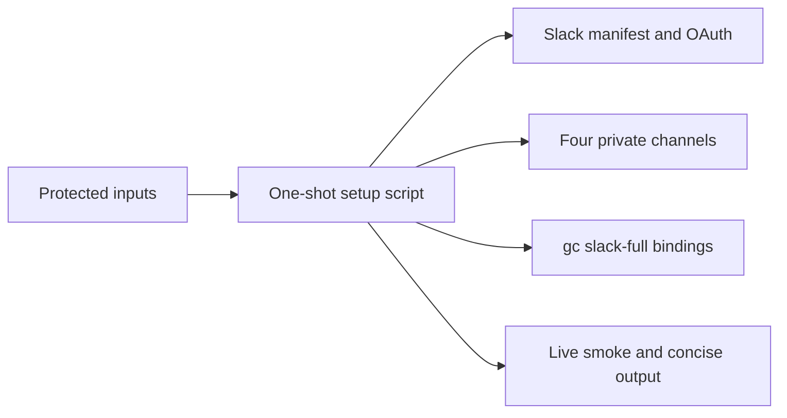

# Slack Full Bootstrap - Plan

## Goal Capsule

- **Objective:** Add a small, repeatable bootstrap for the pinned stock Slack Full pack used by this one d2b Gas City city.
- **Product authority:** `d2b-gascity` owns generic composition and documentation. The host-owned script owns Slack workspace state, credentials, channel IDs, app IDs, and Gas City bindings.
- **Scope:** One Slack workspace, one city, one operator, one switchboard app, four private channels, and six human-facing identity apps.
- **Stop conditions:** Stop on missing Slack authority, wrong workspace, denied OAuth, unsupported stock-pack behavior, or unsafe route/configuration state. Do not add a relay, Socket Mode bridge, custom service, or upstream patch.
- **Execution profile:** One-shot operator setup, idempotent reruns, and a bounded live smoke. This is not a production multi-tenant system.

## Product Contract

### Summary

Provide a script that uses Slack's standard App Manifest, OAuth, and Conversations APIs plus stock `gc slack-full` commands to configure the full supported operator surface for one city.

The script must be safe to rerun and must leave only browser login, OAuth consent, and Slack scope approval to the operator.

### Problem Frame

The Slack Full adapter and one operator DM already work, but workspace setup still requires scattered portal changes, manual channel creation, and manual Gas City bindings.

Slack Full supports shared rooms, DM bindings, rig and channel routing, commands, interactions, reactions, files, aliases, identities, and peer fanout. The bootstrap should make those supported paths repeatable without turning the city into a second Slack control plane.

### How This Work Fits Together

<!-- ce-section: work-relationships -->

This plan owns the scripted Slack Full bootstrap. It builds on the existing native Codex, Cloudflare, and Slack runtime work.

- Depends on `docs/plans/2026-08-19-001-feat-codex-router-copilot-slack-plan.md` for the running city, native Slack service, and Cloudflare ownership.
- Enables that plan's U4 proof by making the operator DM, shared channels, and Gas City bindings repeatable.
- Does not change the d2b product repository except for the final safe proof change.

### Key Decisions

- **Use one small host-local script:** `(session-settled: user-directed - chosen over a production reconciler: this is a one-workspace operator setup)`. Governs R1-R5, R18.
- **Use one switchboard and six identity apps:** `(session-settled: user-approved - chosen over forty-five identity apps: expose agents that communicate with humans while keeping internal agents behind shared routing)`. Governs R6-R10.
- **Use four private shared channels:** `(session-settled: user-approved - chosen over public channels: keep workflow discussion private)`. Governs R6-R8.
- **Use stock APIs and commands:** `(session-settled: user-directed - chosen over a relay, Socket Mode, or upstream patch: preserve the existing lifecycle)`. Governs R1, R10-R14.

### Actors

- A1. **Operator:** provides protected credentials, approves OAuth, answers Slack questions, and reviews the final smoke.
- A2. **Bootstrap script:** checks current state, applies missing Slack resources, and invokes stock Gas City commands.
- A3. **Switchboard app:** owns shared-room events, commands, interactions, routing, reactions, files, and peer fanout.
- A4. **Six identity apps:** represent the coordinator, brainstorm, plan, requirements-planner, run-operator, and work agents in human-facing DMs.
- A5. **Gas City:** owns sessions, bindings, retries, and managed Slack service lifecycle.

### Requirements

**Bootstrap and credentials**

- R1. The bootstrap must use the protected Slack App Configuration token and OAuth credentials to inspect and configure the existing switchboard and six identity apps.
- R2. The bootstrap must keep all tokens, refresh tokens, signing secrets, workspace IDs, user IDs, channel IDs, and runtime registries outside Git, Nix stores, and committed artifacts.
- R3. The bootstrap must read the protected expected workspace ID and known app IDs, then validate workspace and app identity before changing any resource.
- R4. The bootstrap must be idempotent: rerunning it must reuse matching apps, channels, memberships, aliases, subscriptions, and Gas City bindings rather than creating duplicates.
- R5. The bootstrap must stop with a useful error on missing authority, denied OAuth, wrong workspace, or unsupported stock-pack behavior. It does not need concurrent-run locking or automatic token rotation.

**Workspace setup**

- R6. The bootstrap must create or reuse four private channels: `gascity-ops`, `gascity-planning`, `gascity-build`, and `gascity-company`.
- R7. The bootstrap must invite and verify the operator and switchboard in those channels and must not remove unrelated members.
- R8. The bootstrap must configure shared-room, rig, channel, alias, and peer-fanout bindings using stock `gc slack-full` commands.
- R9. The bootstrap must create or reuse DM bindings for the six selected identity apps and authorized operator sender records.

**Supported Slack Full surface**

- R10. The switchboard must retain the pinned pack's supported Events, commands, interactions, reactions, files, aliases, identities, and peer-fanout capabilities.
- R11. The existing Cloudflare Slack hostname must route `/slack/events` and `/slack/interactions` without Access login and reject health, OAuth steady-state, and unrelated paths.
- R12. The bootstrap must use the actual imported command binding, `gc slack-full`, and must not add command wrappers.
- R13. Identity apps must use the stock agent-app registry and DM binding flow and must not own shared-room event routing.
- R14. Launcher session spawning or another feature that the pinned pack reports as unsupported must be reported as unsupported rather than patched or simulated.

**Safety and verification**

- R15. Slack requests must retain timestamp, signature, workspace, app, and authorized-sender checks before Gas City dispatch. If the pinned interactions path cannot prove app binding, interactions are blocked.
- R16. The bootstrap must print only concise redacted status: phase, fixed result code, resource counts, and safe Slack error codes. It must not print tokens, private payloads, messages, emails, OAuth URLs, authorization headers, or host paths.
- R17. Native Gas City remains the only lifecycle owner. The bootstrap is a one-shot command and does not start a daemon.
- R18. After a partial failure, the script must stop, identify the failed phase, and support a later operator rerun that reuses completed resources. It does not promise rollback of already-applied external changes.

### Key Flows

- F1. **Check and apply:** The operator runs the script; it validates protected inputs, checks current apps and channels, displays required OAuth/scope changes, and applies only missing setup.
- F2. **Switchboard setup:** The operator approves the switchboard scope/install flow; the script verifies the new token, creates or reuses private channels, and applies stock room bindings.
- F3. **Identity setup:** The operator approves each required identity-app OAuth flow; the script registers the app, binds its DM, and verifies one signed message path.
- F4. **Capability smoke:** The operator runs representative messages, mentions, commands, interactions, reactions, file transfer, aliases, identities, DMs, and peer fanout. Unsupported features are reported separately.
- F5. **Compound Engineering proof:** The bound coordinator receives one planted clarification, publishes through stock Slack Full, and the existing `compound-build` flow opens one safe unmerged d2b `v3` pull request.

### Acceptance Examples

- AE1. A first run creates or configures the requested resources without printing secrets.
- AE2. A second run reuses the same app, channel, membership, identity, and binding records without duplicates.
- AE3. A denied scope or OAuth approval before mutation leaves the current setup intact; a failure after Slack accepts a mutation stops with a partial-state message and a rerun instruction.
- AE4. A same-name public channel, wrong-workspace app, or ambiguous operator stops instead of being reused.
- AE5. A signed message in the operator DM reaches the intended identity and replies through Gas City.
- AE6. A signed wrong-workspace or unauthorized-sender message is rejected.
- AE7. Supported Slack Full operations pass their smoke checks; launcher or other unsupported behavior is reported as unsupported.
- AE8. The planted clarification reaches Slack, the answer returns to the same coordinator, and the resulting d2b pull request targets `v3` without merging.

### Success Criteria

- One host-local command can rerun the setup without duplicating the four channels or six identity records.
- The switchboard and identity apps use only stock Slack Full and Gas City capabilities.
- The operator can use planning/build/company channels and DM the six selected agents.
- The final redacted smoke passes without a committed report, transcript, payload, or secret.

### Scope Boundaries

**Deferred for later**

- Identity apps for internal review, implementation, publisher, and maintenance agents.
- Multi-workspace tenancy, SCIM, Slack Connect, enterprise administration, and automatic browser driving.
- Automatic token rotation, high-availability recovery, concurrent bootstrap runs, and general-purpose provisioning frameworks.

**Outside this product's identity**

- Socket Mode, custom relay services, a second lifecycle owner, delivery-verification infrastructure, or upstream Slack Full patches.
- Public workflow channels or storing Slack setup state in the portable city repository.

### Dependencies and Assumptions

- The operator has a valid App Configuration token, refresh token, Slack OAuth credentials, bot credentials, signing registry, and protected operator email.
- The switchboard receives the additional channel/directory scopes approved for this setup: `groups:write`, `groups:write.invites`, `channels:manage`, `channels:write.invites`, `users:read.email`, and `usergroups:read`.
- The existing Cloudflare route can publish both supported Slack paths and reject unrelated paths.
- The pinned Slack Full revision is the source of truth for supported and unsupported features.

### Outstanding Questions

**Deferred to Planning**

- Define how Gas City discovers stable session names for shared-channel bindings.
- Define the exact redacted status lines and capability smoke order.

### Sources and Research

- Existing city plan: `docs/plans/2026-08-19-001-feat-codex-router-copilot-slack-plan.md`.
- Existing city patterns: `docs/operations.md`, `docs/testing.md`, `SECURITY.md`, `AGENTS.md`, `pack.toml`, `packs.lock`, and `tests/test_city.py`.
- Sibling host patterns: `gascity.nix` `README.md`, `nixosModules/default.nix`, `flake.nix`, and package/module checks.
- Pinned Slack Full README, manifest, adapter, CLI, registries, and company-room docs at `5d2a9d023edbb9ba24fdcff554e89fc3d7da72fe`.
- Slack App Manifest API: `https://docs.slack.dev/reference/methods/apps.manifest.create/`.
- Slack token types: `https://docs.slack.dev/authentication/tokens/`.
- Slack Conversations API: `https://docs.slack.dev/reference/methods/conversations.create/` and `https://docs.slack.dev/reference/methods/conversations.invite/`.

## Planning Contract

### Product Contract Preservation

Product Contract preserved with the user's non-production simplification: the bootstrap is idempotent for one operator and one workspace, but it does not provide concurrent-run locking, automatic rotation, HA recovery, or a generalized control plane.

### Key Technical Decisions

- KTD1. Package one host-local one-shot script through the existing inert distribution pattern. Do not define a service.
- KTD2. Reuse stock Slack manifest/OAuth/Conversations APIs and stock `gc slack-full` commands. Do not duplicate pack behavior.
- KTD3. Reuse resources by stable existing IDs and normalized names. Stop on ambiguity or mismatch.
- KTD4. Keep Cloudflare route ownership in existing host configuration. Verify the two Slack paths and report drift instead of adding a management client.
- KTD5. Store only small app/channel/binding metadata in `~/.local/state/gascity/slack-full/bootstrap.json`. Do not add a transaction journal or background reconciler.
- KTD6. Use the existing stock registry and identity commands for the six apps. Use protected signing-secret files, not argv values, and require all six identities before full setup succeeds.

### High-Level Technical Design

The script runs sequentially: validate -> inspect -> verify existing routes -> ask for required OAuth -> apply switchboard -> create/reuse channels -> install identity apps -> apply stock bindings. A failure stops setup; a later explicit smoke command runs capability checks and the U4 proof. A rerun inspects existing IDs and continues.

The `gascity.nix` distribution remains inert. The NixOS host selects the command and supplies protected files. `d2b-gascity` supplies generic docs and focused static checks.

### System-Wide Impact

- **Host:** Adds one optional command and protected host-local metadata. It adds no service or state under `/var`.
- **Slack:** Expands switchboard scopes and may rotate its bot token once through OAuth. Six identity apps may each require approval.
- **Gas City:** Uses existing native service and binding commands. No new lifecycle owner is introduced.
- **Cloudflare:** Existing tunnel ownership remains unchanged. The script verifies the Slack path pair and stops on drift.
- **Privacy:** The script reports statuses only and never stores live payloads or transcripts.

### Risks and Dependencies

- The App Configuration token may export but not update the existing app. Stop with the required Slack ownership action; do not create a second app silently.
- Scope expansion and reinstall may rotate the switchboard bot token. Verify service health before channels and bindings.
- Channel creation and invites may be denied by Slack workspace policy. Stop on the specific error and rerun after approval.
- The pinned interaction handler may not prove app binding. Mark interactions blocked if the negative smoke cannot pass.
- The pinned launcher path may remain unsupported. Do not add a workaround.

### Implementation Constraints and Sequencing

1. Validate protected inputs and current app/workspace ownership.
2. Export and validate manifests without mutation.
3. Verify existing Cloudflare Slack paths.
4. Apply the switchboard manifest and OAuth approval.
5. Create/reuse channels and invite the operator/switchboard.
6. Install/register six identity apps and bind their DMs.
7. Apply stock Gas City bindings and run the live smoke.

### Documentation and Operational Notes

- Document the command, protected input names, four channel roles, six interactive agents, OAuth approval points, `gc slack-full` commands, route checks, and unsupported features.
- Keep generic manifests and tests in the repositories. Keep actual tokens, emails, IDs, channel state, and generated install files host-local.

## Implementation Units

### U1. Adding the small setup command

- **Goal:** Expose one inert host-local command with protected input checks and simple metadata reuse.
- **Requirements:** R1-R5, R16-R18, KTD1, KTD3, KTD5.
- **Dependencies:** None.
- **Target repository:** `gascity.nix`.
- **Files:** `flake.nix`, `nixosModules/default.nix`, `nix/slack-full-setup.nix`, `scripts/gascity-slack-full-setup.py`, `tests/slack_full_setup.py`, `tests/module.nix`, `tests/package.nix`, `README.md`, `SECURITY.md`, `PROVENANCE.md`.
- **Approach:** Follow the existing optional-package pattern. Read `~/.config/gc-slack-adapter/slack-config.env` and the existing adapter env, validate workspace identity and modes, inspect `~/.local/state/gascity/slack-full/bootstrap.json`, and stop on unsafe or ambiguous state. Never pass secrets in arguments or shell trace output. Do not add a service, lock daemon, or background process.
- **Execution note:** Prefer small unit tests for input validation and redaction; use a live smoke for Slack and Gas City behavior.
- **Patterns to follow:** Existing inert package/module outputs and package/module tests.
- **Test scenarios:**
  - Valid protected inputs pass without printing secret values.
  - Missing, loose, symlinked, wrong-prefix, or mixed-workspace inputs stop before mutation.
  - Existing metadata causes a rerun to reuse resources.
  - Partial metadata identifies the failed phase and permits a later rerun.
- **Verification:** Package/module checks and focused setup tests pass.

### U2. Applying the switchboard setup

- **Goal:** Validate and apply the switchboard manifest, scopes, OAuth, and token registry through stock Slack APIs.
- **Requirements:** R1-R5, R10-R12, R15, KTD2-KTD4.
- **Dependencies:** U1.
- **Target repository:** `gascity.nix`.
- **Files:** `scripts/gascity-slack-full-setup.py`, `tests/slack_full_setup.py`, host-local desired manifest metadata.
- **Approach:** Export and validate first. Show the exact approved switchboard scope set: current Slack Full scopes plus channel creation/invite, email lookup, and user-group lookup scopes. Apply the existing app only when ownership permits. Complete the stock state-bound OAuth flow with the exact client, redirect, expected workspace, single-use callback, and approved scope checks. Stamp the signing registry and verify workspace, app, bot, and service health before continuing. Never pass a secret as an argument.
- **Test scenarios:**
  - Matching manifest and scopes produce a no-op.
  - Missing authority or ownership stops before update.
  - Denied OAuth leaves the current setup intact.
  - Successful reinstall records the new token generation without logging it.
  - Wrong workspace or app identity stops.
- **Verification:** Compare the complete exported manifest before and after. Preserve unmanaged fields, and stop if the installed scope set differs from the approved switchboard set. The switchboard is healthy, the five existing bot events remain enabled, and the public Events/interactions path checks pass.

### U3. Creating the four private channels

- **Goal:** Create or reuse the four private channels and verify operator/switchboard membership.
- **Requirements:** R6-R8, R16, R18, KTD3.
- **Dependencies:** U2.
- **Target repository:** `gascity.nix`.
- **Files:** `scripts/gascity-slack-full-setup.py`, `tests/slack_full_setup.py`, `docs/operations.md`.
- **Approach:** Resolve the operator by protected email, call the stock Conversations API, reuse a known channel ID from `~/.local/state/gascity/slack-full/bootstrap.json`, or accept an exact normalized name only when privacy, workspace, purpose, and the approved member set match. Stop on public, wrong-workspace, ambiguous, or extra-member matches. Do not remove unrelated members.
- **Test scenarios:**
  - First run creates all four private channels.
  - Second run reuses all four without duplicates.
  - Already-member and already-exists results are successful.
  - Same-name public or inaccessible channels stop.
  - Operator lookup ambiguity stops.
- **Verification:** Four private channels exist, the operator and switchboard are members, and no unexpected member is silently accepted.

### U4. Installing six identity apps

- **Goal:** Install the coordinator, brainstorm, plan, requirements-planner, run-operator, and work identity apps through the stock manifest and registry flow.
- **Requirements:** R2-R5, R9, R13, R15, KTD2, KTD6.
- **Dependencies:** U2, U3.
- **Target repositories:** `gascity.nix` and host-local state.
- **Files:** `scripts/gascity-slack-full-setup.py`, `tests/slack_full_setup.py`, `docs/operations.md`.
- **Approach:** Derive safe display names, create/reuse the stock agent-app manifests with only `chat:write`, `im:history`, and `reactions:write`, let the operator approve OAuth per app when required, use `gc slack-full register-agent-app --signing-secret-file`, register each app in the stock `agent_apps.json` registry, store each bot token in the stock protected company-secrets directory, resolve the protected operator user ID, and bind one DM. Persist the immutable team/app/bot/DM/agent tuple. Keep identity apps out of shared-room event ownership.
- **Test scenarios:**
  - Matching agent app metadata is reused.
  - Each new app produces one OAuth handoff and one protected registry record.
  - Wrong team/app/bot identity stops.
  - Each identity DM maps to only its intended agent.
  - One signed ping and reply check runs for every one of the six identity DMs.
  - Partial installation can rerun without duplicating completed apps.
- **Verification:** All six identity records and DM bindings are ready. A blocked identity stops full setup rather than being treated as success.

### U5. Applying stock Gas City bindings

- **Goal:** Configure the four shared-room bindings and selected aliases through `gc slack-full`.
- **Requirements:** R8-R10, R12-R15, KTD2, KTD6.
- **Dependencies:** U3, U4.
- **Target repositories:** `gascity.nix`, host-local state, and `d2b-gascity` documentation.
- **Files:** `scripts/gascity-slack-full-setup.py`, `docs/operations.md`, `docs/testing.md`.
- **Approach:** Use stable rig/agent targets for ops, planning, build, and company rooms. Use the current native session binding for transient proof sessions instead of persisting transient IDs. The canonical stock commands are `bind-room`, `map-channel`, `map-rig`, `handle-alias`, `identity`, `sync-commands`, `bind-dm`, `reply-current`, `react`, `upload`, and `publish`. Apply only commands present in the pinned pack.
- **Test scenarios:**
  - Shared channels map to the intended stable targets.
  - Existing bindings are reused.
  - Missing transient sessions are reported without stale bindings.
  - Unsupported launcher behavior is reported without mutation.
- **Verification:** Stock `gc slack-full` status and binding checks pass.

### U6. Verifying Cloudflare paths

- **Goal:** Confirm the existing Slack hostname exposes only supported public paths.
- **Requirements:** R11, R15, KTD4.
- **Dependencies:** U1.
- **Target repositories:** `d2b-gascity` docs and permitted host configuration.
- **Files:** `docs/operations.md`, `docs/testing.md`, `modules/d2b-gascity.nix` in the NixOS host configuration.
- **Approach:** Keep Cloudflare lifecycle ownership in the existing host setup. Test signed POST requests to `/slack/events` and `/slack/interactions` without Access, verify the adapter is the origin, and verify `/healthz`, OAuth steady-state, and unrelated paths are rejected. Include stale timestamp, wrong-app, wrong-workspace, method, and duplicate-event checks using the stock adapter behavior. Stop if route drift is found.
- **Test scenarios:**
  - Supported Events and interactions paths reach the adapter.
  - Health, OAuth steady-state, root, and unrelated paths return 404.
  - Unsigned, stale, duplicate, wrong-app, or wrong-workspace requests are rejected or safely deduplicated by the stock adapter.
- **Verification:** Redacted path checks pass; no home inbound port is open.

### U7. Updating operator documentation and checks

- **Goal:** Document the simple setup and preserve generic repository checks.
- **Requirements:** R1-R18, AE1-AE8.
- **Dependencies:** U1-U6.
- **Target repository:** `d2b-gascity`.
- **Files:** `docs/operations.md`, `docs/testing.md`, `SECURITY.md`, `tests/test_city.py`.
- **Approach:** Document protected inputs, OAuth handoffs, four channels, six identities, exact `gc slack-full` commands, route checks, and unsupported features. Keep live evidence manual and redacted.
- **Test scenarios:**
  - Static checks assert generic setup terms, stock command names, and secret separation.
  - No authored file contains private host values or runtime state.
- **Verification:** `python3 tests/test_city.py` and `make check` pass.

### U8. Running the live Slack and d2b proof

- **Goal:** Run a separate supported-surface smoke and the existing smallest Compound Engineering proof.
- **Requirements:** R10-R18, AE1-AE8, KTD2-KTD6.
- **Dependencies:** U2-U7.
- **Target repositories:** host runtime, `d2b-gascity`, and the d2b `v3` proof worktree.
- **Files:** Host-local redacted outcomes only; no committed runtime report.
- **Approach:** Run representative message, mention, command, interaction, reaction, file, alias, identity, DM, and peer-fanout checks outside the setup command. Mark unsupported features honestly, and stop the final proof when a required supported path is unverified. Run the existing `d2b/roles.run-operator` plus `compound-build` proof with one planted clarification and open one safe unmerged `v3` pull request.
- **Test scenarios:**
  - A signed DM reaches the intended identity and replies through Gas City.
  - A shared-room message and mention reach the intended stable target.
  - A wrong-workspace, unauthorized-sender, stale, or unsigned request is rejected.
  - The planted clarification returns to the same coordinator and the PR targets `v3` without merging.
- **Verification:** `gc status`, Slack service health, all six identity checks, redacted diff/PR review, and the final unmerged pull request pass.

## Verification Contract

| Scope | Check | Done signal |
|---|---|---|
| `gascity.nix` | Existing flake/package/module checks plus small setup tests | Optional one-shot command evaluates and protected input tests pass |
| `d2b-gascity` | `python3 tests/test_city.py` and `make check` | Portable city and stock Slack command documentation pass |
| Switchboard | Export/validate/OAuth/service health | Existing app or approved replacement is healthy with expected events/scopes |
| Workspace | Four channel and membership checks | Private channels exist and expected principals are members |
| Identity apps | Six stock registry/DM checks | All six identities are installed and bound |
| Routes | Events/interactions plus negative path probes | Supported paths work; health/OAuth/unrelated paths are rejected |
| Live proof | One DM question/answer and one d2b publication | Safe unmerged PR targets `v3` |

Do not add a mock Slack server, delivery-verification harness, Socket Mode bridge, production scheduler, automatic token-rotation service, or committed runtime report.

## Definition of Done

- U1 provides the one-shot host-local command without a new lifecycle owner.
- U2 applies or stops on the switchboard manifest/OAuth change.
- U3 creates or reuses the four private channels without duplicates.
- U4 installs or clearly reports the six identity apps and DMs.
- U5 applies stock Gas City bindings and no custom binding state.
- U6 verifies the existing Cloudflare route pair and negative paths.
- U7 updates docs and static checks.
- U8 completes the separate supported Slack smoke and opens one safe unmerged d2b `v3` pull request only when all six identity apps and bindings are ready.
- No secrets, private identifiers, runtime state, transcripts, or dead-end implementation code enter the repository.
