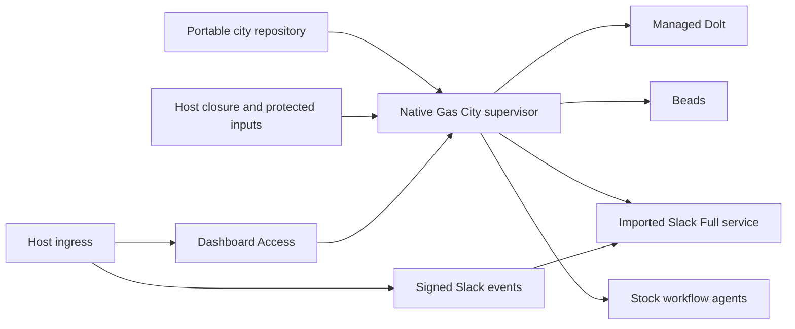
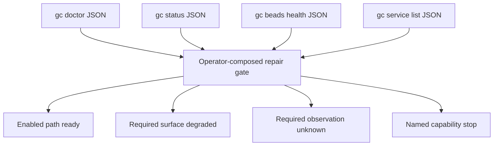
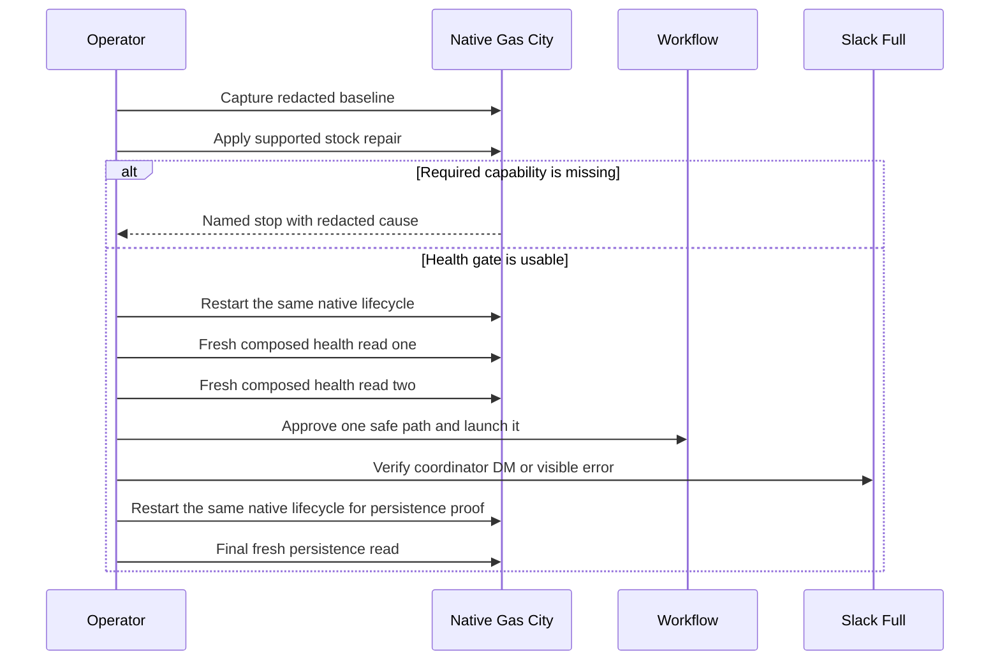
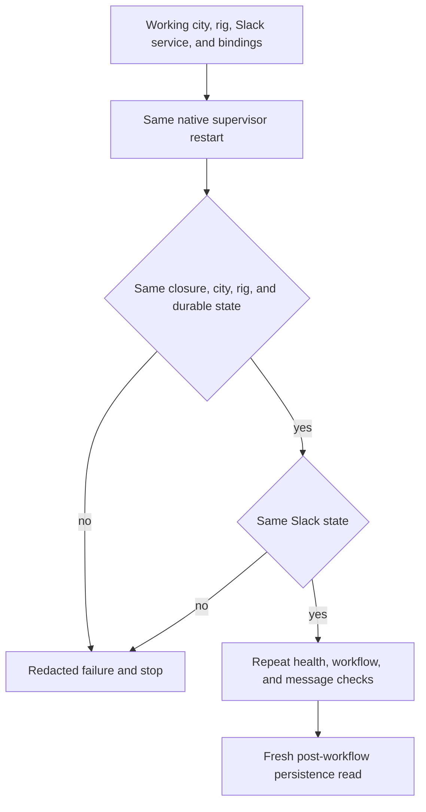

# Gas City In-Place Reliability Repair - Plan

## Goal Capsule

- **Objective:** Repair the existing d2b Gas City installation in place until the observed health, workflow, Slack, and integration failures are no longer present.
- **Product authority:** `d2b-gascity` owns the portable city contract. Host-private credentials, dependency projections, ingress values, and runtime state remain host-local. Gas City, Beads, Dolt, Slack Full, and Compound Engineering remain authoritative for supported behavior.
- **Scope decision:** This is one small test-system repair, not a new reliability platform. The current city and rig are repaired in place; a clean-room rebuild, dual deployment, high availability, and broad historical cleanup are not active work.
- **Open blockers:** Compatible stock Gas City and pack revisions and protected Slack inputs and bindings must be available before the enabled test path is declared fixed. Discord is disabled and is not a prerequisite.
- **Stop conditions:** Stop rather than inventing a workaround when the current state cannot be repaired safely, a required stock capability is unavailable, or the only apparent fix requires a custom relay, second lifecycle owner, local upstream fork, delivery-verification code, or destructive cleanup without authorization.

---

## Product Contract

### Summary

Repair the running native Gas City city and its d2b rig without replacing the deployment or losing its state.
The repair is complete when the original operator-visible failures are gone: health is usable, scheduled maintenance is not failing silently, a coordinator DM is delivered or returns an immediate error, and one clean workflow can run and survive restart.

### Problem Frame

The current test system is live but cannot be trusted for the basic test it exists to perform.
The rig-scoped Beads doctor path takes roughly 14-17 seconds and encounters Dolt connection failures, causing the dashboard to show `bd doctor probe failed: exec timeout` even though simple Dolt server checks pass.
CLI, dashboard, and API health surfaces disagree, store statistics report impossible zero-row values, and scheduled health and tracking orders fail or become stale.

The d2b rig has blocked work, duplicate control beads, stranded assigned sessions, inconsistent run lineage, lost retry descriptions, and invalid stock validator paths.
These failures allow a test run to create more ambiguous state instead of producing one clear result.

Slack has a stale coordinator target, incomplete company bindings, missing expected adapter inputs, and a recorded no-delivery DM.
Discord is not part of the enabled test path and will be removed from the portable pack composition.
Several configuration warnings are real but do not all need to be cleaned up for this test system to work.

### Key Decisions

- **Repair in place:** (session-settled: user-directed - chosen over a clean-room rebuild: this is a test system that exists to make the current installation work) Preserve the current city, rig, and durable state while correcting the active integration failures.
- **Keep the repair narrow:** Address failures that block the observed test and defer non-blocking hygiene, historical cleanup, backup expansion, and resource tuning.
- **Use stock capabilities:** (session-settled: user-directed - chosen over local patches, custom relays, and a second lifecycle owner: keep Gas City simple and native) Use compatible upstream runtime and pack revisions plus supported commands and configuration.
- **Make the symptom disappear:** (session-settled: user-directed - chosen over a broad verification program: basic validation is enough for this test system) Judge success by the original health, routing, workflow, and restart failures no longer reproducing.
- **Do not silently mutate work:** Duplicate merges, assignment changes, closures, federation changes, and deletion require an explicit operator action even when the system is only a test deployment.
- **Disable unused integrations:** Discord is disabled for this city, while Slack remains the only enabled external integration.

<!-- ce-section: work-relationships -->
### How This Work Fits Together

This plan owns one in-place repair outcome across four connected surfaces.
The health gate is fixed first because workflow and messaging cannot be trusted while the city reports false health.

- **Health and scheduler:** Establish the blocking signal for the repair and remove the Dolt and maintenance failures that obscure the rest.
- **Workflow state:** Make the current rig safe enough for one clean run without promising to clean every historical bead.
- **Messaging integration (Slack Full):** Repair stable session targeting, required inputs, and visible failure feedback after the city can report its real state.
- **Restart and ingress:** Confirm the repaired state survives the native lifecycle and that dashboard and signed messaging ingress are not masking a local failure.

### Actors

- A1. **Operator:** Supplies protected integration inputs, approves durable work changes, and runs the basic acceptance smokes.
- A2. **Gas City supervisor:** Owns the city, services, sessions, health surfaces, and restart lifecycle.
- A3. **Beads and Dolt:** Own issues, dependencies, assignments, database state, and server or query health.
- A4. **Scheduler and doctor:** Run maintenance orders and expose stale, failed, missing, or contradictory health information.
- A5. **Workflow agents and formulas:** Consume task inputs, create descendants, and execute the representative test workflow.
- A6. **Slack Full service:** Verify, route, publish, and report the configured human-facing integration.
- A7. **Host and upstream inputs:** Supply the selected stock closures, executable dependencies, protected credentials, and host-local ingress configuration.

### Requirements

**In-place lifecycle and state**

- R1. The repair must capture a concise redacted baseline of the current city, rig, service, health, and workflow state before changing durable data.
- R2. The repair must preserve the current city and rig in place and must not create a second active city, supervisor, Dolt lifecycle, or alternate state root.
- R3. Native Gas City must remain the only lifecycle owner, and an upgrade or restart must leave the active `gc` command pointing at the intended closure with the same durable state.
- R4. The repair must stop before a destructive action unless the operator has authorized that action and the baseline remains available for local rollback.

**Health, Dolt, and scheduled maintenance**

- R5. The rig health probe must complete reliably within its configured health budget after repair, so the dashboard no longer reports the known `bd doctor probe failed: exec timeout` symptom.
- R6. Health must distinguish Dolt server reachability from rig-scoped Beads query and doctor health, and a successful server ping must not make a failed rig query appear healthy.
- R7. CLI, dashboard, and API health surfaces must agree on the same city and rig status, including failure, partial, unknown, and unavailable states.
- R8. Store metrics and trends must use real available data or report unavailable; an uncompleted row count must not appear as zero.
- R9. Scheduled health, tracking, and maintenance orders must record successful or failed outcomes with an actionable cause, and critical stale orders must no longer be silently treated as current.
- R10. `gc doctor` must report blocking failures consistently in its exit status and machine-readable result, and missing executables, environment inputs, or integration configuration must be named rather than treated as healthy.

**Workflow execution and recovery**

- R11. Before starting a new workflow, the repair must identify the current blocked roots, duplicate controls, stranded assignments, stale claims, missing task descriptions, invalid validator references, and inconsistent descendants.
- R12. The repair must make one safe test path available without automatically merging, deleting, closing, unassigning, or rewriting every historical issue.
- R13. A blocked root must not silently create more descendants; continuation or reassignment must be an explicit operator-approved action.
- R14. Retry and clone behavior must preserve the task information required by the worker, and a title-only task must stop before agent execution with a visible missing-input error.
- R15. Validator checks used by the test workflow must resolve to assets supplied by the selected stock pack revision; missing or stale paths must stop the affected workflow with a specific diagnostic.
- R16. Provider-health and session-liveness failures must be shown as unknown or degraded and must not be treated as healthy when their registry or observation path is unavailable.

**Slack integration**

- R17. The coordinator identity must resolve to the exact live stable Gas City session recorded in the baseline before accepting a DM, and a stale or missing target may be re-resolved once only to confirm that identity before returning an actionable operator-visible error.
- R18. Slack readiness must validate the required signing, application, workspace, bot, directory, DM, company-binding, and identity inputs before reporting the adapter ready.
- R19. Accepted Slack messages must receive a native acknowledgement, response, progress update, or explicit failure response, and delivery counters must distinguish received, routed, delivered, no-delivery, rejected, and failed outcomes.
- R20. Slack signature, timestamp, workspace, application, authorized-sender, and existing session-binding checks must remain enforced for every inbound path; signing authenticates the application only and is not sender or session authorization.

**Disabled integrations**

- R21. Discord must be absent from the portable pack imports and lock, must not be enabled by the native restart path, and must not require credentials, services, routes, or readiness checks in this repair.

**Host configuration and ingress**

- R22. The host closure must provide the executable dependencies and protected environment inputs required by the enabled integrations, while secrets and private identifiers remain outside the repository.
- R23. Only configuration warnings that block the test must be repaired in this pass; deprecated declarations, stale hooks, missing roles, and generated-file warnings that do not block the test must be recorded as deferred rather than expanding the repair.
- R24. Dashboard ingress, signed Slack ingress, and local supervisor health must remain distinguishable, and a tunnel, authentication proxy, or SSE interruption must not be reported as a healthy local city or require a new relay.
- R25. The native restart path must preserve the repaired bindings, service state, workflow state, dashboard access, and supported event-stream or message reconnect behavior.

**Validation and privacy**

- R26. Focused repository checks must remain credential-free and must validate the portable city, stock imports, native lifecycle ownership, and privacy boundaries.
- R27. Live validation must be limited to basic status, health, service, DM, workflow, and restart smokes and must not add delivery-verification agents, committed transcripts, reports, prompts, responses, or private runtime state.
- R28. Any failed smoke must return a concise redacted failure with the failed surface and cause; a partial repair must not be presented as success.

### Key Flows

- F1. **Protect and diagnose**
  - **Trigger:** The operator starts the in-place repair.
  - **Actors:** A1, A2, A3, A4.
  - **Steps:** Capture the baseline, verify the active city and rig, classify blocking versus deferred findings, and confirm that the current state can be changed safely.
  - **Outcome:** The operator knows what will change and has a local recovery point without copying runtime state into the repository.
  - **Covered by:** R1-R4, R26-R28.

- F2. **Repair health and maintenance**
  - **Trigger:** The baseline shows the rig doctor timeout, Dolt failures, false-green status, invalid metrics, or stale orders.
  - **Actors:** A1, A2, A3, A4, A7.
  - **Steps:** Apply supported stock upgrades or configuration corrections, repair the active database and scheduler path, and recheck all health surfaces.
  - **Outcome:** The known health-page timeout and silent maintenance failures no longer reproduce.
  - **Covered by:** R5-R10, R22-R24.

- F3. **Make one workflow safe**
  - **Trigger:** The rig contains blocked, duplicate, stranded, or malformed work from earlier test attempts.
  - **Actors:** A1, A2, A3, A4, A5.
  - **Steps:** Prevent unsafe continuation, preserve history, apply only the smallest authorized reconciliation, and verify one clean root-to-worker path.
  - **Outcome:** A new test can run without inheriting the known blocked, stranded, missing-input, or invalid-validator failures.
  - **Covered by:** R11-R16.

- F4. **Repair operator Slack messaging**
  - **Trigger:** The operator sends a coordinator DM through the enabled Slack path.
  - **Actors:** A1, A2, A6.
  - **Steps:** Validate protected inputs and bindings, resolve the target session, acknowledge the message, and publish either the result or a visible error.
  - **Outcome:** A successful DM reaches the coordinator, while a bad target or missing setup cannot disappear silently.
  - **Covered by:** R17-R20, R28.

- F5. **Prove the fixed test system**
  - **Trigger:** Health and workflow gates are clear enough for a basic smoke.
  - **Actors:** A1, A2, A3, A5, A6, A7.
  - **Steps:**
    1. Run focused checks, verify `gc` status and health, send one DM, and run one representative workflow.
    2. Restart the native lifecycle and repeat the basic checks.
    3. Confirm Discord is absent from the portable pack and lock and is not required, started, or enabled after restart.
  - **Outcome:** The original issues are no longer present and the repaired state survives restart.
  - **Covered by:** R3, R19, R21, R24-R28.

### Acceptance Examples

- AE1. **Known health symptom is gone**
  - **Given:** The server reachability check passes and the rig doctor path previously exceeded the health budget.
  - **When:** The operator refreshes the city health view after repair.
  - **Then:** The rig doctor check completes within the configured budget and the known `bd doctor probe failed: exec timeout` message is absent.
  - **Covers:** R5-R7, R10.

- AE2. **Unavailable data is not zero**
  - **Given:** A store count or trend query cannot complete.
  - **When:** CLI, dashboard, and API status are read.
  - **Then:** Each surface reports the metric as unavailable or degraded rather than showing a valid zero or unqualified healthy status.
  - **Covers:** R6-R8.

- AE3. **Maintenance failures are visible**
  - **Given:** A scheduled health or tracking order encounters a database connection failure.
  - **When:** The operator checks maintenance status.
  - **Then:** The order shows a failed outcome, cause, and stale or overdue state, and the failure is not counted as a success.
  - **Covers:** R9-R10, R28.

- AE4. **One workflow path is clean**
  - **Given:** Earlier runs left blocked roots, duplicate controls, stranded assignments, or stale descendants.
  - **When:** The operator prepares and starts a new representative workflow.
  - **Then:** It does not silently fan out from a blocked root, inherit unsafe ownership, or report a clean state while those conditions remain unresolved.
  - **Covers:** R11-R16.

- AE5. **Retry and validator inputs are usable**
  - **Given:** A retry or validation step is required by the representative workflow.
  - **When:** the worker starts.
  - **Then:** the task description is present and the validator path resolves to the selected stock pack; otherwise the workflow stops before agent execution with a named error.
  - **Covers:** R14-R15.

- AE6. **Coordinator DM succeeds or errors**
  - **Given:** The coordinator binding points to the live session and Slack readiness inputs are present.
  - **When:** the operator sends a DM.
  - **Then:** the coordinator receives it and the operator sees the response; if the target is stale or missing, the operator receives an actionable error instead of a silent no-delivery.
  - **Covers:** R17-R20, R28.

- AE7. **Discord is disabled**
  - **Given:** The portable city composition does not import Discord.
  - **When:** integration health is checked.
    - **Then:** no Discord service is enabled, and no Discord credential, public route, or readiness check is required. Leftover stock service names may appear only as present and not started. If native restart enables Discord or requires its inputs, the repair stops.
  - **Covers:** R21.

- AE8. **Restart preserves the repaired state**
  - **Given:** the city has a working binding, service state, rig, and representative workflow state.
  - **When:** the native lifecycle or host closure is restarted.
  - **Then:** the same city and rig reopen, `gc` resolves to the intended closure, bindings remain present, and the basic health and DM smokes still pass.
  - **Covers:** R2-R5, R25-R27.

- AE9. **Failure feedback is not silent**
  - **Given:** any required health, service, target, dependency, or workflow check fails.
  - **When:** the operator performs the corresponding smoke.
  - **Then:** the result identifies the failed surface and cause without exposing credentials or private payloads.
  - **Covers:** R10, R19, R26-R28.

### Success Criteria

- `gc status` finds the existing city and reports the active rig and services without the original discovery or closure problem.
- The health page and local health API no longer show the known rig doctor execution-timeout symptom after restart.
- `gc doctor` has no blocking failures for the enabled test path, and its exit code agrees with its machine-readable result.
- The active maintenance orders no longer fail silently or remain critically stale for the repaired test path.
- One coordinator DM is delivered, and a deliberately stale target produces a visible error rather than no response.
- One representative workflow completes without invalid execution paths, missing task input, hidden provider failure, or new stranded ownership.
- The portable pack and lock exclude Discord, and the native service list does not require or start a Discord service.
- Restarting the native lifecycle preserves the city, rig, bindings, and working service state.
- Focused checks and redacted live smokes pass without committed secrets, runtime state, or delivery-verification code.

### Scope Boundaries

**Deferred for later**

- Exhaustive cleanup or merging of all historical duplicate issues and order-tracking beads.
- Full migration of non-blocking deprecated formulas, workspace placement, hooks, roles, and generated-file warnings.
- Off-host backup, high availability, host-wide resource tuning, and broad performance work.
- Re-enabling Discord or adding Discord credentials, services, or publication.
- Historical Cloudflare outages and other ingress incidents that do not reproduce during the final smoke.
- General-purpose recovery tooling for other Gas City cities or rigs.

**Outside this product's identity**

- A custom Slack or Discord relay, Socket Mode bridge, delivery-verification agent, second Gas City lifecycle owner, or new dashboard.
- Automatic deletion, merging, unassignment, closure, federation removal, or forceful rewriting of durable work.
- Changes to unrelated d2b product behavior.
- Publishing credentials, private host values, user or channel identifiers, logs, prompts, responses, or pull-request payloads.

### Dependencies and Assumptions

- The operator wants the current city and rig repaired rather than replaced and accepts a small local rollback copy before mutation.
- Compatible stock Gas City and gascity-packs revisions exist for the required health, retry, validator, and Slack behavior.
- The operator can provide protected Slack values. Discord inputs are not required because the pack is disabled.
- The native supervisor, managed Dolt, Beads, Pack v2, Slack Full, Compound Engineering, and current host closure remain the supported lifecycle surfaces.
- The d2b rig remains the only rig and continues to target branch `v3`.
- Runtime logs and counters are audit evidence; portable repository files remain authoritative for configuration and privacy claims.

### Outstanding Questions

**Deferred to Planning**

- Validate the first compatible stock Gas City and gascity-packs revisions that contain the required fixes without local forks.
- Validate the protected host inputs that are authoritative for Slack signing, application identity, and company bindings.
- The exact order of supported repair commands and restart operations.
- The smallest authorized reconciliation of the current blocked and stranded workflow state.
- The exact health budget and smoke repetition needed to prove the original timeout is gone.
- The precise redacted error and status fields shown to the operator.

### Sources and Research

- `docs/operations.md` for native initialization, rig binding, service diagnosis, and lifecycle ownership.
- `docs/testing.md` for focused credential-free checks and redacted live smokes.
- `city.toml`, `pack.toml`, and `packs.lock` for the current portable city, d2b `v3` rig, and stock imports.
- `docs/plans/2026-08-18-001-refactor-native-gas-city-distribution-plan.md` for native state, lifecycle, stock-pack, and host-private boundaries.
- `docs/plans/2026-08-19-001-feat-codex-router-copilot-slack-plan.md` for native Codex routing, Slack feedback, ingress, and the no-custom-relay boundary.
- `docs/plans/2026-08-20-001-feat-slack-full-bootstrap-plan.md` for idempotent Slack resources, bindings, and protected credentials.
- The redacted 2026-08-21 Gas City health audit for the observed health, scheduler, workflow, Slack, and ingress failures.
- Gas City issue #4239 and Gas City Packs PR #194 for the stock validator asset-path gap.
- Gas City issues #4861 and #4864 for Ralph retry description preservation.
- Gas City issue #4387 for abandoned work remaining assigned after agent death.
- Gas City issue #4382 for reconciler-created sessions without an initial prompt.
- Gas City issue #2893 for open-work gate timeouts during order dispatch.

---

## Planning Contract

### Product Contract Preservation

Product Contract changed: A6 is Slack-only, and R21, AE7, and related scope and assumption text disable Discord and narrow the enabled external integration to Slack; all stable IDs remain unchanged.

### Key Technical Decisions

- KTD1. **Use the current pin family as the compatibility floor.** Keep the current Gas City `v1.4.1`, packs lock SHA `5d2a9d023edbb9ba24fdcff554e89fc3d7da72fe`, Beads `v1.2.2`, and Dolt `2.1.7` family unless execution verifies a newer tagged family that removes a blocking symptom. Do not select rolling `main` or `edge` as a repair target because external research did not prove a compatible newer family. Any verified pin change updates the lock, CI, provenance, and related documentation together. `(session-settled: user-directed - chosen over local patches, custom relays, and a second lifecycle owner: keep Gas City simple and native)`
- KTD2. **Use the native in-place repair path.** The repair consists of a redacted baseline, a same-identity host-local recovery snapshot, supported `gc doctor --fix` work, `gc import install` only for a present-but-invalid pack cache, and the existing native supervisor or city restart path. `gc doctor --fix` is limited to supported mechanical, import, and drift repair; it is not workflow reconciliation. Native Gas City remains the only lifecycle owner, and no repair helper or second state root is introduced. `(session-settled: user-directed - chosen over a clean-room rebuild: this is a test system that exists to make the current installation work)`
- KTD3. **Compose health from stock surfaces without a new aggregator.** Read `gc doctor --json`, `gc status --json`, `gc beads health --json`, and `gc service list --json` as separate evidence for the same city and rig, plus a fresh rig-store-health sample for the known dashboard/API symptom. Treat `status.ok` and provider-health success as command or lifecycle evidence only, keep Dolt reachability distinct from Beads content health, and classify timed-out, incomplete, or unavailable required checks as unknown or degraded rather than healthy. If `gc beads health` performs recovery or warms the observed path, collect it outside the two-sample symptom window. `(session-settled: user-directed - chosen over a broad verification program: basic validation is enough for this test system)`
- KTD4. **Use one operator-gated workflow path and fail closed on missing prerequisites.** Inventory blocked roots, duplicate controls, stranded assignments, stale claims, missing descriptions, invalid validator references, and inconsistent descendants before launching one `d2b/roles.run-operator` path on `compound-build`. Prefer a new clean bead with no dependency or assignment relationship to blocked work. Require approval tied to the current city and rig identity and to each operator-initiated durable action, including root creation, reassignment, unassignment, closure, merge, deletion, or rewriting. Worker-created descendants inside the approved stock run are expected workflow output, but blocked-root fan-out and ownership changes remain forbidden. Stop before agent execution when a required description or validator asset is missing. Do not depend on unresolved stock fixes for validator paths, retry descriptions, unprimed sessions, abandoned assignments, or the open-work gate. `(session-settled: user-directed - chosen over silent mutation and a historical cleanup program: keep one safe path)`
- KTD5. **Use stock Slack Full bindings and reply surfaces.** Keep the adapter, CLI, protected inputs, bindings, status, service, and `reply-current` behavior in the stock pack and host closure. Accept a DM only when the existing operator-authorized binding names the same live stable session identified in the baseline; re-resolution may confirm that exact identity once but may not select or create another binding. Require both stock authorized-sender and session-binding checks because signing authenticates the Slack application, not the human sender. Preserve signature, timestamp, duplicate/replay, workspace, application, and all stock-required readiness checks, and return a visible error after bounded supported recovery. `(session-settled: user-directed - chosen over a custom relay or second lifecycle owner: use stock Slack Full)`
- KTD6. **Disable Discord in the portable composition.** Remove the Discord pack import from `pack.toml` and its entry from `packs.lock`. Do not configure or start Discord, and do not require Discord credentials, routes, services, or readiness checks for this repair. If pre-existing Discord runtime state remains, handle it only through supported native lifecycle behavior; stop if disabling it requires manual deletion, a wrapper, or a second owner. `(session-settled: user-directed - chosen over retaining an unconfigured imported service: focus the repair on Slack and avoid unused integration state)`
- KTD7. **Keep portable configuration and host runtime ownership separate.** This repository may change portable authored files, generic documentation, and credential-free checks. Host closures, protected credentials, ingress values, `.gc`/`.beads`/Dolt state, and live smoke notes remain outside the repository. The workspace/app registry is the authoritative Slack signing source; global signing-secret and OAuth client fallbacks stay unset after onboarding. The adapter remains loopback-bound, and only the signed Slack `/slack/events` route is published with a catch-all `404`, separate from dashboard Access and local supervisor health. `(session-settled: user-directed - chosen over moving host or runtime ownership into the city repo)`
- KTD8. **Prove the original timeout with two distinct fresh samples.** After one stock repair and one same-supervisor restart for health proof, take two distinct fresh rig-store-health samples before workflow or Slack proof. Immediate reads with the same sampler timestamp do not count; wait for the stock sampler cadence when needed. On the current `v1.4.1` family, measure the rig doctor probe against the stock 15-second sampler deadline and the stock sample cadence rather than an HTTP request duration. Each counted sample must contain parsed doctor checks, no timeout-class or incomplete result, and a measured duration within the discovered stock budget. U6 performs a separate persistence restart after workflow and messaging checks and adds one fresh persistence sample. Do not add a local timeout knob or claim success when the symptom remains. `(session-settled: user-directed - chosen over a broad verification program: make the original symptom disappear)`

### System-Wide Impact

- **Operator and host:** The operator supplies protected Slack inputs, controls any durable Beads action, and keeps redacted baseline and smoke notes on the host.
- **Native city:** The supervisor, services, sessions, health surfaces, scheduler, Beads, and Dolt retain their existing ownership and durable state.
- **Workflow workers:** Stock formulas and agents use the same shared Beads and Dolt objects as the operator. A worker must not receive a healthier status than the operator.
- **External integrations:** Slack Full remains the only enabled external integration. Slack signing authenticates the application; the existing operator binding authorizes the coordinator session. Discord is absent from the portable composition and is not part of this repair.
- **Trust boundaries:** Slack signing authenticates the application request, authorized-sender checks authenticate the human sender, and the existing DM binding authorizes the target session. All three remain required for the enabled DM path.
- **Repository and CI:** Portable pin, import, privacy, and host-boundary assertions remain credential-free. Live runtime state is never made a repository fixture.
- **Credential and ingress separation:** Slack adapter variables are not inherited by Copilot Requests, d2b publication, or unrelated workers. Dashboard Access, signed Slack ingress, loopback adapter health, and local supervisor health remain separate observations.

### Alternatives Considered

- **Clean-room rebuild or shadow deployment:** Rejected because it would abandon the current city and rig state, obscure whether the existing installation was repaired, and violate the in-place decision.
- **Local health wrapper, relay, or delivery verifier:** Rejected because the stock lifecycle and packs already own these surfaces and a second owner would create conflicting truth.
- **Bulk Beads cleanup or automatic reconciliation:** Rejected because it could destroy evidence, change ownership without approval, and hide unresolved stock defects.
- **Full Slack company binding and room or slash activation:** Deferred because the core acceptance bar is a coordinator DM, not activation of every Slack surface.

### Implementation-Time Unknowns

These items are discovered during execution and do not change the Product Contract or hold the artifact at requirements-only:

- The configured live health budget and the measured duration of the repaired rig doctor path.
- Whether the pack cache is absent, valid, or present but invalid.
- Which maintenance orders are critically stale after the health path is repaired.
- The smallest operator-approved Beads action and the bead identifier used for the representative workflow.
- Whether Slack adapter and CLI binaries are already built and which protected bindings are live.
- The exact stock JSON field names for Slack delivery outcomes.
- Whether CLI, dashboard, and API projections agree after the stock repair.
- Whether a newer tagged pin family becomes available before execution; if not, stay on the current family.

If an unknown cannot be answered by a stock surface or operator decision, the affected unit stops with a redacted cause.

### Risks and Dependencies

- **Unproven stock capability:** The current pin family does not prove the validator-path, retry-description, unprimed-session, abandoned-assignment, or durable open-work-gate fixes. If the enabled path still needs one, stop rather than rolling an unproven revision or adding a local workaround.
- **Recovery identity drift:** A host-local snapshot or restart that changes the city, rig, `v3` branch, state-root identity, Dolt endpoint/database identity, or binding identity can orphan later writes. Restore only onto the original identity; otherwise stop.
- **Unbounded durable mutation:** `gc doctor --fix`, inspection commands, re-slinging, or a broad reconciliation can change Beads ground truth. Keep baseline capture write-free, restrict `--fix` to mechanical/import drift, review its proposed changes, and require action-specific operator approval for operator-initiated writes.
- **Unrestorable snapshot:** A live file copy of a managed Dolt or Beads tree may be crash-inconsistent and may include protected registries. Use a stock or host-authorized backup primitive that excludes credentials, or stop before mutation; never retarget the live endpoint to a copied tree.
- **Derived blocked state:** `blocked` is derived from open dependency edges. Closing or rewriting a blocked bead to make the workflow appear ready can hide its blocker and unlock unsafe work. Keep blocked history visible and use a new clean bead by default.
- **Slack replay or authorization drift:** Public event retries, stale timestamps, duplicate bodies, auto-rebinding, or incomplete required bindings can create duplicate or unauthorized work. Preserve stock replay checks, require the existing binding and authorized sender, and fail closed when readiness is incomplete.
- **Ingress and credential leakage:** Repair or restart can publish the wrong Slack path, reopen OAuth, or copy tokens and identifiers into notes. Keep the adapter loopback-bound, retain the documented path allowlist, and record only redacted outcome codes.
- **False performance proof:** A warm cache, an unsampled post-restart view, a gate-timeout skip, or an old maintenance success can look healthy. Require two fresh samples before workflow or Slack proof and a post-tick maintenance outcome.
- **Stale Discord runtime state:** Removing the portable import may leave previously materialized service entries until the native lifecycle applies the new composition. Inspect only stock service names, use supported native reload or restart behavior, and stop if disabling it would require manual deletion or a second owner.

### Sequencing

1. Establish the portable contract and credential-free gate.
2. Capture the redacted host baseline and classify blocking versus deferred findings.
3. Apply the stock health and scheduler repair path, restart the same native lifecycle for health proof, and perform two distinct fresh composed health samples.
4. Prepare one operator-approved workflow path without broad durable-state cleanup.
5. Repair and verify the coordinator DM path as the only enabled external integration.
6. Restart the same native lifecycle for persistence proof, then perform the final fresh read and repeat the required workflow and messaging checks without re-running repair mutations.

Health must be trustworthy before workflow or messaging proof. Repository checks must pass before any live smoke. A capability stop takes precedence over later units.

### Sources and Research

**Local repository sources**

- `city.toml`, `pack.toml`, and `packs.lock` for portable city composition, imported services, and the current pin family.
- `tests/test_city.py` for authored-file, privacy, pin-consistency, import, and optional native-init checks.
- `.github/workflows/check.yml` and `PROVENANCE.md` for CI and provenance projections of the pin family.
- `docs/operations.md` for native lifecycle, rig binding, service diagnosis, Slack commands, and representative workflow launch.
- `docs/testing.md` and `SECURITY.md` for credential-free checks, redacted live smokes, and privacy boundaries.
- `docs/plans/2026-08-18-001-refactor-native-gas-city-distribution-plan.md`, `docs/plans/2026-08-19-001-feat-codex-router-copilot-slack-plan.md`, and `docs/plans/2026-08-20-001-feat-slack-full-bootstrap-plan.md` for established lifecycle, host, ingress, and Slack boundaries.

**External and upstream sources**

- Gas City release and troubleshooting documentation at `https://docs.gascity.com/`, including the `gc doctor --fix`, `gc import install`, status, Beads health, service, and supervisor contracts.
- The Gas City `v1.4.1` release and the gascity-packs `v0.4.0` tree at `https://github.com/gastownhall/gascity/releases/tag/v1.4.1` and `https://github.com/gastownhall/gascity-packs/tree/v0.4.0`.
- Gas City issues `#4239`, `#4382`, `#4387`, `#4861`, `#4864`, and `#2893`, plus gascity-packs issue `#193`, for unresolved validator, retry, session, assignment, and gate behavior.
- Slack Full pack documentation for protected inputs, stock bindings, service health, and publication boundaries.
- OWASP Logging Cheat Sheet, NIST backup guidance, Kubernetes probe guidance, and Google SRE monitoring guidance for redacted baselines, fail-closed required readiness, and bounded operational proof.

External findings are load-bearing: they set the current pin as the compatibility floor, preserve unresolved stock defects as stop conditions, and prevent local workarounds from being added to this repository.

---

## High-Level Technical Design

The repair keeps the existing ownership graph and adds no new component.

### Ownership boundary

The repository authors portable city files, generic documentation, and focused checks. The host supplies protected values and ingress. Native Gas City owns the supervisor, services, sessions, and restart lifecycle.

### Health composition

The four stock surfaces remain distinct. A successful command envelope, a reachable Dolt server, or a running supervisor does not erase a failed rig query, a timed-out doctor check, or an unavailable service.

### Repair sequence and stop gates

The capability gate stops before workflow or messaging proof when the proven stock family cannot satisfy a required behavior. The two fresh health reads occur before workflow and Slack proof. The repair never substitutes a local fork, relay, or second lifecycle owner.

### Restart persistence

Restart is a persistence proof. It is not a cutover, migration to a new state root, or opportunity to create another supervisor.

---

## Implementation Units

### U1. Disabling Discord and updating the portable repair contract

**Goal:** Remove the unused Discord integration from the portable city and encode the stock health, host-private, Slack, and focused-validation boundaries without adding a repair subsystem.

**Requirements:** R3, R5-R10, R15, R21-R28; A1, A2, A6, A7; F1, F2, F4, F5; AE1, AE2, AE3, AE7, AE9; KTD1, KTD3, KTD5, KTD6, KTD7, KTD8.

**Dependencies:** None.

**Files:**

- `docs/operations.md`
- `docs/testing.md`
- `SECURITY.md`
- `README.md`
- `CHANGELOG.md`
- `AGENTS.md`
- `tests/test_city.py`
- `pack.toml`
- `packs.lock`

**Approach:**

1. Preserve the existing import-only city composition, named sessions, host inheritance, and Slack fragment split.
2. Document the four native health surfaces and the distinction between command-envelope success, Dolt preflight, Beads health, service health, and ingress health.
3. Document the stock repair verbs and their limits, including the invalid-cache condition for `gc import install`.
4. Remove the Discord import from `pack.toml` and the matching lock entry from `packs.lock`; do not add a replacement disable wrapper or service.
5. Remove active Discord setup instructions and update repository guidance to state that Slack is the only enabled external integration.
6. Make the Slack steady-state ingress contract explicit: publish only `/slack/events`, return `404` for other paths, keep OAuth onboarding closed, and keep the adapter loopback-bound.
7. Make the workspace/app registry the authoritative Slack signing source and keep global signing-secret and OAuth client fallbacks unset after onboarding.
8. Record unresolved stock capabilities as stop conditions instead of naming a local timeout, validator asset, relay, or durable-state helper.
9. Extend static checks only with generic, non-secret markers that protect the portable contract and privacy boundary.

**Execution note:** Add characterization coverage for the current documentation and static assertions before changing any portable contract or pin.

**Patterns to follow:** Existing `tests/test_city.py` authored-file and privacy assertions; `docs/operations.md` native lifecycle wording; `docs/testing.md` redacted-smoke wording; `SECURITY.md` host and credential separation; imported Slack Full pack ownership.

**Test scenarios:**

- Covers AE1. Given the current authored files, static checks accept documentation that names the four stock health surfaces and reject a new `gc health` or local health wrapper.
- Covers AE7. Given the portable city disables Discord, static checks reject the Discord import and lock entry without requiring a local disable flag or runtime wrapper.
- Covers AE9. Given a documentation or configuration failure, focused checks identify the failed boundary without reading secrets, host values, runtime state, or private payloads.
- Given an internally inconsistent pin-family edit, focused checks fail until `pack.toml`, `packs.lock`, CI, provenance, and version assertions agree.
- Given the Slack documentation is checked, the steady-state route is `/slack/events` plus catch-all `404`, while OAuth and `/slack/interactions` are not presented as active routes.
- Given the Slack signing setup is checked, the workspace/app registry is authoritative and global signing-secret or OAuth client fallbacks are not required in the long-lived supervisor environment.
- Given `GC_BIN`, the existing native initialization and rig-binding smoke still leaves runtime metadata outside authored source files and does not start Slack, Codex Router, or a live health harness.

**Verification:** `python3 tests/test_city.py` and `make check` pass with no Discord import or lock entry, no forbidden runtime paths, services, credentials, or delivery-verification code in the diff.

### U2. Capturing the redacted baseline

**Goal:** Establish the current city, rig, service, health, workflow, and Slack state before any durable change, including whether old Discord service state remains.

**Requirements:** R1, R4, R11, R21, R23, R27, R28; A1-A4; F1; AE7, AE9; KTD2, KTD6, KTD7.

**Dependencies:** U1.

**Files:** Host-local redacted notes only; no committed runtime state. `tests/test_city.py` remains the repository preflight and is not a live-health fixture.

**Approach:**

1. Confirm that one intended city, one `d2b` rig on `v3`, one native supervisor, and the existing durable state root are being inspected.
2. Record redacted join keys for the city, rig, branch, state root, Dolt database and endpoint-origin identity, named sessions, scheduler orders, and service bindings. Treat a managed Dolt listen port as restart-volatile unless stock behavior proves it stable.
3. Create both a redacted notes artifact and a same-identity host-local recovery snapshot before any durable write, using a stock or host-authorized backup primitive.
4. Do not copy a live managed Dolt or Beads tree while its server is running. Stop before mutation if no crash-consistent snapshot method is available.
5. Read the four stock health surfaces, scheduler and maintenance visibility, workflow anomalies, Slack readiness, and ingress-versus-local observations without using a mutating inspection command.
6. Separate blocking findings from deprecated formulas, stale hooks, missing roles, generated-file warnings, historical ingress incidents, and other deferred hygiene.
7. Keep the snapshot and notes on an operator-selected host-local path outside the repository. Exclude Slack environment files, app or install registries, token files, runtime trees, logs, prompts, responses, raw identifiers, and private payloads.
8. If the enabled Slack path lacks its stock binaries or protected inputs, record the dependency and complete approved host preparation before the U3 health-proof restart; do not defer a required service restart into U5.
9. Use only the stock service list to record whether `discord-gateway`, `discord-interactions`, or `discord-admin` remains present; do not inspect Discord credentials or runtime files, and do not start, delete, or rewrite it during baseline capture.

**Execution note:** Use characterization-first inspection. Stop before mutation if the intended city, rig, or durable state cannot be identified safely.

**Patterns to follow:** The redacted live-smoke policy in `docs/testing.md` and the privacy rules in `SECURITY.md`.

**Test scenarios:**

- Covers AE9. Given a missing executable, protected input, or failed probe, the baseline records the failed surface and redacted cause instead of treating it as healthy.
- Given deferred hygiene warnings, the baseline records them as deferred and does not trigger automatic Beads or configuration cleanup.
- Given an existing blocked root, duplicate control, stranded assignment, or stale claim, the baseline records it without changing ownership or creating descendants.
- Given a missing or unsafe recovery location, the repair stops before durable mutation and leaves no copy in the repository.
- Given a failed read-only inspection that changed durable state, the baseline is discarded and retaken only after a fresh same-identity snapshot.
- Given a pre-existing Discord service entry, the baseline records only its stock service name and presence without treating it as a Slack readiness failure or mutating it.

**Verification:** The operator has separate redacted notes and a same-identity host-local recovery snapshot, a blocking/deferred classification, and matching join keys. No durable work has been changed.

### U3. Repairing stock health, Dolt, and scheduler state

**Goal:** Remove the known rig doctor timeout and silent maintenance failure from the existing city, or stop on a stock capability gap.

**Requirements:** R5-R10, R16, R22, R24-R25; A2-A4, A7; F2; AE1-AE3, AE9; KTD1-KTD3, KTD8.

**Dependencies:** U2.

**Files:** Host-local runtime state only. Update `docs/operations.md` or `docs/testing.md` only when U1's portable wording needs a correction. Do not edit `city.toml`, workflow shadows, the host closure, or runtime state unless a separately verified stock pin requires the portable projections named in U1.

**Approach:**

1. Use the U2 baseline to distinguish Dolt reachability, Beads native-store eligibility, Beads content health, city status, service health, and scheduler outcomes.
2. Apply `gc doctor --fix` only for supported mechanical repair. Run `gc import install` only when the bundled pack cache is present but invalid.
3. Restart the same native supervisor or city lifecycle once after the stock repair for the health proof.
4. Wait for a fresh rig-store-health sample with a non-empty sampler timestamp and parsed checks, then capture a second distinct sample before U4 or U5. Immediate reads with the same timestamp do not count; wait for the stock sampler cadence when needed.
5. Treat a remaining timeout-class result, incomplete or unsampled sample, false-green envelope, valid-looking zero for an unavailable count, or silently current stale order as a stop when stock behavior cannot correct it.
6. Confirm the new native composition does not require or start a Discord service. Leftover stock service names may be present but not started; stop if native lifecycle behavior requires Discord inputs, restores Discord, or proposes deleting its state.
7. Do not run `gc beads health` between the two symptom-proof reads if it would recover or warm the observed path, and do not raise the health budget, bypass `dolt_mode_safe`, add a `gc health` command, or create a second database lifecycle.

**Execution note:** Prefer smoke-first live verification. The configured health budget and exact maintenance order names are discovered from the live stock surfaces.

**Patterns to follow:** Native `gc doctor`, `gc status`, `gc beads health`, `gc service`, and supervisor behavior documented in `docs/operations.md`; no local health or repair helper.

**Test scenarios:**

- Covers AE1. Given a passing Dolt reachability check and the prior rig doctor timeout, two distinct fresh rig-store-health samples before workflow or Slack proof omit the timeout-class symptom and include parsed rig doctor checks.
- Covers AE2. Given an incomplete or unavailable store query, CLI, dashboard, and API projections report unavailable or degraded rather than a valid zero or unqualified healthy status.
- Covers AE3. Given a failed maintenance order after a scheduler tick, stock visibility shows a failed outcome, cause, and stale or overdue state rather than success; before the first tick, absence is unknown.
- Given Dolt server reachability with a failed Beads query or doctor check, the composed result remains degraded or failed and does not become healthy.
- Given a timed-out, incomplete, or unsampled doctor check or unavailable service observation, the result remains unknown or degraded and the repair stops if that surface is required for the enabled path.
- Given a `beads-health` gate skip, suppressed streak, or old success after an order timeout, maintenance is not counted as healthy.
- Given the Discord import has been removed, native service status does not require or start a Discord service; leftover stock names may remain present and not started.

**Verification:** One same-supervisor restart for health proof is followed by two distinct fresh rig-store-health samples before workflow or Slack proof. Each sample has a new sampler timestamp, contains parsed checks, is within the discovered stock budget, and is free of the timeout-class symptom. Doctor exit status agrees with its machine-readable blocking result, and critical maintenance failures are visible after a scheduler tick. If stock cannot achieve this without a forbidden workaround, report the named capability blocker and stop.

### U4. Preparing one operator-gated workflow path

**Goal:** Make one clean `run-operator` and `compound-build` path available without rewriting historical Beads state.

**Requirements:** R11-R16, R23; A1, A3, A5; F3; AE4, AE5, AE9; KTD4.

**Dependencies:** U3.

**Files:** Host-local Beads and workflow state only. Read `assets/workflows/do-work/prepare-worktree.md` and `assets/workflows/build-base/publish.md` as existing patterns; keep both files read-only for this repair. `tests/test_city.py` remains the repository gate and receives no live Beads fixture.

**Approach:**

1. Use the U2 inventory to select or create one safe root for the representative run, preferring a new clean bead with no relationship to blocked work.
2. Bind each operator-initiated durable action to the U2 city/rig identity and require approval that names the action type and affected bead identifiers.
3. Require explicit operator approval for root creation, reassignment, unassignment, closure, merge, deletion, rewriting, or any other operator-initiated durable action.
4. Launch the existing `gc sling d2b/roles.run-operator <bead-id> --on compound-build` path with the established variables and shared Beads/Dolt state only once.
5. Treat worker-created descendants inside that approved stock run as expected workflow output, but do not permit blocked-root fan-out or ownership changes outside the approved root.
6. If the selected path needs an unresolved validator asset, retry-description fix, unprimed-session fix, abandoned-assignment fix, or open-work-gate root fix, stop before agent execution with a named upstream gap.
7. Leave blocked roots, duplicate controls, stranded assignments, and stale descendants visible when no approved safe action exists. A blocked bead remains blocked until its dependency edge is resolved by an approved action.

**Execution note:** Characterize current durable state before any mutation. The representative path is smoke-first and must not become a historical cleanup program.

**Patterns to follow:** `docs/operations.md` Compound Engineering launch; fail-closed `v3` workflow shadows; stock formula and worker ownership; no merge or force-push behavior in the existing workflow assets.

**Test scenarios:**

- Covers AE4. Given blocked roots and stale descendants, the selected path does not silently fan out from a blocked root or create new descendants before operator approval.
- Covers AE5. Given a title-only retry or clone, the worker stops before agent execution with a named missing-description error.
- Covers AE5. Given a missing or stale validator asset, the affected workflow stops before agent execution with a named validator diagnostic and no vendored replacement.
- Given a stranded assignment or unprimed session, the operator sees the condition and chooses an approved action or another safe root; no automatic unassignment or prompt invention occurs.
- Given unavailable provider or session-liveness observation, the worker and operator see unknown or degraded state rather than healthy.
- Given a live assignment on an existing bead, the representative launch does not take ownership of that bead without an explicit transfer approval.
- Given a restart after the representative launch, the same bead is not re-slung and no duplicate descendants or scheduler orders are created.
- Given the approved root launches successfully, worker-created descendants remain within that root and are not treated as unauthorized historical cleanup.

**Verification:** One redacted representative run reaches the intended stock worker path with a matching U2 identity, action-specific approval, no unsafe fan-out, no missing required task input, no invalid validator execution, no hidden liveness failure, and no new stranded ownership. If no safe path exists on the proven stock family, stop rather than patching it.

### U5. Repairing Slack readiness and coordinator messaging

**Goal:** Deliver one coordinator DM or return an immediate actionable error through the stock Slack integration.

**Requirements:** R17-R20, R22, R24, R28; A1, A6; F4; AE6, AE9; KTD5, KTD7.

**Dependencies:** U3. U4 may be complete or independently gated before this unit runs.

**Files:** Host-local protected inputs, bindings, and service state only. Update `docs/operations.md`, `docs/testing.md`, or `tests/test_city.py` only for generic stock field or command markers discovered during execution. Do not add a Slack service, relay, or delivery-verification test.

**Approach:**

1. Validate the stock Slack adapter and CLI binaries, required protected environment inputs, service state, and bindings without recording their values. Missing required binaries or inputs are a stop carried forward from U2, not a reason to add a later repair restart.
2. Confirm the existing operator-authorized coordinator binding names the exact live stable session recorded in U2; a stale target may be re-resolved only to confirm that identity and is never auto-bound to another or same-name session.
3. Send one coordinator DM and one deliberately stale-target negative smoke. Confirm the existing binding with stock status or show surfaces only; do not run `bind-dm`, `map-channel`, `map-rig`, or any rebind during the smoke.
4. Keep signature, timestamp, duplicate/replay, workspace, application, authorized-sender, and session-binding checks enforced on every inbound path. A signed event is not sufficient to authorize a sender or target session.
5. Treat every stock-required readiness input, including required company bindings, as a blocking prerequisite. Do not lower readiness for the DM proof or exercise room, slash, or mapping paths that are not part of this smoke.
6. Keep OAuth closed and the adapter loopback-bound. Pass only when public ingress exposes `/slack/events` plus catch-all `404`, OAuth and `/slack/interactions` are not published, global signing-secret and OAuth client fallbacks remain unset, and unrelated workers do not inherit Slack or publication credentials. Keep dashboard Access separate from signed Slack ingress.

**Execution note:** Smoke-first. Use the stock idempotent reply path and never add an inbound retry loop or a delivery-verification channel.

**Patterns to follow:** Existing `slack-v0` and `slack-progress` fragment split, host environment inheritance wording, `gc slack-full` commands, and source-only Slack pack behavior.

**Test scenarios:**

- Covers AE6. Given complete protected inputs and a live coordinator binding, one DM receives a native acknowledgement or reply and the operator sees the result.
- Covers AE6. Given a stale coordinator target, one bounded stock re-resolution may confirm only the exact U2 session identity and otherwise ends in an actionable error rather than silent no-delivery or auto-rebinding.
- Given a missing Slack binary or protected input, stock readiness reports the missing prerequisite and the adapter is not treated as healthy.
- Given an unsigned, stale-timestamp, duplicate, wrong-workspace, wrong-application, or unauthorized-sender event, the stock inbound checks reject it without exposing private payloads.
- Given required company binding is absent, stock readiness remains not ready and the plan stops rather than weakening the readiness bar.
- Given dashboard Access, signed Slack ingress, loopback adapter health, or SSE connectivity fails while local health remains available, the result identifies ingress failure separately from local city health.
- Given public ingress receives an OAuth, health, or other non-allowlisted path, the stock route rejects it and the smoke records only the redacted status outcome.
- Given a DM smoke succeeds, no new binding or durable Beads mutation is created by the smoke.

**Verification:** The coordinator DM path either delivers visibly or fails visibly, Slack delivery counters distinguish received, routed, delivered, no-delivery, rejected, and failed outcomes, and replay and stale-target negatives fail closed. If stock cannot expose the required counter taxonomy, stop with a named capability blocker.

### U6. Verifying restart persistence and final symptom proof

**Goal:** Prove that the repaired city, rig, Slack service, workflow state, bindings, and health survive the same native lifecycle restart while Discord remains disabled.

**Requirements:** R2-R5, R19, R21, R24-R28; A1, A2, A7; F5; AE1, AE7, AE8, AE9; KTD2, KTD6, KTD7, KTD8.

**Dependencies:** U3, U4, U5.

**Files:** Host-local redacted smoke outcomes only. Update `docs/testing.md` only if the portable two-sample and post-workflow-restart rule is not already represented after U1. No runtime state, transcript, prompt, response, or delivery-verification artifact is committed.

**Approach:**

1. Restart through the existing native supervisor or city lifecycle after U4 and U5 without changing the state root or creating another owner.
2. Confirm the U2 city, rig, `v3` branch, state-root, Dolt database and endpoint-origin identity, scheduler, service, and binding join keys still match. Accept only stock-documented listen-port changes.
3. Confirm the same `gc` closure, city, `d2b` rig, durable state, services, and Slack bindings, and confirm no Discord service is enabled.
4. Capture one new fresh persistence sample and repeat composed health, maintenance, representative workflow status, and one new coordinator DM or visible Slack failure without re-running `doctor --fix`, `import install`, sling, or binding writes.
5. Re-check Slack environment inheritance, OAuth state, path allowlist, loopback binding, and dashboard Access separation. Pass only when public ingress exposes `/slack/events` plus catch-all `404`, OAuth and `/slack/interactions` are not published, global signing-secret and OAuth client fallbacks remain unset, and unrelated workers do not inherit Slack or publication credentials.
6. Treat any lost binding, duplicate service, renewed timeout, identity mismatch, or partial repair as a redacted failure rather than success.

**Execution note:** Smoke-first. This unit supplies the separate persistence restart and fresh read required by the Product Contract; U3 owns the KTD8 health-proof samples.

**Patterns to follow:** Native lifecycle wording in `docs/operations.md` and redacted manual smokes in `docs/testing.md`; supervisor adoption of existing sessions rather than respawning a second workflow.

**Test scenarios:**

- Covers AE7. Given Discord is absent from the portable composition, same-supervisor restart does not require or enable a Discord service; leftover stock names may remain present and not started.
- Covers AE8. Given repaired city and rig state, same-supervisor restart preserves the closure, city, rig, durable state, services, and Slack bindings.
- Covers AE1. Given the two clean fresh composed reads from U3, the post-workflow persistence read also omits the timeout-class symptom and contains a new rig-store-health sample.
- Covers AE9. Given any failed post-restart surface, the smoke reports the surface and redacted cause and does not claim partial repair as success.
- Given a tunnel, Access, or SSE interruption, local city health remains separately observable and the ingress failure is not presented as a healthy local result.
- Given a restart race or service observation gap, the result remains unknown or degraded until stock status proves readiness.
- Given Slack bindings or environment inheritance drift after restart, the smoke fails without auto-rebinding or copying credentials into notes.
- Given the representative workflow already ran, restart does not re-sling it or create duplicate descendants, orders, or bindings.
- Given Discord is disabled, the native restart does not require or inherit Discord credential inputs; only redacted presence or absence is recorded.

**Verification:** U3 supplies two distinct fresh health samples after its health-proof restart and before workflow or Slack proof. U6 performs the separate post-workflow persistence restart, adds one fresh sample, confirms all U2 join keys, preserves the coordinator binding, confirms Discord remains disabled, re-checks the Slack ingress and credential boundaries, and leaves all live notes uncommitted and redacted.

---

## Verification Contract

| Scope | Proof | Done signal |
| --- | --- | --- |
| Portable repository | `python3 tests/test_city.py` or `make check` | Authored-file, pin-consistency, privacy, import, lifecycle, Slack-boundary, Discord-disablement, and optional native-init checks pass. |
| Capability gate | Current pin family and stock command/pack behavior | No required symptom depends on an unproven rolling revision, local fork, relay, second owner, or destructive cleanup. |
| Health symptom | One same-supervisor health-proof restart followed by two distinct fresh rig-store-health samples, with supporting `gc doctor --json`, `gc status --json`, and `gc service list --json` evidence | Each sample has a new sampler timestamp and parsed checks, stays within the discovered stock budget, and omits the timeout-class symptom. Immediate reads with the same timestamp do not count, and a recovering Beads-health operation stays outside the sample window. |
| Doctor truth | Native doctor exit status and machine-readable result, with Beads health treated as supporting lifecycle evidence | Exit status agrees with blocking failures; non-zero exit, missing JSON, incomplete checks, timed-out checks, or provider recovery failure are not treated as healthy. |
| Health surfaces | CLI, dashboard, and API views over the same city and rig | Failure, partial, unknown, unavailable, and ready states agree semantically; `status.ok`, provider-health success, TCP reachability, or sampler availability alone is never used as the city health bit. |
| Metrics and maintenance | Stock store metrics, scheduler, and order visibility after a maintenance tick | Unavailable counts are not zero, and critical stale, suppressed, skipped, or timed-out orders show failed or overdue state with a cause. Before the first tick, absence is unknown. |
| Workflow | One operator-approved `run-operator` and `compound-build` path | No blocked-root fan-out, missing description, invalid validator execution, hidden liveness failure, or new stranded ownership. |
| Durable identity | U2 join keys and host-local recovery snapshot | City, rig, `v3` branch, state root, Dolt database and endpoint-origin, scheduler, service, and binding identities match after repair and restart; documented listen-port changes are accepted; restoration never retargets the live root. |
| Durable actions | Host-local approval record and Beads inventory | Each operator-initiated write names the action type and affected bead against the U2 identity; worker-created descendants stay within the approved root; blocked edges and existing assignments remain unchanged unless explicitly approved; the representative launch occurs once. |
| Slack | Stock readiness, service, binding, DM, stale-target, replay, ingress, reply, and delivery-counter surfaces | One DM delivers visibly or returns an immediate actionable error; received, routed, delivered, no-delivery, rejected, and failed outcomes remain distinguishable; timestamp, duplicate, signature, and authorization negatives fail closed; no-delivery is not success. Missing counter taxonomy is a capability stop. |
| Discord disablement | Portable pack and lock composition plus native service status | Discord is absent from imports and lock, no Discord service is required, and native restart does not enable it. |
| Restart | Same native supervisor or city restart after workflow and Slack checks | The same closure, city, rig, durable state, services, and bindings remain available for the persistence proof. |
| Ingress and credentials | Host-local route, environment, and redaction review | Adapter stays loopback-bound, dashboard Access and signed Slack ingress remain separate, OAuth stays closed, unrelated workers do not inherit Slack or publication credentials, and notes contain only redacted outcome codes. |
| Privacy | Staged repository diff and host-local smoke review | No secrets, host values, runtime state, logs, transcripts, prompts, responses, private identifiers, or delivery-verification code are committed. |

The exact health-budget seconds, live bead identifier, maintenance order names, and stock JSON field names are execution-time discoveries. A failed required gate is a named blocker, not a success-shaped fallback.

---

## Definition of Done

- The Product Contract preserves stable IDs, and its Discord scope is changed to disabled by explicit user direction.
- U1 passes the credential-free repository gate, removes the Discord import and lock entry, and keeps the portable city import-only, host-private, and native-lifecycle-owned.
- U2 leaves separate redacted notes and a same-identity host-local recovery snapshot before durable mutation, with matching join keys and no writes during inspection.
- U3 performs one same-supervisor health-proof restart and obtains two distinct fresh health samples before workflow or Slack proof, removes the known timeout and silent maintenance failure on stock surfaces, or stops with a named stock capability blocker.
- U4 provides one operator-approved safe workflow path using a new clean bead by default, or stops before agent execution when the proven stock family cannot satisfy a required input or validator contract.
- U5 provides a visible coordinator DM result or visible readiness/target failure, rejects stale or duplicate inbound events, and exposes the required delivery-counter taxonomy.
- U6 performs the separate post-workflow same-supervisor persistence restart against the U2 join keys, adds one fresh health read without another repair mutation, leaves existing assignments and bindings intact, and keeps Discord disabled.
- No unit adds a custom relay, second lifecycle owner, local upstream fork, delivery-verification system, city-owned Slack or Discord service, or unauthorized durable-state mutation.
- No abandoned helper, experimental wrapper, temporary runtime copy, or failed approach remains in the repository diff.
- Live smokes are redacted and uncommitted. The plan is not complete while a required health, workflow, messaging, or restart gate still fails.

---

## Documentation and Operational Notes

- Keep `docs/operations.md` as the owner of native lifecycle, stock diagnosis, operator-gated Beads actions, Slack binding and reply behavior, Discord disablement, and ingress distinctions.
- Keep `docs/testing.md` as the owner of the credential-free repository gate, two fresh-read timeout proof before workflow or Slack actions, redacted live-smoke policy, and no-committed-runtime-evidence rule.
- Keep `SECURITY.md` generic and secret-free. Do not document real host paths, authorities, users, channels, identifiers, tokens, cookies, or credential locations.
- Document that Slack signing authenticates the application, authorized-sender checks authenticate the human sender, and the existing DM binding authorizes the coordinator session. Keep stale timestamp, duplicate, unauthorized sender, and missing-input checks in the host-only smoke set.
- Keep OAuth closed, publish only `/slack/events` with catch-all `404`, and keep the adapter loopback-bound and separate from dashboard Access. Do not publish `/slack/interactions` for this repair, add an inbound retry loop, or auto-rebind a stale coordinator.
- Update `CHANGELOG.md` only for the portable contract, pin, or documentation change that actually lands. Do not use it as live repair evidence.
- Do not add `scripts/`, `doctor/`, `commands/`, a city Slack or Discord service, a repair wrapper, or a committed smoke report.
- Do not modify the separate host integration repository, host system configuration, `.gc`, `.beads`, Dolt, run state, materialized pack binaries, or the d2b product tree from this repository.
