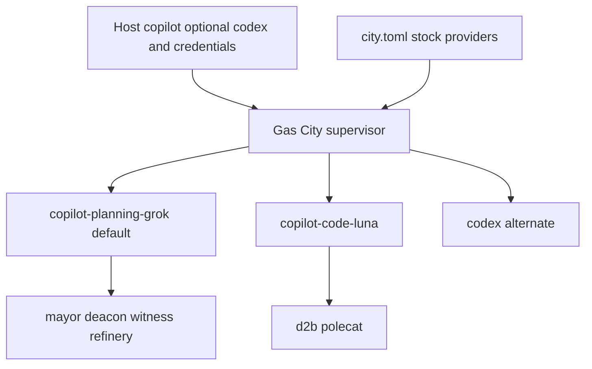

# Builtin Copilot CLI Provider Lanes - Plan

## Goal Capsule

- **Objective:** Default this portable city to Gas City's stock `builtin:copilot` provider, with Grok planning/review and Luna coding lanes, while keeping stock `builtin:codex` available as an alternate provider.
- **Product authority:** `d2b-gascity` owns the portable city provider graph, polecat coding-lane patch, and operator docs. The separate `gascity.nix` repository still owns Copilot CLI installation. Do not recreate that boundary here.
- **Open blockers:** The operator must supply a Copilot CLI binary and a Copilot Requests credential through host-local setup. Model identifiers are the documented Grok and Luna lanes, not a host-router catalog.
- **Stop conditions:** Stop if stock `builtin:copilot` cannot launch `copilot` without a custom adapter, Codex wrapper, alternate transport, or `GH_TOKEN` coupling.
- **Execution profile:** City configuration, tests, design, and documentation only. Do not add a verification harness or touch `gascity.nix` from this checkout.
- **Tail ownership:** A human owns merge decisions. This plan does not record implementation progress.

## Product Contract

### Summary

Declare both stock providers. The workspace default is Copilot CLI Grok
`grok-4.6` at `high` effort and `long_context`. The d2b polecat uses Luna at
`max` effort. Stock `builtin:codex` remains an alternate provider with an
empty model default. Copilot Requests stay separate from Codex, d2b
publication, and Discord app credentials.

### Problem Frame

The city currently declares only `providers.codex` from `builtin:codex` and documents Codex Router as the model gateway. Copilot CLI already supplies the required Grok and Luna lanes, but operators may still want stock Codex.

Gas City v1.4.1 already materializes `builtin:copilot` as the `copilot` command with `--yolo`, and `builtin:codex` as the `codex` command. The city should default to Copilot lanes and keep Codex declared.

### Supersession

This plan supersedes the Codex provider, Codex Router, and single host-selected model requirements in `docs/plans/2026-08-19-001-feat-codex-router-copilot-slack-plan.md`.

It preserves that earlier plan's credential-separation rule: never set `GH_TOKEN` from a Copilot token.

It does not restore Slack Full Pack, Compound Engineering named workers, or Copilot-to-`GH_TOKEN` coupling. Gastown, Discord, PR-only refinery handoff, and native Gas City lifecycle remain in force.

The 2026-08-18 builtin Copilot lane graph is the restored provider shape, adapted to the current Gastown polecat city rather than Compound Engineering agent patches.

### Key Decisions

- **Default to stock `builtin:copilot` and keep stock `builtin:codex`:** (session-settled: user-directed - chosen over Copilot-only or Codex-only: support both, default Copilot CLI) Governs R1-R3.
- **Keep two model lanes in the city:** Workspace default is Grok planning/review; only the d2b polecat is patched to Luna coding. Governs R2 and R4.
- **Do not couple publication credentials:** Omit provider `env`. The host may export `COPILOT_GITHUB_TOKEN`; the city must not set `GH_TOKEN`. Governs R5.
- **Keep host installation outside this repository:** `gascity.nix` or another compatible host source supplies `copilot`. Governs R6.
- **Do not add a custom provider, relay, or second lifecycle:** Governs R1 and R7.

### Actors

- A1. **Operator:** Installs Copilot CLI, supplies the Copilot Requests credential locally, and starts the city.
- A2. **Gas City supervisor:** Launches builtin Copilot sessions for Gastown roles.
- A3. **Copilot CLI:** Runs as the stock `copilot` command with lane argv.
- A4. **d2b polecat:** Uses the Luna coding lane and `mol-d2b-polecat-work`.

### Requirements

- R1. `city.toml` must declare the Copilot lanes and stock `builtin:codex`. It must not add a wrapper `command`, Codex Router URLs, or a custom adapter. The workspace default must be Copilot, not Codex.
- R2. The workspace provider must be `copilot-planning-grok` with argv `--yolo --model grok-4.6 --context long_context --effort high`.
- R3. The city must declare `copilot-code-luna` with argv `--yolo --model gpt-5.6-luna --context default --effort max`.
- R4. The existing d2b polecat patch must keep `mol-d2b-polecat-work` and add `provider = "copilot-code-luna"`. Other Gastown roles inherit the workspace Grok lane.
- R5. Provider blocks must omit `env`, `COPILOT_GITHUB_TOKEN`, and `GH_TOKEN`. Docs must keep Copilot Requests, d2b publication, and Discord credentials separate.
- R6. Operator docs must say the host supplies `gc`, `copilot`, optional `codex`, and `gh`. Copilot CLI is the default. Codex Router is optional host support for the Codex provider, not required to start the city.
- R7. Focused tests must prove the lane graph, the polecat patch, dummy `copilot` smoke PATH coverage, and the no-token-coupling rule.
- R8. Design and operations docs must describe the provider graph and credential boundary without private host values.

### Key Flows

- F1. **City start:** Operator starts the city. Gas City launches `copilot` through `builtin:copilot`. Planning and review sessions use the Grok lane. Covers R1, R2, R6.
- F2. **Polecat coding:** Sling to the d2b polecat uses Luna and `mol-d2b-polecat-work`. Covers R3 and R4.
- F3. **Credential isolation:** Copilot inference uses the host Copilot Requests credential. Publication uses a separate GitHub identity. Discord app tokens stay in host-managed Discord state. Covers R5.

### Acceptance Examples

- AE1. **Native Copilot default:** Given the host supplies `copilot`, when the city starts a default agent, then Gas City uses `builtin:copilot`. Codex remains selectable through `providers.codex`.
- AE2. **Lane split:** Given a mayor or review session, then argv selects Grok `high`/`long_context`. Given a d2b polecat, then argv selects Luna `max`.
- AE3. **No token coupling:** Given `city.toml`, then it contains no `GH_TOKEN`, Copilot token variable, or Codex provider.
- AE4. **Focused gate:** Given `python3 tests/test_city.py`, then the portable-city checks pass without starting Copilot, Discord, or publication.

### Scope Boundaries

**Deferred**

- Additional per-role Copilot patches beyond the d2b polecat.
- Host-package changes in `gascity.nix`.
- Live authenticated Copilot or publication smokes as committed evidence.

**Outside this work**

- Custom Copilot or Codex adapters, ACP shims, or a second lifecycle owner.
- Making Codex the workspace default.
- Restoring `GH_TOKEN=$COPILOT_GITHUB_TOKEN`.
- Discord, Gastown, or PR-handoff behavior unrelated to the provider switch.

### Dependencies and Assumptions

- Gas City v1.4.1 `builtin:copilot` launches `copilot` with `--yolo` and delivers prompts through the interactive session contract.
- Copilot CLI accepts `--model`, `--context`, and `--effort`.
- The operator has a Copilot entitlement that can see `grok-4.6` and `gpt-5.6-luna`.
- `gascity.nix` or another host source can expose `copilot` without this repository owning installation.

### Success Criteria

- `city.toml` defaults to the Copilot lanes, keeps stock Codex, and patches the d2b polecat to Luna.
- Docs and design describe Copilot CLI as default and Codex as alternate.
- `python3 tests/test_city.py` passes.

### Sources

- `city.toml`, `tests/test_city.py`, `docs/operations.md`, `AGENTS.md`
- `docs/plans/2026-08-18-001-refactor-native-gas-city-distribution-plan.md` KTD7
- `docs/plans/2026-08-19-001-feat-codex-router-copilot-slack-plan.md` credential-separation rule
- [Gas City v1.4.1 builtin provider catalog](https://github.com/gastownhall/gascity/blob/v1.4.1/internal/worker/builtin/profiles.go)
- [Gastown config recipes](https://github.com/gastownhall/gascity/blob/v1.4.1/docs/guides/gastown-config-recipes.md)

## Planning Contract

### Key Technical Decisions

- KTD1. **Declare two named builtin Copilot profiles and keep stock Codex.** Default the workspace to Copilot. Governs R1-R3.
- KTD2. **Patch only the d2b polecat to the coding lane.** Inherit Grok everywhere else. Governs R4.
- KTD3. **Pass lane flags as `args`, not `option_defaults`.** Builtin Copilot has no model option schema. Governs R2 and R3.
- KTD4. **Keep credentials out of `city.toml`.** Builtin Copilot already reads `COPILOT_GITHUB_TOKEN` from the host environment. Governs R5.
- KTD5. **Treat design plus operations as the operator contract.** The plan is authority; do not edit it to record progress. Governs R8.

### High-Level Technical Design

See `docs/designs/2026-08-27-001-copilot-cli-provider.md`.

### Implementation Units

### U1. Recording the Copilot CLI plan and design

- **Goal:** Add the authority plan and the provider design without editing older plans for progress.
- **Requirements:** R8, KTD5.
- **Files:** `docs/plans/2026-08-27-001-feat-copilot-cli-provider-plan.md`, `docs/designs/2026-08-27-001-copilot-cli-provider.md`.

### U2. Switching the city provider graph and focused tests

- **Goal:** Replace Codex with builtin Copilot lanes and prove the contract.
- **Requirements:** R1-R5, R7, KTD1-KTD4.
- **Files:** `city.toml`, `tests/test_city.py`.

### U3. Updating operator and governance docs

- **Goal:** Document Copilot CLI as the default, stock Codex as alternate, lanes, and credential separation.
- **Requirements:** R6, R8.
- **Files:** `AGENTS.md`, `README.md`, `docs/operations.md`, `docs/testing.md`, `SECURITY.md`, `CONTRIBUTING.md`, `PROVENANCE.md`, `CHANGELOG.md`.

## Verification Contract

| Scope | Check | Done signal |
|---|---|---|
| City contract | `python3 tests/test_city.py` / `make check` | Builtin Copilot lanes, polecat patch, privacy, and dummy `copilot` smoke coverage pass |
| Docs | Review staged docs and design | Codex Router is not required; lanes and credential separation remain |

Do not add a Copilot harness or committed live evidence.

## Definition of Done

- U1 is complete when the plan and design exist and older plans are unchanged except by this supersession statement.
- U2 is complete when `city.toml` and focused tests encode the Copilot lanes.
- U3 is complete when operator docs require Copilot CLI rather than Codex Router.
