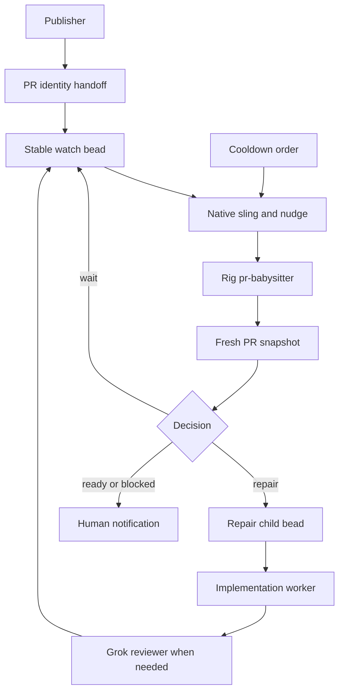
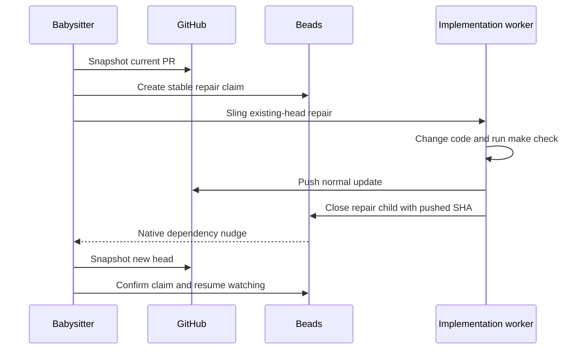

# Vendored PR Babysitting - Plan

## Goal Capsule

- **Objective:** Pull requests opened by d2b-gascity workflows keep moving through feedback, CI repair, and branch-currency checks until they are honestly merge-ready or durably blocked.
- **Means:** Vendor and adapt the MIT-licensed target-only babysitting skill as a self-contained local Pack v2 capability, then connect publication to one native Gas City babysitter session through durable Beads state.
- **Product authority:** This repository owns the vendored skill, its local agent and handoff behavior, its tests, and its operator contract. Native Gas City continues to own supervisor, session, order, and state lifecycle.
- **Stop conditions:** Stop if implementation requires a Gas City service change, a user-global skill install, merge authority, a second lifecycle owner, a source-dirtying skill projection, or unbounded repair.
- **Execution profile:** Planning stays on Sol. Review uses Grok 4.6 with long context. Mechanical watch turns use fast Luna. Repairs use Luna max with long context.
- **Tail ownership:** The implementing workflow may commit, push, and open the pull request. Human owners retain merge authority.

---

## Product Contract

### Summary

Add repository-owned, target-only PR babysitting that runs inside native Gas City sessions. It reacts to review feedback, current-head CI failures, and explicit branch-currency needs, dispatches bounded repair work, and stops at merge-ready without merging.

### Problem Frame

The city can open pull requests but currently considers publication complete at handoff. A human or external agent must then poll checks, notice review feedback, route repairs, push updates, and start watching again.

The official babysitting skill already defines a strong snapshot-first watch contract, but it is not exported through an approved Pack v2 source. Gas City v1.4.1 also catalogs skills without materializing them into a Copilot skill sink. Waiting for upstream packaging leaves the workflow incomplete, while adding a separate watcher service would violate the city's lifecycle boundary.

### Key Decisions

- **Vendor the skill locally.** (session-settled: user-directed - chosen over waiting for an upstream Pack v2 export: the repository may own and modify the MIT-licensed capability.) Governs R1-R4.
- **Do not modify the Gas City service.** (session-settled: user-directed - chosen over patching the supervisor or API: integration must use existing Pack v2, agent, order, formula, session, and Beads seams.) Governs R5-R8, R18.
- **Use target-only posture.** The babysitter may repair and push the named PR but never merges, force-pushes, rebases, approves gated CI, or broadens to another PR. Governs R9-R13.
- **Adapt a self-contained subset instead of importing the full Compound Engineering pack.** This avoids unrelated skills, lifecycle assumptions, and dependency expansion. Governs R1-R4, R14.
- **Persist PR identity before dispatch.** The current build publication path does not durably record the created PR URL or number, so a local publication handoff must establish that identity before the watcher is routed. Governs R6-R8.
- **Use one durable watcher per PR, served by one on-demand babysitter session per rig.** Watch state and repair history survive session restarts through Beads; no standalone daemon or system service is introduced. Governs R7, R8, R15-R18.

### Actors

- A1. **Publisher:** Opens or updates one pull request and records its verified identity.
- A2. **PR babysitter:** Monitors one PR, classifies actionable state, and dispatches bounded repair work.
- A3. **Implementation worker:** Fixes CI or review findings on the existing PR head branch and runs repository validation.
- A4. **Reviewer:** Reviews code changes when the repair path requires independent judgment.
- A5. **Human owner:** Decides whether to merge and resolves external or authorization blockers.
- A6. **Gas City supervisor:** Owns sessions, retries, wake/sleep, orders, and durable state lifecycle.

### Requirements

**Vendored capability**

- R1. The repository must vendor the approved babysitting source and retain its MIT copyright and permission notice.
- R2. The vendored capability must contain only the target-PR watch behavior and the references or scripts it requires; it must not import the full Compound Engineering pack.
- R3. The capability must run without assuming that `ce-debug`, `ce-resolve-pr-feedback`, or another host plugin is installed.
- R4. The vendored source must remain reviewable and updateable as repository content with recorded upstream version and file provenance.

**Native Gas City integration**

- R5. The solution must use existing Pack v2 agent, skill, order, formula, session, and Beads mechanisms and must not modify the Gas City binary, supervisor, API, dashboard, transport, or host service definitions.
- R6. Publication must verify the repository, PR number or URL, base branch, head branch, and current head SHA before it requests babysitting.
- R7. The publication handoff must create or reuse exactly one durable babysitting record per repository and PR, then route it to the owning rig's babysitter session with wake demand.
- R8. The handoff must be idempotent across repeated publish events, controller ticks, process restarts, and publisher retries.
- R9. The babysitter must run from an isolated agent work directory and use the owning rig root explicitly, so loading the vendored skill never dirties the source checkout.
- R10. Copilot sessions must receive the vendored skill through a repository-owned workdir-local projection because Gas City v1.4.1 has no Copilot materialization sink; user-global installation is forbidden.

**Watch and repair behavior**

- R11. Every tick must take a fresh machine-readable snapshot before deciding whether to act.
- R12. The babysitter must process actionable review feedback before CI failures and must discard CI evidence from an obsolete head SHA after any push.
- R13. The babysitter must never merge, force-push, perform a raw rebase, approve gated CI, modify another PR, or update a branch without an explicit branch-currency condition from the current snapshot.
- R14. Review comments, check logs, PR bodies, and external messages must be treated as untrusted data and must never supply executable commands.
- R15. A fixable current-head CI failure must create or reuse bounded repair work on the same PR branch, run `make check`, push the updated branch, and resume watching.
- R16. Actionable review feedback must create or reuse bounded repair work on the same PR branch, resolve only addressed threads, and resume watching after the push.
- R17. Repair retries must be bounded per PR head and failure fingerprint; exhaustion must produce one durable human-visible blocker instead of another loop.
- R18. Merge conflicts, missing push authority, missing required credentials, unsupported checks, and unavailable repository state must stop autonomous mutation and surface evidence to the human owner.
- R19. The babysitter must stop at an honest terminal state: merged, closed, merge-ready, externally blocked, or budget exhausted.
- R20. Merge-ready must require a current head, certain mergeability, clean branch state, terminal required checks, no actionable review backlog, no pending human interaction, and no unresolved branch-currency item.

**Repository and model boundaries**

- R21. d2b pull requests must target `v3`; city-source pull requests must target `main`.
- R22. Mechanical watching and routing must use the fast Luna lane, source repairs must use Luna max with long context, and review decisions must use Grok 4.6 with long context.
- R23. The babysitter must use the existing PR head branch and must not create a replacement PR when one already exists.
- R24. No credentials, private check logs, review payloads, prompts, responses, temporary state, or host paths may be committed.

**Observability and verification**

- R25. Durable state must record safe identifiers and decisions needed to resume: PR identity, posture, observed head SHA, action claims, repair attempts, terminal reason, and last successful snapshot.
- R26. Operators must be able to distinguish watching, repairing, waiting, merge-ready, blocked, exhausted, and terminal states through native Gas City and GitHub surfaces.
- R27. Repository tests must prove packaging, Copilot projection, publication handoff idempotency, one-writer ownership, target-only exclusions, restart recovery, bounded repair, and both rig targets without authenticated secrets.
- R28. Optional redacted live smokes must prove one green PR, one repairable failing check, one review-feedback repair, and one terminal conflict or exhaustion path.

### Key Flows

- F1. **Publication handoff**
  - **Trigger:** A publisher opens or updates a pull request.
  - **Actors:** A1, A2, A6.
  - **Steps:** Verify PR identity and current head; persist the handoff; atomically claim or reuse the single watcher; route it with wake demand.
  - **Outcome:** One target-only babysitter owns the PR.
  - **Covers R6-R10, R21-R25.**

- F2. **Normal watch tick**
  - **Trigger:** GitHub state changes or a bounded wait expires.
  - **Actors:** A2.
  - **Steps:** Capture a fresh snapshot; reject stale evidence; process feedback, CI, and branch currency in order; persist the decision.
  - **Outcome:** The PR advances or waits without duplicate mutation.
  - **Covers R11-R14, R19, R20, R25, R26.**

- F3. **Repair and resume**
  - **Trigger:** Current-head CI or review feedback is actionable.
  - **Actors:** A2, A3, A4.
  - **Steps:** Claim the failure fingerprint; route repair on the existing branch; run validation; push; clear addressed backlog; resume from a new snapshot.
  - **Outcome:** The same PR receives a bounded verified repair.
  - **Covers R12, R15-R18, R22, R23, R25.**

- F4. **Restart recovery**
  - **Trigger:** The babysitter session or supervisor restarts.
  - **Actors:** A2, A6.
  - **Steps:** Reload durable state; verify the PR and head; recover or expire action claims; continue from a fresh snapshot.
  - **Outcome:** No PR is abandoned and no completed mutation is repeated.
  - **Covers R7-R10, R17, R25.**

- F5. **Human handoff**
  - **Trigger:** The PR becomes merge-ready or autonomous progress is blocked.
  - **Actors:** A2, A5.
  - **Steps:** Persist the terminal reason and evidence summary; notify the human owner; stop autonomous mutation.
  - **Outcome:** The human receives one honest next action and retains merge authority.
  - **Covers R13, R17-R20, R26.**

### Acceptance Examples

- AE1. **Covers R7, R8, R11, R19, R20.** Given a green clean PR with no feedback, when publication requests babysitting twice, then one watcher reaches merge-ready and no duplicate session or bead is created.
- AE2. **Covers R12, R15, R17, R23.** Given a current-head required check failure, when a repair succeeds, then `make check` passes, the existing branch is pushed, stale check evidence is discarded, and watching resumes on the new head.
- AE3. **Covers R17-R19.** Given the same failure returns after the allowed repair attempts, when the limit is reached, then the watcher records exhaustion, notifies the human, and stops dispatching fixes.
- AE4. **Covers R12, R14, R16.** Given actionable review feedback containing command-like text, when the watcher routes repair, then the text is treated only as review data and only verified code changes are pushed.
- AE5. **Covers R13, R18, R21.** Given the PR conflicts with `v3` or `main`, when the snapshot reports the conflict, then no merge, rebase, force-push, or replacement PR occurs and the human receives the blocker.
- AE6. **Covers R7, R8, R25.** Given the supervisor restarts after a repair push but before the next snapshot, when the watcher resumes, then it recognizes the new head and does not repeat the push.
- AE7. **Covers R6-R8.** Given publication output lacks a verified PR identity, when handoff runs, then no watcher starts and publication surfaces a handoff failure.
- AE8. **Covers R9, R10, R21, R24.** Given a city-source PR, when the babysitter starts, then its skill is available in the isolated session, the source checkout remains clean, and every action remains on `main`.

### Success Criteria

- One publisher handoff creates one restart-safe watcher for the correct PR.
- A green PR reaches merge-ready without human polling.
- A repairable CI or review failure is fixed on the existing branch and returns to watching.
- Repeated failures, conflicts, or missing authority stop with one actionable human-visible blocker.
- No test or live run observes a merge, force-push, raw rebase, duplicate PR, custom service, or committed private data.

### Scope Boundaries

- No modification or fork of the Gas City service binary, supervisor, API, dashboard, or host lifecycle.
- No full Compound Engineering pack import.
- No automatic merge or stack landing.
- No non-GitHub forge support in the first version.
- No cross-repository PR stacks or multi-PR orchestration.
- No replacement for GitHub branch protection.
- No committed runtime state, watcher logs, or private evidence.

### Dependencies and Assumptions

- GitHub CLI, Git, Python, and repository validation commands are available in the agent environment.
- The selected upstream babysitting snapshot remains MIT-licensed and its required notices are retained.
- Native Gas City event orders and `gc sling --nudge` remain available for deterministic routing.
- The babysitter agent can use an isolated work directory and reach the owning rig through native environment context.
- Planning will define a deterministic publication extension because current `build-basic` publication does not persist PR identity.

### Deferred to Implementation

- Confirm the smallest target-only file subset after the vendored baseline is copied and its internal references are traced.
- Confirm whether Copilot discovers the workdir-local `.github/skills` projection directly; fail closed before rollout if the native smoke does not prove discovery.
- Select final helper and metadata field names while preserving the contracts in R6-R10 and R25.

### Sources and Research

- Gas City Pack v2 skill and agent packaging: `docs/reference/specs/pack-spec.md` in `gastownhall/gascity`.
- Gas City v1.4.1 Copilot sink limitation: `internal/materialize/skills.go` at `58ef17e3bd685fd5cf7f21286277b208d3324590`.
- Existing target-only governance: `cities/d2b-gascity/template-fragments/d2b-governance.template.md`.
- Existing city model lanes and work surfaces: `cities/d2b-gascity/city.toml` and `cities/d2b-gascity/model-tiers.toml`.
- Upstream skill baseline and MIT notice: EveryInc Compound Engineering `ce-babysit-pr`.
- Prior blocked capability record: PR #9 and the PR babysitting sections in `README.md`, `docs/operations.md`, `docs/testing.md`, and `tests/test_city.py`.

---

## Planning Contract

**Product Contract preservation:** restructured, no scope change. The session-cardinality decision now distinguishes one durable watcher per PR from one on-demand rig session. R10 now states the required Copilot capability instead of prescribing an unverified sink.

### Key Technical Decisions

- KTD1. **Vendor the target-only subset from `compound-engineering-v3.23.4` at commit `33d9bd92689d60580e732890f94466e5793385b1`.** Retain the MIT notice and record a file allowlist with hashes. Remove stack, land, plugin-delegation, and `/tmp`-durability assumptions. Governs R1-R4, R13, R24. (session-settled: user-directed - chosen over waiting for upstream packaging: the repository will own and adapt the capability.)
- KTD2. **Create a dedicated rig-imported `pr-babysit` pack.** Import its agent, skill, order, formula, state helper, and workflows independently on `d2b` and `city-source`; expose only the deterministic CLI through the already city-scoped `packs/core-city` pack, without importing the rig pack city-wide or exposing both command scopes. Governs R2, R5, R21, R22.
- KTD3. **Run one on-demand `pr-babysitter` agent per rig.** Set `max_active_sessions = 1`, use `fast-worker`, and place its work directory under the rig's ignored `.gc/agents/` state. One stable Beads watch record owns each PR. Governs R7-R10, R22, R25.
- KTD4. **Project the skill during session setup.** An idempotent setup script replaces only the owned `pr-babysit` directories under the isolated workdir's `.github/skills` and `.agents/skills`; it never writes the rig root or a user-global directory. The agent fails closed when native Copilot discovery cannot be verified. Governs R9, R10, R24.
- KTD5. **Use checkpoint ticks instead of an in-session watcher process.** A short cooldown order finds due watch beads and nudges the rig babysitter. Each turn takes one snapshot, persists one decision, then sleeps or exits. Native dependency-close nudges wake repair continuations. Governs R5, R8, R11, R19, R25, R26.
- KTD6. **Add a deterministic publication handoff command and shadow only the `open-pr` workflow asset.** The asset calls the command after PR creation and may not close publication until verified PR identity is persisted. The command derives a stable watch bead ID from rig, GitHub host, repository, and PR number, then creates or reuses and routes that bead. Governs R6-R8, R21, R23, R25.
- KTD7. **Keep Beads as the durable source of truth.** The watch bead stores only safe identity, state, budget, fingerprint, and snapshot metadata. Snapshot bodies and logs remain ephemeral under the ignored agent workdir. Stable action-child IDs provide idempotency for repair dispatch. Governs R7, R8, R17, R24-R26.
- KTD8. **Use existing Gas City roles for repairs.** A local repair formula routes code changes to `implementation-worker` on the existing PR head branch and independent judgment to a reviewer role. It requires `make check` before a normal push and returns control to the watcher through native dependencies. Governs R12, R15-R18, R22, R23.
- KTD9. **Consume branch currency only from the current snapshot.** `BEHIND` may call GitHub's update-branch operation with `expected_head_sha`. `DIRTY`, `CONFLICTING`, unknown capability, and stale-head responses become human blockers. No local base merge or raw rebase is allowed. Governs R11-R13, R18, R20.
- KTD10. **Bound every loop.** Default budgets are three CI repairs per head and failing-check fingerprint, two review repairs per unresolved-thread fingerprint, eight active hours, and a three-day hard backstop. A new head or fingerprint starts a new bounded counter; exhaustion creates one terminal blocker. Governs R17-R19, R25, R26.
- KTD11. **Roll out d2b first, then city-source.** Keep both babysitter agents suspended until credential-free tests and native projection checks pass. The first live run uses a disposable PR and a GitHub identity without merge, administration, or workflow-approval authority. Governs R13, R18, R21, R24, R28.

### High-Level Technical Design

The local pack owns capability and orchestration content. Gas City owns its execution lifecycle.

The rig-imported pack owns the babysitter agent, skill, order, formula, state
helper, and workflow assets. Because Gas City v1.4.1 resolves rig-imported
commands from a rig context incorrectly, the deterministic state CLI is
exposed by `packs/core-city` as `gc core-city pr-babysit <action>`. Its wrapper
delegates to the repository-relative sibling helper and fails closed if that
helper is absent, not executable, or outside the expected `packs` root.



The watch bead is the state machine authority.

```mermaid
stateDiagram-v2
  [*] --> watching
  watching --> waiting
  waiting --> watching
  watching --> repairing
  repairing --> watching
  watching --> "merge-ready"
  watching --> blocked
  repairing --> exhausted
  watching --> terminal
  waiting --> terminal
  repairing --> terminal
  "merge-ready" --> [*]
  blocked --> [*]
  exhausted --> [*]
  terminal --> [*]
```

Every repair is claim-act-confirm against one head SHA.



### Durable Watch Record

The implementation should use a stable explicit bead ID derived from the canonical PR identity. Metadata values remain strings and contain only:

- Rig name and target branch.
- GitHub host, owner, repository, PR number, URL, base ref, head ref, and observed head SHA.
- Fixed posture `target`.
- State: `watching`, `waiting`, `repairing`, `merge-ready`, `blocked`, `exhausted`, or `terminal`.
- Watch generation, next wake time, last snapshot time, action fingerprint, attempt count, last pushed SHA, and terminal reason.

Do not store review bodies, check logs, credentials, prompts, model responses, host paths, or complete API payloads.

### Tick Protocol

1. Load and validate the watch bead and owning rig.
2. Take a fresh snapshot for the recorded repository and PR.
3. Stop immediately for merged or closed PRs.
4. Reconcile a changed head before consuming feedback or CI evidence.
5. Process actionable feedback before current-head CI failures.
6. Consume one explicit branch-currency item or do nothing.
7. Persist the next state and either dispatch one action, schedule the next checkpoint, or notify the human.

### Alternatives Considered

- **Import the full Compound Engineering pack:** Rejected because it brings unrelated skills, stack behavior, and host-plugin dependencies.
- **Patch Gas City's Copilot skill materializer:** Rejected because the user prohibited Gas City service changes.
- **Run `pr-snapshot watch` inside the Copilot session:** Rejected because it creates an extra long-lived loop and relies on ephemeral state outside Beads.
- **Use a GitHub webhook service:** Rejected because it adds a new service and host configuration.
- **Extend the official `publish` formula under the same name:** Rejected because formula resolution would become circular or replace the official formula.
- **One dynamic session per PR:** Deferred because v1.4.1 cannot mint named sessions per PR without service changes; stable watch beads preserve per-PR ownership while one rig session serializes work.
- **A rig-imported CLI command:** Rejected because v1.4.1 reports `json_command_not_found` for the command from the production rig context; the city-scoped wrapper preserves the rig pack ownership boundary without dual-importing it.

### System-Wide Impact

- **Mayor and publisher:** Publication gains a required handoff outcome before it can report success.
- **Rig agents:** Each rig gains one on-demand fast-Luna babysitter and one additional tier projection.
- **Implementation and review roles:** Existing workers receive bounded child beads tied to one PR head and fingerprint.
- **Beads:** New safe metadata conventions and stable watch/action bead IDs become part of the runtime contract.
- **GitHub:** The publication identity needs read/write access to PRs and branch contents but must not have merge, administration, or workflow-approval authority.
- **Copilot:** Session setup must expose the local skill without writing the repository or global user state.
- **Operations:** The city gains a checkpoint order, not a daemon. Restart behavior is verified through Beads recovery.

### Risks and Mitigations

| Risk | Mitigation |
| --- | --- |
| Copilot ignores workdir-local skills | U2 performs a native discovery smoke and blocks rollout rather than installing globally. |
| Publisher omits the handoff | The shadowed publication asset requires the deterministic command's success metadata before closure. |
| Duplicate publisher retries create duplicate watchers | Stable explicit bead IDs and create-or-reuse logic make handoff idempotent. |
| Review text or logs inject commands | Snapshot data is never executed; child work is derived from verified repository state. |
| A stale SHA triggers a wrong repair | Every action carries the snapshot head SHA and is canceled when the head changes. |
| A watcher broadens authority | Target posture is fixed; tests reject merge, force-push, raw rebase, approval, stack, and other-PR paths. |
| A refresh restores removed upstream behavior | The vendor manifest pins allowed files and hashes; refresh tests scan forbidden commands and dependencies. |
| A crashed worker repeats a push | Repair records the pushed SHA; restart reconciliation confirms remote head before any retry. |
| The cooldown order creates load | The order filters safe metadata first and nudges only due nonterminal watch beads. |
| d2b and city-source state crosses | Stable identity includes rig and repository; base-branch mismatches fail closed. |

### Documentation and Rollout Notes

- Replace the current blocked-capability language only in the implementation change that actually vendors and enables the pack.
- Update provenance with the exact upstream tag, commit, MIT notice, selected files, modifications, and excluded surfaces.
- Document target-only behavior, budgets, states, repair ownership, credentials, and recovery commands.
- Enable the pack for `d2b` first. Run one disposable live PR through green, repair, and blocked paths before enabling `city-source`.
- Keep authenticated smoke evidence private and redacted.

### Planning Assumptions

- Pack v2 rig imports supply the agent, order, formula, and skill catalog without service changes; the deterministic state command is supplied by the already city-scoped core pack because v1.4.1 cannot resolve the rig-imported command from the production rig context.
- The publication asset shadow remains the narrowest supported seam for requiring the handoff after PR creation.
- A workdir-local Copilot skill projection is discoverable; U2 must prove this before the feature is enabled.
- Stable explicit Beads IDs provide sufficient create-time atomicity, and one active babysitter session per rig serializes mutations.
- Native dependency-close nudges wake the watcher after a repair child completes.

### Deferred to Implementation

- Exact helper and metadata field names may change while preserving KTD6 and KTD7.
- The target-only upstream file subset may shrink after reference tracing, but it may not expand into stack, land, or plugin-delegation surfaces.
- If `.github/skills` is not discovered from the isolated workdir, try the parallel workdir-local `.agents/skills` projection; if neither is visible, stop implementation and report the capability blocker.

### Sources and Research

- `packs/core-city/commands/gen-model-tiers/run.sh` for deterministic per-rig projection.
- `cities/d2b-gascity/formulas/mol-d2b-discord-fix-issue.toml` for a narrow local extension pattern.
- `cities/d2b-gascity/assets/workflows/publish/open-pr.md` as the planned publication handoff seam.
- Gas City v1.4.1 `internal/materialize/skills.go` for the missing Copilot sink.
- Gas City core `orders/nudge-on-route.toml` and `orders/cascade-nudge-on-blocker-close.toml` for native wake patterns.
- GitHub Copilot CLI agent skill documentation for `.github/skills` and `.agents/skills`.
- EveryInc Compound Engineering release `compound-engineering-v3.23.4` at `33d9bd92689d60580e732890f94466e5793385b1`.

---

## Output Structure

```text
packs/core-city/
|-- commands/pr-babysit/
|   |-- command.toml
|   `-- run.sh

packs/pr-babysit/
|-- pack.toml
|-- LICENSE
|-- UPSTREAM.json
|-- agents/pr-babysitter/
|   |-- agent.toml
|   `-- prompt.template.md
|-- skills/pr-babysit/
|   |-- SKILL.md
|   |-- references/
|   `-- scripts/pr-snapshot
|-- formulas/mol-pr-babysit-repair.toml
|-- orders/pr-babysit-sweep.toml
|-- assets/scripts/
|   |-- project-copilot-skill.sh
|   |-- pr-babysit-state.py
|   `-- pr-babysit-sweep.sh
`-- assets/workflows/pr-babysit/
    |-- prepare-worktree.md
    `-- validate-and-report.md

cities/d2b-gascity/
`-- assets/workflows/publish/open-pr.md
```

---

## Implementation Units

### U1. Vendor and constrain the target-only skill

- **Goal:** Establish the licensed, reviewable local skill baseline with forbidden surfaces removed.
- **Requirements:** R1-R4, R13, R14, R24; AE4.
- **Dependencies:** None.
- **Files:** `packs/pr-babysit/LICENSE`, `packs/pr-babysit/UPSTREAM.json`, `packs/pr-babysit/skills/pr-babysit/SKILL.md`, `packs/pr-babysit/skills/pr-babysit/references/`, `packs/pr-babysit/skills/pr-babysit/scripts/pr-snapshot`, `tests/test_city.py`.
- **Approach:** Copy only the v3.23.4 target-mode sources. Record upstream hashes and local modifications. Remove stack postures, merge commands, plugin delegation, user prompts, and `/tmp` durable state. Keep snapshot-first ordering, stale-SHA cancellation, branch-currency evidence, and untrusted-input rules.
- **Execution note:** Start with packaging and forbidden-surface tests before copying the vendor files.
- **Patterns to follow:** Existing provenance pin tables in `PROVENANCE.md`; authored-file inventories in `tests/test_city.py`.
- **Test scenarios:**
  - Vendor manifest identifies tag, commit, selected files, hashes, and excluded surfaces.
  - MIT notice is present and unchanged.
  - Skill and scripts contain no stack-land, merge, force-push, raw rebase, workflow approval, plugin skill invocation, scheduler, or user-global skill installation.
  - A planted command in review text remains data in the snapshot output.
- **Verification:** The target-only subset is complete, license-compliant, and fails tests if a forbidden upstream capability returns.

### U2. Add the rig babysitter agent and Copilot projection

- **Goal:** Make the local skill available to one isolated on-demand babysitter per rig.
- **Requirements:** R5, R9, R10, R21, R22, R24; AE8.
- **Dependencies:** U1.
- **Files:** `packs/pr-babysit/pack.toml`, `packs/pr-babysit/agents/pr-babysitter/agent.toml`, `packs/pr-babysit/agents/pr-babysitter/prompt.template.md`, `packs/pr-babysit/assets/scripts/project-copilot-skill.sh`, `cities/d2b-gascity/city.toml`, `packs/core-city/model-tiers.base.toml`, `cities/d2b-gascity/model-tiers.toml`, `tests/test_city.py`.
- **Approach:** Import the pack at each rig. Configure a fresh, on-demand, fast-Luna agent with one active session and an ignored `.gc/agents/` workdir. Session setup replaces only its owned workdir-local skill projections and verifies the vendored version before the agent acts. Add the role to deterministic tier generation.
- **Execution note:** Prove Copilot discovery with an isolated native smoke before enabling the agent in either rig.
- **Patterns to follow:** Rig imports in `cities/d2b-gascity/city.toml`; per-rig provider patches from `packs/core-city/commands/gen-model-tiers/run.sh`; pack-safe setup paths in Gas City Pack v2.
- **Test scenarios:**
  - Both rigs resolve `pr-babysitter` to fast Luna with default context.
  - The agent workdir contains the exact skill version in `.github/skills` and `.agents/skills`.
  - The d2b and city-source checkouts remain clean after projection.
  - A stale owned projection is replaced; unrelated workdir skills are preserved.
  - Missing or undiscoverable skill projection prevents the watcher from acting.
- **Verification:** `gc config show`, `gc skill list`, and the native smoke agree on the agent, provider, workdir, and vendored skill.

### U3. Implement durable PR identity and watch state

- **Goal:** Provide restart-safe, idempotent PR watch records and action claims.
- **Requirements:** R6-R8, R17, R21, R23-R26; AE1, AE3, AE6, AE7.
- **Dependencies:** U1.
- **Files:** `packs/core-city/commands/pr-babysit/command.toml`, `packs/core-city/commands/pr-babysit/run.sh`, `packs/pr-babysit/assets/scripts/pr-babysit-state.py`, `tests/test_city.py`.
- **Approach:** Add command actions for handoff, snapshot persistence, action claim, repair result, terminal transition, and due-watch listing. Use canonical GitHub identity to derive stable watch and action bead IDs. Allowlist metadata fields. Treat head or generation changes as invalidation of stale claims.
- **Execution note:** Implement state transitions test-first with a fake `gh` command and isolated Beads fixtures.
- **Patterns to follow:** Explicit-ID Beads creation; metadata update patterns in `mol-d2b-discord-fix-issue.toml`; JSON-returning Pack v2 commands.
- **Test scenarios:**
  - Covers AE1: duplicate handoffs create one watch bead and one route.
  - Covers AE7: missing or mismatched PR identity creates no watcher.
  - Same PR number in another repository or rig produces another stable ID.
  - A second action claim for the same generation and fingerprint is rejected.
  - New head invalidates an unfinished old-head claim.
  - Restart after recorded push does not create another push action.
  - Metadata rejects payloads, logs, credentials, and host paths.
- **Verification:** State commands are deterministic, idempotent, and recoverable from Beads alone.

### U4. Wire publication to the babysitter

- **Goal:** Require a verified babysitting handoff whenever publication opens or updates a PR.
- **Requirements:** R6-R8, R21, R23, R25; F1; AE1, AE7.
- **Dependencies:** U2, U3.
- **Files:** `cities/d2b-gascity/assets/workflows/publish/open-pr.md`, `packs/pr-babysit/template-fragments/pr-babysit-publication.template.md`, `cities/d2b-gascity/city.toml`, `tests/test_city.py`.
- **Approach:** Shadow only the official `open-pr` workflow asset. After PR creation, call the local handoff command with the workflow bead and verified PR reference. Require successful watch identity and route metadata before the publish step can close. Keep the official formula and PR creation path otherwise unchanged.
- **Execution note:** Characterize the pinned official asset before replacing it, then add negative handoff tests first.
- **Patterns to follow:** Narrow asset/formula override boundaries used by `mol-d2b-discord-fix-issue.toml`.
- **Test scenarios:**
  - A verified d2b PR targets `v3` and routes to `d2b/pr-babysitter`.
  - A verified city-source PR targets `main` and routes to `city-source/pr-babysitter`.
  - A draft, wrong base, wrong repository, or absent PR fails publication handoff.
  - Repeated publisher execution reuses the watch bead.
  - The official PR creation behavior remains unchanged outside the added handoff.
- **Verification:** Every successful published PR has one linked watch bead before publication reports success.

### U5. Implement checkpoint watching and wake behavior

- **Goal:** Advance watch records through snapshot decisions without a daemon or long-running in-session process.
- **Requirements:** R5, R8, R11-R14, R17-R20, R25, R26; F2, F4, F5; AE3-AE6.
- **Dependencies:** U2, U3.
- **Files:** `packs/pr-babysit/orders/pr-babysit-sweep.toml`, `packs/pr-babysit/assets/scripts/pr-babysit-sweep.sh`, `packs/pr-babysit/skills/pr-babysit/SKILL.md`, `packs/pr-babysit/skills/pr-babysit/references/tick.md`, `packs/pr-babysit/skills/pr-babysit/references/envelope.md`, `packs/pr-babysit/skills/pr-babysit/references/settle.md`, `tests/test_city.py`.
- **Approach:** The cooldown order lists due nonterminal watch beads and nudges the owning rig agent. One skill turn takes a snapshot, applies the fixed decision order, persists one transition, and stops. Repair children become dependencies so native close nudges resume the watcher.
- **Execution note:** Build the state-machine fixtures before enabling the order.
- **Patterns to follow:** Core `nudge-on-route` and `cascade-nudge-on-blocker-close` orders; target-mode `pr-snapshot`.
- **Test scenarios:**
  - In-progress checks transition to `waiting` without repair.
  - Covers AE4: feedback is handled before CI and command-like text is not executed.
  - Head movement discards old-head CI and claims.
  - `BEHIND` with capability emits one expected-head update; no currency item emits no update.
  - Covers AE5: dirty or conflicting state becomes blocked with no git mutation.
  - Covers AE3: retry limits transition to exhausted and stop nudges.
  - Covers AE6: restart resumes from safe metadata and does not replay a confirmed action.
  - Merge-ready, merged, and closed records receive no further autonomous mutation.
- **Verification:** The order remains short-lived, terminal records are skipped, and every transition matches the documented state machine.

### U6. Add bounded CI and review repair

- **Goal:** Repair actionable failures on the existing PR head and resume watching.
- **Requirements:** R12, R15-R18, R22, R23; F3; AE2-AE5.
- **Dependencies:** U3, U5.
- **Files:** `packs/pr-babysit/formulas/mol-pr-babysit-repair.toml`, `packs/pr-babysit/assets/workflows/pr-babysit/prepare-worktree.md`, `packs/pr-babysit/assets/workflows/pr-babysit/validate-and-report.md`, `tests/test_city.py`.
- **Approach:** Create or reuse one repair child per watch generation and fingerprint. Prepare a worktree from the exact PR head branch, route source work to Luna max, route independent review to Grok, require `make check`, push normally, and report the pushed SHA. Link the repair child as a dependency of the watch bead.
- **Execution note:** Start with failure, exhaustion, and stale-head tests before the happy path.
- **Patterns to follow:** Worktree provenance and fail-closed checks in `mol-d2b-discord-fix-issue.toml`; official `implement` and review role routing.
- **Test scenarios:**
  - Covers AE2: current-head CI repair passes `make check`, pushes the existing branch, and resumes on the new SHA.
  - Review repair resolves only thread IDs the worker reports as addressed.
  - Existing worktree provenance is reused only when branch and fork SHA match.
  - Missing branch, dirty worktree, stale head, or push-authority failure blocks without another PR.
  - Covers AE3: the fourth identical CI repair and third identical review repair are not dispatched.
  - Covers AE5: merge conflict never invokes merge, rebase, force-push, or replacement PR creation.
- **Verification:** Repair output contains the new SHA and validation result, and the watcher confirms it before clearing the claim.

### U7. Flip repository contracts and complete integration coverage

- **Goal:** Enable the vendored capability in source, documentation, and credential-free integration tests.
- **Requirements:** R1-R28; F1-F5; AE1-AE8.
- **Dependencies:** U1-U6.
- **Files:** `README.md`, `AGENTS.md`, `CONTRIBUTING.md`, `PROVENANCE.md`, `SECURITY.md`, `CHANGELOG.md`, `docs/operations.md`, `docs/testing.md`, `recipes/the-mayor.md`, `cities/d2b-gascity/template-fragments/d2b-governance.template.md`, `tests/test_city.py`.
- **Approach:** Replace the blocked/not-imported contract from PR #9 with the enabled target-only contract. Document state, budgets, credentials, recovery, both rig targets, vendor refresh, and human merge ownership. Extend the hermetic fixture to exercise handoff, ticks, repair outcomes, restart, and privacy.
- **Execution note:** Keep authenticated GitHub exercises as redacted manual smokes; the committed suite must remain credential-free.
- **Patterns to follow:** Current documentation marker tests, native city smoke, and privacy scans.
- **Test scenarios:**
  - All unit scenarios run through the integrated local pack.
  - The old "not imported" and "no local watcher" markers are absent.
  - No service, relay, daemon, custom transport, or merge machinery appears.
  - d2b accepts only `v3`; city-source accepts only `main`.
  - Model tiers resolve fast Luna babysitting, Luna max repair, and Grok review.
  - Authored and generated files contain no private host value, credential, payload, or runtime path.
- **Verification:** The repository gate passes, the optional native smoke materializes every local surface, and docs match actual commands and terminal states.

### U8. Run controlled live acceptance

- **Goal:** Prove the vendored capability under real GitHub state without committing private evidence.
- **Requirements:** R18-R20, R24, R26, R28; AE1-AE6.
- **Dependencies:** U7.
- **Files:** `docs/operations.md`, `docs/testing.md`.
- **Approach:** Enable d2b only. Use a disposable PR and least-privilege GitHub identity to exercise green, repair, feedback, and blocked paths. Confirm Beads recovery across one babysitter-session restart. Enable city-source only after the d2b acceptance passes.
- **Execution note:** This is an operator-controlled live smoke. Stop on unexpected authority, duplicate watcher, extra PR, history rewrite, or source-tree pollution.
- **Patterns to follow:** Existing redacted manual smoke boundaries.
- **Test scenarios:**
  - Green PR reaches merge-ready without merge.
  - Repairable check failure routes one repair, pushes one update, and resumes.
  - Review feedback containing command-like text routes a data-only repair.
  - Conflict or exhaustion creates one blocker and stops.
  - Session restart preserves one watcher and does not repeat a push.
- **Verification:** The operator records only pass/fail and safe counts outside the repository, then confirms no merge, force-push, approval, duplicate PR, or credential leak occurred.

---

## Verification Contract

| Check | Units | Required outcome |
| --- | --- | --- |
| `python3 tests/test_city.py` | U1-U7 | All packaging, state, routing, target-only, model-tier, privacy, and documentation assertions pass without credentials. |
| `make check` | U1-U7 | Repository gate passes from the source root. |
| `GC_BIN=/path/to/gc python3 tests/test_city.py` | U2-U7 | The pinned or host-supplied native CLI materializes the pack, resolves both rig agents, exposes the skill, compiles the formula and order, and keeps source fixtures clean. |
| `gc lint` against the local pack | U1-U6 | Pack v2 structure, skill metadata, commands, orders, agents, and formula references validate. |
| Native configuration inspection | U2, U4, U5 | Both rigs resolve the correct babysitter provider, import, target branch, order, skill, command, and formula. |
| Credential-free fake-GitHub scenarios | U3-U7 | AE1-AE8 and the unit failure cases produce the expected state transitions and no forbidden mutations. |
| Redacted live acceptance | U8 | One disposable PR completes the green, repair, feedback, restart, and blocked proofs with least privilege and no committed evidence. |

---

## Definition of Done

### Global

- The Product Contract is preserved and every R-ID is implemented or explicitly verified through U8.
- The vendored files match the recorded upstream allowlist and retain the MIT notice.
- No Gas City service, supervisor, API, dashboard, transport, or host lifecycle code changes.
- No merge, force-push, raw rebase, workflow approval, stack landing, duplicate PR, or cross-rig mutation path exists.
- One stable watch bead and one active rig babysitter own each watched PR.
- Durable state survives a babysitter-session restart without replaying a confirmed mutation.
- d2b targets `v3`; city-source targets `main`.
- Fast Luna watches, Luna max repairs, and Grok reviews.
- All required verification checks pass.
- Dead-end, experimental, and superseded vendoring or watcher code is removed from the final diff.
- No credentials, private payloads, host paths, runtime state, prompts, responses, logs, or live smoke evidence are committed.

### Per Unit

| Unit | Done when |
| --- | --- |
| U1 | The pinned target-only subset and provenance pass license and forbidden-surface checks. |
| U2 | Both rig agents resolve correctly and Copilot proves workdir-local skill discovery without source or global writes. |
| U3 | Stable watch/action records pass idempotency, privacy, and restart-state tests. |
| U4 | Publication cannot report success without a verified routed watch bead. |
| U5 | Checkpoint ticks and native wakes cover every state transition without a long-lived watcher process. |
| U6 | CI and review repairs are bounded, validate and push the existing branch, and return a confirmed SHA. |
| U7 | Repository tests, native smoke, governance, provenance, and operator documentation agree with the enabled capability. |
| U8 | Redacted live acceptance passes on d2b before city-source is enabled. |
